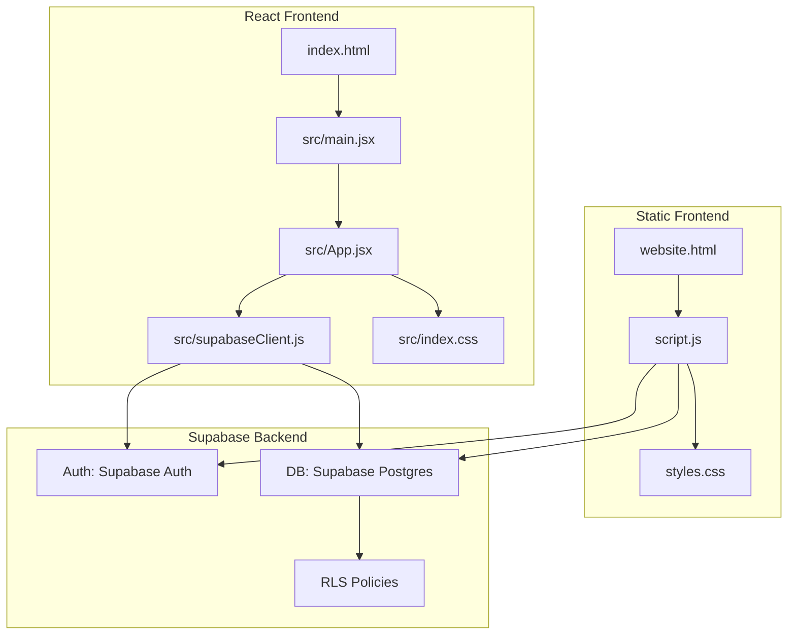
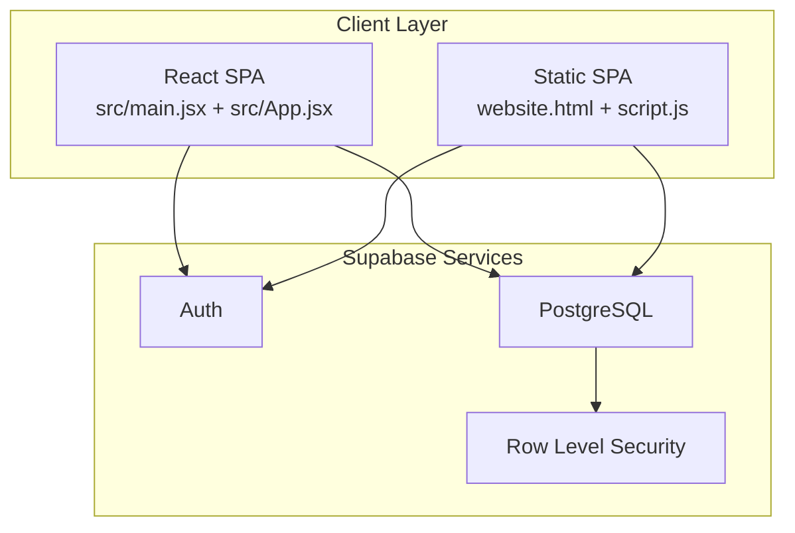
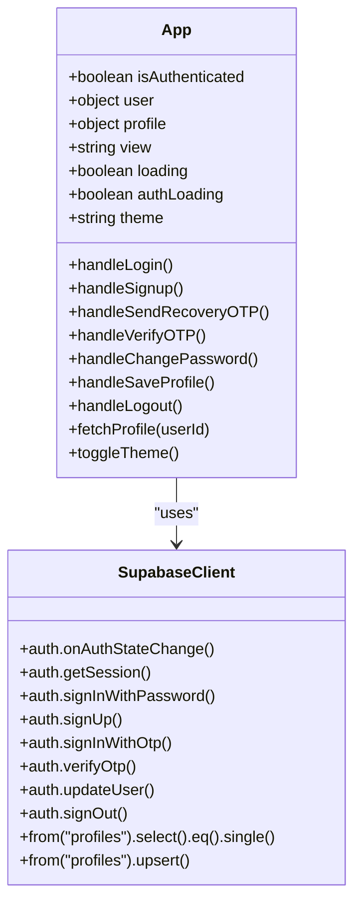
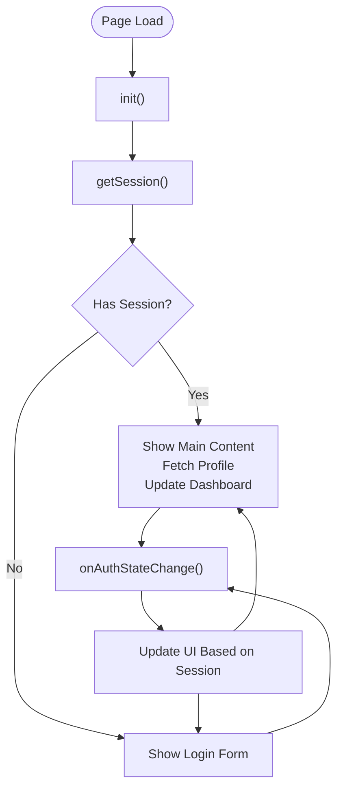
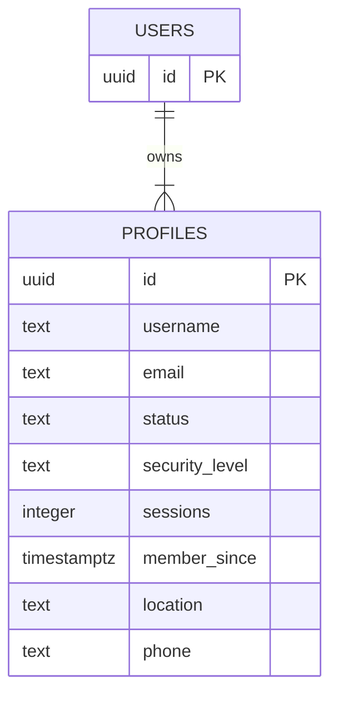
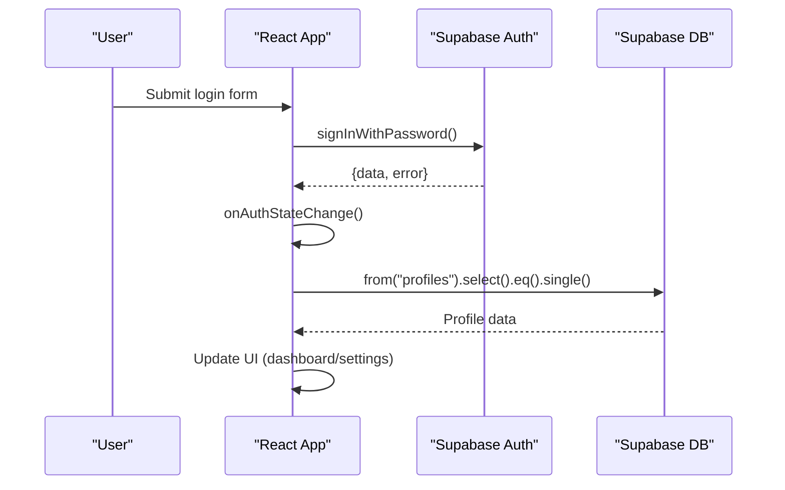
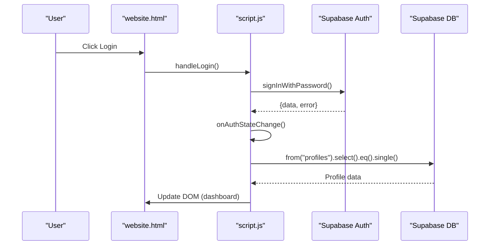
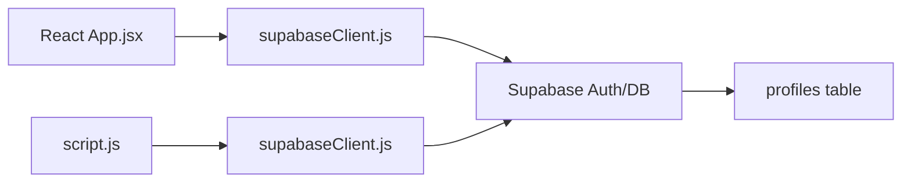
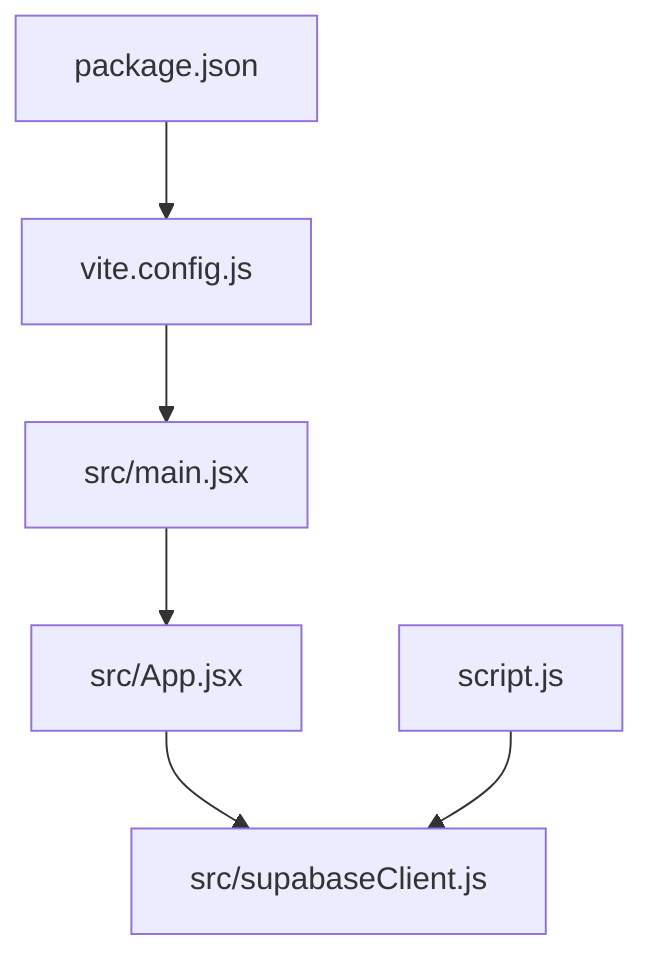

# Architecture Overview

<cite>
**Referenced Files in This Document**
- [README.md](file://README.md)
- [package.json](file://package.json)
- [vite.config.js](file://vite.config.js)
- [index.html](file://index.html)
- [src/main.jsx](file://src/main.jsx)
- [src/App.jsx](file://src/App.jsx)
- [src/supabaseClient.js](file://src/supabaseClient.js)
- [src/index.css](file://src/index.css)
- [website.html](file://website.html)
- [script.js](file://script.js)
- [styles.css](file://styles.css)
- [setup.sql](file://setup.sql)
</cite>

## Table of Contents
1. [Introduction](#introduction)
2. [Project Structure](#project-structure)
3. [Core Components](#core-components)
4. [Architecture Overview](#architecture-overview)
5. [Detailed Component Analysis](#detailed-component-analysis)
6. [Dependency Analysis](#dependency-analysis)
7. [Performance Considerations](#performance-considerations)
8. [Troubleshooting Guide](#troubleshooting-guide)
9. [Conclusion](#conclusion)
10. [Appendices](#appendices)

## Introduction
This document describes the dual-implementation architecture of the HMC WEBSITE project. It covers:
- A modern React-based SPA with component hierarchy, state management, and real-time profile updates
- A static HTML/CSS/JS implementation with event-driven programming and DOM manipulation
- Supabase integration for authentication, database schema design, and real-time synchronization
- Component interactions between frontend implementations and backend services
- Data flows for user authentication and profile management
- System boundaries, architectural decisions, trade-offs, security considerations, scalability aspects, and deployment topology

## Project Structure
The repository hosts two distinct frontends sharing a common Supabase backend:
- React SPA: built with Vite and React, rendering a modern dashboard with real-time profile sync
- Static HTML/CSS/JS: a classic event-driven implementation with modal overlays and view toggling

**Diagram sources**
- [index.html:1-16](file://index.html#L1-L16)
- [src/main.jsx:1-11](file://src/main.jsx#L1-L11)
- [src/App.jsx:1-650](file://src/App.jsx#L1-L650)
- [src/supabaseClient.js:1-11](file://src/supabaseClient.js#L1-L11)
- [src/index.css:1-1148](file://src/index.css#L1-L1148)
- [website.html:1-303](file://website.html#L1-L303)
- [script.js:1-660](file://script.js#L1-L660)
- [styles.css:1-1071](file://styles.css#L1-L1071)
- [setup.sql:1-26](file://setup.sql#L1-L26)

**Section sources**
- [package.json:1-22](file://package.json#L1-L22)
- [vite.config.js:1-8](file://vite.config.js#L1-L8)
- [index.html:1-16](file://index.html#L1-L16)
- [website.html:1-303](file://website.html#L1-L303)

## Core Components
- React SPA
  - Root entry: [src/main.jsx:1-11](file://src/main.jsx#L1-L11)
  - Application shell and routing: [src/App.jsx:1-650](file://src/App.jsx#L1-L650)
  - Supabase client initialization: [src/supabaseClient.js:1-11](file://src/supabaseClient.js#L1-L11)
  - Styling: [src/index.css:1-1148](file://src/index.css#L1-L1148)
- Static HTML/CSS/JS
  - Entry page: [website.html:1-303](file://website.html#L1-L303)
  - Behavior and UI logic: [script.js:1-660](file://script.js#L1-L660)
  - Styling: [styles.css:1-1071](file://styles.css#L1-L1071)
- Supabase Backend
  - Authentication and database: [src/supabaseClient.js:1-11](file://src/supabaseClient.js#L1-L11), [script.js:1-10](file://script.js#L1-L10)
  - Database schema and policies: [setup.sql:1-26](file://setup.sql#L1-L26)

Key runtime behaviors:
- Both frontends initialize Supabase clients and subscribe to auth state changes
- Both fetch and update a shared “profiles” table for user metadata
- Both support password-based login, OTP-based recovery, and profile editing

**Section sources**
- [src/main.jsx:1-11](file://src/main.jsx#L1-L11)
- [src/App.jsx:1-650](file://src/App.jsx#L1-L650)
- [src/supabaseClient.js:1-11](file://src/supabaseClient.js#L1-L11)
- [website.html:1-303](file://website.html#L1-L303)
- [script.js:1-660](file://script.js#L1-L660)
- [setup.sql:1-26](file://setup.sql#L1-L26)

## Architecture Overview
High-level architecture:
- Two frontends share a single Supabase project for authentication and data
- The React SPA uses a component-driven state model with hooks and effects
- The static HTML/CSS/JS uses imperative DOM manipulation and event handlers
- Both frontends rely on Supabase’s Auth service and a Postgres table for user profiles
- Real-time updates are achieved via Supabase’s auth state change listener

**Diagram sources**
- [src/App.jsx:1-650](file://src/App.jsx#L1-L650)
- [src/supabaseClient.js:1-11](file://src/supabaseClient.js#L1-L11)
- [website.html:1-303](file://website.html#L1-L303)
- [script.js:1-10](file://script.js#L1-L10)
- [setup.sql:1-26](file://setup.sql#L1-L26)

## Detailed Component Analysis

### React SPA Component Model
The React SPA centers around a single App component orchestrating:
- Authentication state and lifecycle
- Profile data fetching and updates
- Navigation between views (dashboard, settings, notes)
- Theme persistence and UI feedback

**Diagram sources**
- [src/App.jsx:1-650](file://src/App.jsx#L1-L650)
- [src/supabaseClient.js:1-11](file://src/supabaseClient.js#L1-L11)

Key implementation patterns:
- Auth state management via Supabase auth listeners and session checks
- Profile CRUD via Supabase SQL helpers
- Controlled forms for login, signup, recovery, and settings
- Conditional rendering for views and modals
- Theme persistence using local storage

**Section sources**
- [src/App.jsx:1-650](file://src/App.jsx#L1-L650)
- [src/supabaseClient.js:1-11](file://src/supabaseClient.js#L1-L11)

### Static HTML/CSS/JS Event-Driven Model
The static SPA uses:
- A single HTML document with multiple hidden sections
- Event listeners binding forms and buttons to handlers
- Modal overlays for settings and recovery
- DOM manipulation to switch views and update user info

**Diagram sources**
- [website.html:1-303](file://website.html#L1-L303)
- [script.js:631-659](file://script.js#L631-L659)

Key implementation patterns:
- Event delegation and handler registration
- Modal rendering via innerHTML injection
- Profile updates via upsert and auth metadata updates
- Theme persistence and toggle

**Section sources**
- [website.html:1-303](file://website.html#L1-L303)
- [script.js:1-660](file://script.js#L1-L660)

### Supabase Integration Architecture
- Authentication
  - Password sign-in/sign-up
  - OTP-based sign-in and verification
  - Session management and auth state change subscriptions
- Database Schema
  - profiles table with foreign key to auth.users
  - Row Level Security policies enabling selective access
- Real-time Synchronization
  - Auth state change listener triggers UI updates
  - Profile upsert ensures presence and updates metadata

**Diagram sources**
- [setup.sql:1-26](file://setup.sql#L1-L26)

**Section sources**
- [src/supabaseClient.js:1-11](file://src/supabaseClient.js#L1-L11)
- [script.js:1-10](file://script.js#L1-L10)
- [setup.sql:1-26](file://setup.sql#L1-L26)

### Authentication and Profile Management Data Flows
React SPA login flow:

Static SPA login flow:

**Diagram sources**
- [src/App.jsx:102-139](file://src/App.jsx#L102-L139)
- [script.js:165-191](file://script.js#L165-L191)
- [src/supabaseClient.js:1-11](file://src/supabaseClient.js#L1-L11)
- [script.js:1-10](file://script.js#L1-L10)

### Component Interactions Between Frontends and Backend
- Both frontends depend on the same Supabase client configuration
- Both subscribe to auth state changes to keep UI synchronized
- Both use the profiles table for user metadata and persistence
- Both support password updates via Supabase Auth updateUser

**Diagram sources**
- [src/App.jsx:1-650](file://src/App.jsx#L1-L650)
- [script.js:1-660](file://script.js#L1-L660)
- [src/supabaseClient.js:1-11](file://src/supabaseClient.js#L1-L11)
- [setup.sql:1-26](file://setup.sql#L1-L26)

## Dependency Analysis
- Build and tooling
  - Vite with React plugin powers the React SPA
  - No external bundler for the static SPA; served statically
- Runtime dependencies
  - @supabase/supabase-js used by both frontends
  - React and react-dom for the React SPA
- Supabase dependencies
  - Auth service for identity and session management
  - Postgres for relational data (profiles)
  - RLS policies for row-level access control

**Diagram sources**
- [package.json:1-22](file://package.json#L1-L22)
- [vite.config.js:1-8](file://vite.config.js#L1-L8)
- [src/main.jsx:1-11](file://src/main.jsx#L1-L11)
- [src/App.jsx:1-650](file://src/App.jsx#L1-L650)
- [src/supabaseClient.js:1-11](file://src/supabaseClient.js#L1-L11)
- [script.js:1-10](file://script.js#L1-L10)

**Section sources**
- [package.json:1-22](file://package.json#L1-L22)
- [vite.config.js:1-8](file://vite.config.js#L1-L8)

## Performance Considerations
- React SPA
  - Component-level state minimizes re-renders; use of local state avoids unnecessary global stores
  - Effects run once on mount; ensure cleanup to prevent memory leaks
  - CSS-in-JS via styled components is not used; CSS modules or scoped styles are not present; consider extracting styles to reduce bundle size
- Static SPA
  - DOM manipulation is straightforward; avoid excessive DOM queries by caching element references
  - Modal rendering via innerHTML is efficient but ensure safe content insertion
- Supabase
  - Use select projections to limit payload sizes
  - Batch updates where feasible to reduce network requests
  - Leverage RLS to minimize server-side filtering logic

[No sources needed since this section provides general guidance]

## Troubleshooting Guide
Common issues and remedies:
- Supabase client initialization warnings
  - Ensure environment variables are configured; the React client logs a warning if keys are missing
  - Verify Supabase URL and Anon Key are set in the environment
- Authentication failures
  - Check error messages for invalid credentials or unconfirmed emails
  - Confirm OTP flow steps and phone number formatting
- Profile updates failing
  - Verify RLS policies allow insert/update for the authenticated user
  - Ensure profile upsert occurs after auth sign-up
- Static SPA not switching views
  - Confirm event bindings occur after DOMContentLoaded
  - Ensure onAuthStateChange updates UI consistently

**Section sources**
- [src/supabaseClient.js:1-11](file://src/supabaseClient.js#L1-L11)
- [src/App.jsx:102-139](file://src/App.jsx#L102-L139)
- [script.js:165-191](file://script.js#L165-L191)
- [setup.sql:1-26](file://setup.sql#L1-L26)

## Conclusion
The HMC WEBSITE employs a dual-frontend architecture leveraging Supabase for authentication and data:
- The React SPA offers a modern component model with robust state management and real-time updates
- The static HTML/CSS/JS SPA provides a lightweight, event-driven alternative with minimal tooling
- Shared Supabase backend ensures consistent user experiences across both implementations
- RLS policies and structured profile management underpin security and scalability
- Deployment can serve the static SPA directly from a CDN while the React SPA is built and deployed via Vite

[No sources needed since this section summarizes without analyzing specific files]

## Appendices

### System Boundaries and Deployment Topology
- Internal boundaries
  - React SPA: Vite-built bundle with React runtime
  - Static SPA: Single-page HTML with embedded JavaScript and CSS
  - Supabase boundary: Auth and Postgres managed externally
- Deployment options
  - Static SPA: Serve website.html and assets from a static host or CDN
  - React SPA: Build with Vite and deploy to hosting provider or containerized environment
- Environment configuration
  - Supabase URL and Anon Key must be provided via environment variables for the React SPA
  - The static SPA currently embeds Supabase keys in code; in production, replace with secure configuration

**Section sources**
- [package.json:1-22](file://package.json#L1-L22)
- [vite.config.js:1-8](file://vite.config.js#L1-L8)
- [src/supabaseClient.js:1-11](file://src/supabaseClient.js#L1-L11)
- [script.js:1-10](file://script.js#L1-L10)