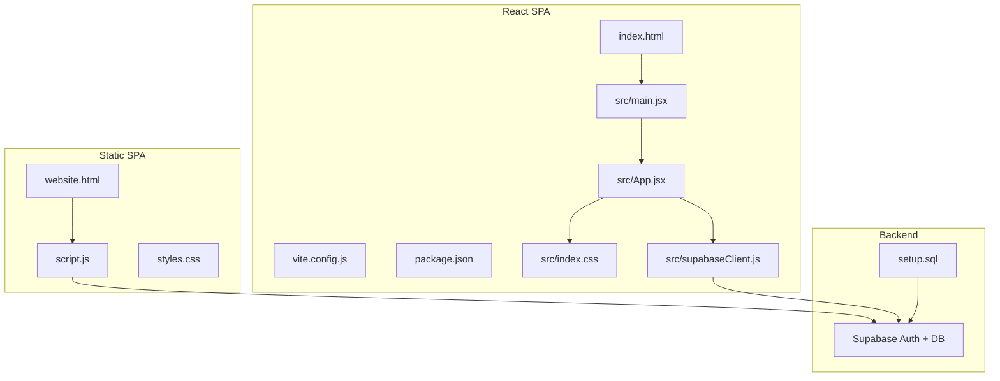
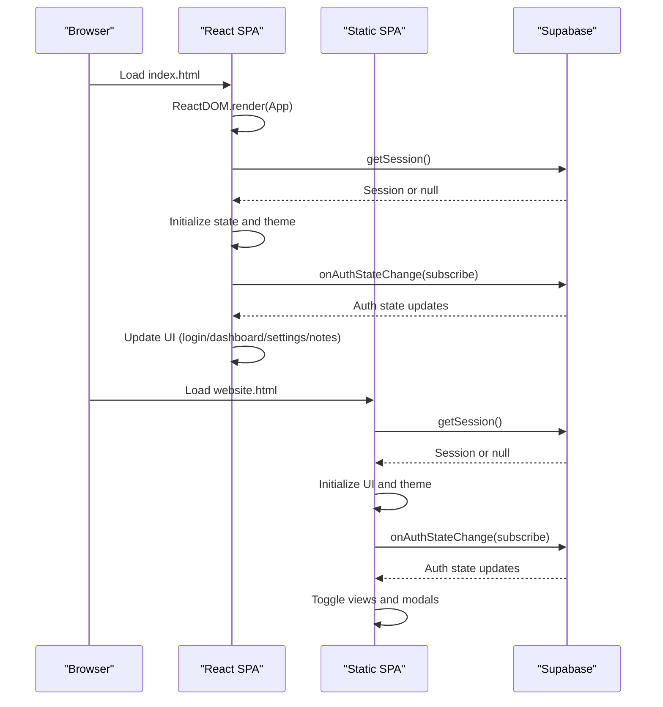
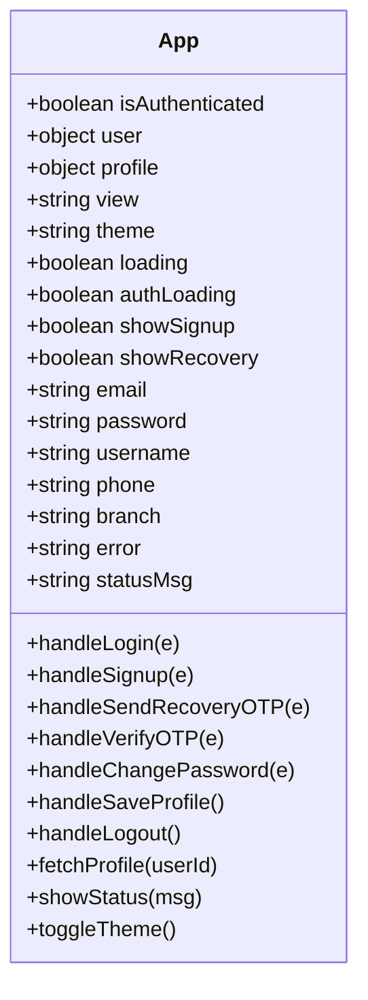
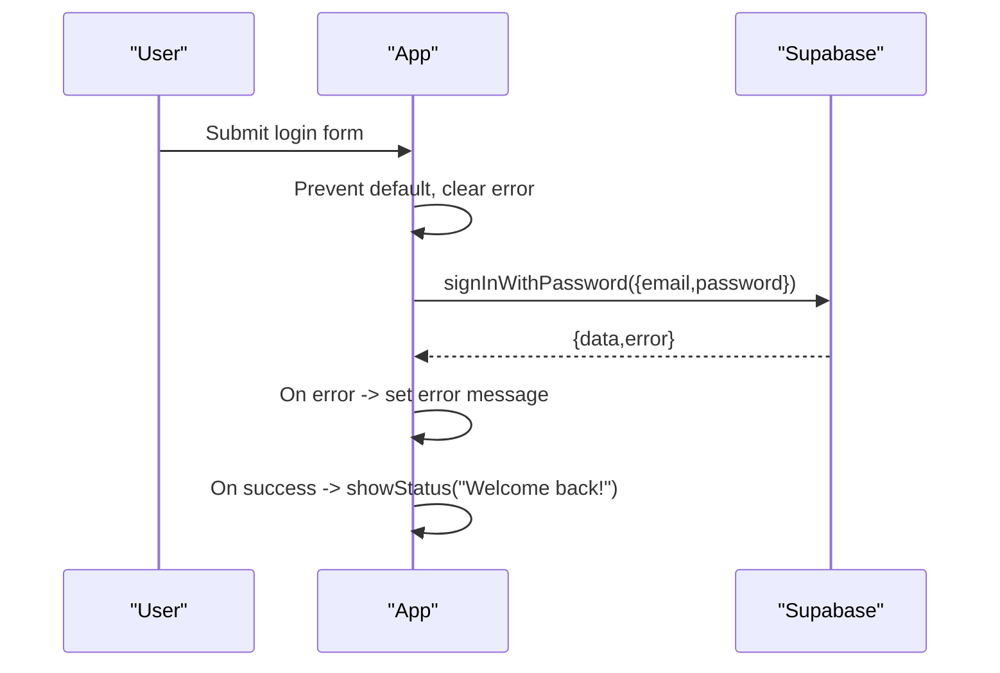
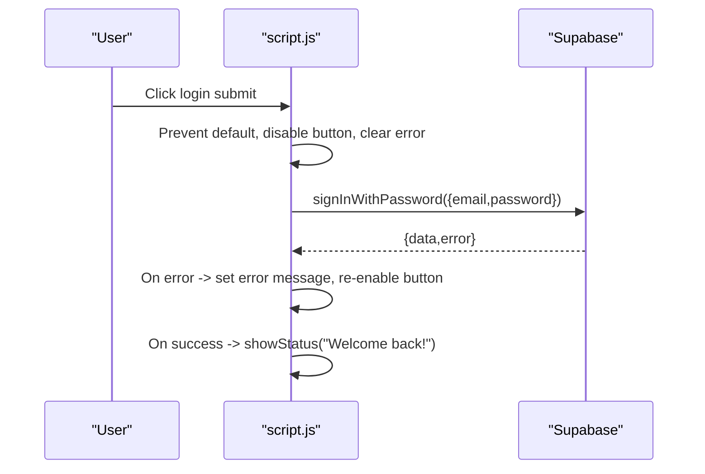
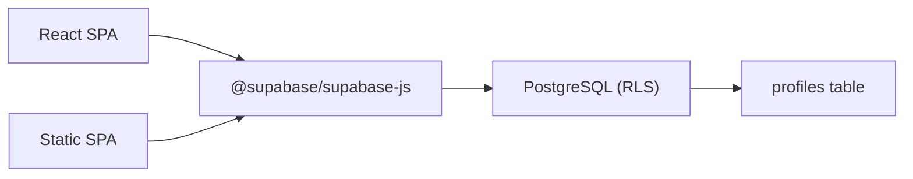

# Component Interaction Patterns

<cite>
**Referenced Files in This Document**
- [index.html](file://index.html)
- [vite.config.js](file://vite.config.js)
- [package.json](file://package.json)
- [src/main.jsx](file://src/main.jsx)
- [src/App.jsx](file://src/App.jsx)
- [src/supabaseClient.js](file://src/supabaseClient.js)
- [src/index.css](file://src/index.css)
- [website.html](file://website.html)
- [script.js](file://script.js)
- [styles.css](file://styles.css)
- [setup.sql](file://setup.sql)
</cite>

## Table of Contents
1. [Introduction](#introduction)
2. [Project Structure](#project-structure)
3. [Core Components](#core-components)
4. [Architecture Overview](#architecture-overview)
5. [Detailed Component Analysis](#detailed-component-analysis)
6. [Dependency Analysis](#dependency-analysis)
7. [Performance Considerations](#performance-considerations)
8. [Troubleshooting Guide](#troubleshooting-guide)
9. [Conclusion](#conclusion)

## Introduction
This document explains how two distinct implementations of the same application achieve identical functionality through different architectural approaches:
- React implementation: Component hierarchy, prop drilling patterns, state management with hooks, and event handling.
- Static implementation: DOM manipulation patterns, event delegation, modal management, and form processing.

Both implementations integrate with Supabase for authentication and profile storage, and share a theming system via CSS custom properties. The goal is to compare component interaction patterns, data binding, and user interface state management across both architectures, and to provide best practices for each.

## Project Structure
The project consists of:
- A React SPA bootstrapped with Vite and React, rendering into a root element.
- A static HTML page with embedded JavaScript that manipulates the DOM directly.
- Shared styling via CSS custom properties enabling dark/light themes.
- Supabase client configuration and a database schema for user profiles.

**Diagram sources**
- [index.html:1-16](file://index.html#L1-L16)
- [vite.config.js:1-8](file://vite.config.js#L1-L8)
- [package.json:1-22](file://package.json#L1-L22)
- [src/main.jsx:1-11](file://src/main.jsx#L1-L11)
- [src/App.jsx:1-621](file://src/App.jsx#L1-L621)
- [src/supabaseClient.js:1-11](file://src/supabaseClient.js#L1-L11)
- [src/index.css:1-1148](file://src/index.css#L1-L1148)
- [website.html:1-303](file://website.html#L1-L303)
- [script.js:1-660](file://script.js#L1-L660)
- [styles.css:1-1071](file://styles.css#L1-L1071)
- [setup.sql:1-26](file://setup.sql#L1-L26)

**Section sources**
- [index.html:1-16](file://index.html#L1-L16)
- [vite.config.js:1-8](file://vite.config.js#L1-L8)
- [package.json:1-22](file://package.json#L1-L22)
- [src/main.jsx:1-11](file://src/main.jsx#L1-L11)
- [src/App.jsx:1-621](file://src/App.jsx#L1-L621)
- [src/supabaseClient.js:1-11](file://src/supabaseClient.js#L1-L11)
- [src/index.css:1-1148](file://src/index.css#L1-L1148)
- [website.html:1-303](file://website.html#L1-L303)
- [script.js:1-660](file://script.js#L1-L660)
- [styles.css:1-1071](file://styles.css#L1-L1071)
- [setup.sql:1-26](file://setup.sql#L1-L26)

## Core Components
- React SPA
  - Root renderer mounts the App component into the DOM.
  - App manages global state (authentication, views, forms, theme) and orchestrates navigation and modals.
  - Supabase client encapsulated for auth and profile operations.
  - Theming controlled via CSS custom properties and persisted to localStorage.

- Static SPA
  - Single-page application built with vanilla JavaScript manipulating the DOM.
  - Uses a central elements map for DOM nodes and helper functions for UI updates.
  - Implements modal overlays and settings panels via dynamic HTML injection and event delegation.
  - Integrates with Supabase for authentication and profile synchronization.

Key shared concerns:
- Authentication state management and real-time updates.
- Profile CRUD operations and sync with Supabase.
- Theme switching and persistence.
- Navigation between dashboard, settings, and notes views.

**Section sources**
- [src/main.jsx:1-11](file://src/main.jsx#L1-L11)
- [src/App.jsx:1-621](file://src/App.jsx#L1-L621)
- [src/supabaseClient.js:1-11](file://src/supabaseClient.js#L1-L11)
- [website.html:1-303](file://website.html#L1-L303)
- [script.js:1-660](file://script.js#L1-L660)

## Architecture Overview
Both implementations share a similar functional flow:
- On load, check Supabase session and initialize UI state.
- On authentication state changes, update UI visibility and user data.
- Provide login/signup/recovery flows with OTP support.
- Allow editing profile and changing password.
- Manage theme preferences and persist to localStorage.

**Diagram sources**
- [src/main.jsx:1-11](file://src/main.jsx#L1-L11)
- [src/App.jsx:35-62](file://src/App.jsx#L35-L62)
- [website.html:1-303](file://website.html#L1-L303)
- [script.js:631-657](file://script.js#L631-L657)

## Detailed Component Analysis

### React Implementation

#### Component Hierarchy and Prop Drilling
- App is the root component managing:
  - Authentication state (isAuthenticated, user, loading).
  - UI state (view, theme, showSignup, showRecovery).
  - Form states (email, password, username, phone, branch, etc.).
  - Profile state (profile, editUsername, editPhone, editBranch, editEmail).
  - Error/status messages and loading flags.

Prop drilling is minimal because App holds all state and passes handlers and derived values to child UI blocks. There is no explicit prop drilling to deeply nested children; instead, App composes views inline and uses local state for modals and forms.

**Diagram sources**
- [src/App.jsx:5-621](file://src/App.jsx#L5-L621)

**Section sources**
- [src/App.jsx:5-621](file://src/App.jsx#L5-L621)

#### State Management with Hooks
- useState: Manages UI and form state, including authentication flags, view selection, and theme.
- useEffect: 
  - Initializes session and subscribes to auth state changes.
  - Synchronizes theme with localStorage and CSS variables.
  - Preloads profile data when view switches to settings.

Lifecycle implications:
- Mount: Check session, subscribe to auth changes, set theme.
- Unmount: Subscription cleanup prevents memory leaks.

**Section sources**
- [src/App.jsx:35-62](file://src/App.jsx#L35-L62)
- [src/App.jsx:64-76](file://src/App.jsx#L64-L76)

#### Event Handling
- Form submission handlers prevent default, validate inputs, and call Supabase APIs.
- Button click handlers toggle views and modals.
- Auth state change listener updates UI automatically.

Best practices:
- Disable submit buttons while loading to prevent duplicate submissions.
- Clear errors on navigation to avoid stale messages.
- Use derived values (e.g., editUsername from profile) to keep forms in sync.

**Section sources**
- [src/App.jsx:101-138](file://src/App.jsx#L101-L138)
- [src/App.jsx:180-236](file://src/App.jsx#L180-L236)
- [src/App.jsx:140-178](file://src/App.jsx#L140-L178)
- [src/App.jsx:276-299](file://src/App.jsx#L276-L299)
- [src/App.jsx:243-274](file://src/App.jsx#L243-L274)
- [src/App.jsx:238-241](file://src/App.jsx#L238-L241)

#### Data Binding and UI State Management
- Controlled inputs bind to state via onChange handlers.
- Conditional rendering switches between login, signup, recovery, dashboard, settings, and notes views.
- Status messages are shown temporarily and cleared after timeout.

**Section sources**
- [src/App.jsx:530-619](file://src/App.jsx#L530-L619)
- [src/App.jsx:442-456](file://src/App.jsx#L442-L456)
- [src/App.jsx:459-525](file://src/App.jsx#L459-L525)
- [src/App.jsx:96-99](file://src/App.jsx#L96-L99)

#### Interaction Flow: Login

**Diagram sources**
- [src/App.jsx:101-138](file://src/App.jsx#L101-L138)

### Static Implementation

#### DOM Manipulation Patterns and Event Delegation
- Centralized DOM node references stored in an elements map for reuse.
- Event listeners attached via bindEvents; uses delegation where applicable.
- Dynamic toggling of visibility for login, signup, recovery, dashboard, settings, and notes views.

Patterns:
- showView toggles display of containers and updates menu button text.
- showModal/hideModal manage overlay and modal body content.
- Inline event handlers on modal buttons to save profile and change password.

**Section sources**
- [script.js:11-43](file://script.js#L11-L43)
- [script.js:587-629](file://script.js#L587-L629)
- [script.js:403-425](file://script.js#L403-L425)
- [script.js:90-101](file://script.js#L90-L101)

#### Modal Management
- Modal overlay and content are managed via hidden class and aria attributes.
- Dynamic HTML is injected into modalBody; onOpen callback binds inner event handlers.
- Close actions either hide modal or navigate back to previous step.

**Section sources**
- [script.js:90-101](file://script.js#L90-L101)
- [script.js:333-388](file://script.js#L333-L388)

#### Form Processing
- Form handlers prevent default, collect values, validate, and call Supabase APIs.
- Error messages are displayed in dedicated spans; success messages are shown via status helper.
- After successful sign-up, profile is upserted into Supabase.

**Section sources**
- [script.js:165-191](file://script.js#L165-L191)
- [script.js:193-256](file://script.js#L193-L256)
- [script.js:273-324](file://script.js#L273-L324)
- [script.js:361-387](file://script.js#L361-L387)

#### Interaction Flow: Login

**Diagram sources**
- [script.js:165-191](file://script.js#L165-L191)

#### Theme Preferences
- Theme is applied to documentElement data attribute and persisted to localStorage.
- Toggle updates theme and refreshes settings panel UI.

**Section sources**
- [script.js:390-401](file://script.js#L390-L401)

## Dependency Analysis
- React SPA
  - Dependencies: React, ReactDOM, @supabase/supabase-js.
  - Build tool: Vite with React plugin.
  - Runtime: Root element renders App; App manages state and UI.

- Static SPA
  - Dependencies: Supabase client loaded via CDN in script.js.
  - Runtime: website.html loads script.js; script.js initializes UI and binds events.

- Backend
  - Supabase Auth + Profiles table with RLS policies.
  - Schema defines profile fields and row-level security.

**Diagram sources**
- [package.json:12-16](file://package.json#L12-L16)
- [src/supabaseClient.js:1-11](file://src/supabaseClient.js#L1-11)
- [script.js:1-9](file://script.js#L1-L9)
- [setup.sql:1-26](file://setup.sql#L1-L26)

**Section sources**
- [package.json:12-16](file://package.json#L12-L16)
- [src/supabaseClient.js:1-11](file://src/supabaseClient.js#L1-L11)
- [script.js:1-9](file://script.js#L1-L9)
- [setup.sql:1-26](file://setup.sql#L1-L26)

## Performance Considerations
- React SPA
  - Efficient re-renders through granular state slices (view, theme, forms).
  - Avoid unnecessary re-renders by keeping heavy computations out of render and memoizing callbacks.
  - Debounce or throttle frequent UI updates (e.g., status messages).

- Static SPA
  - Minimize DOM queries by caching element references in the elements map.
  - Batch DOM updates when possible to reduce layout thrashing.
  - Use requestAnimationFrame for animations and transitions.

[No sources needed since this section provides general guidance]

## Troubleshooting Guide
Common issues and remedies:
- Supabase keys missing
  - Symptom: Warning in console about missing anon key.
  - Fix: Provide VITE_SUPABASE_URL and VITE_SUPABASE_ANON_KEY in environment.
  - Section sources
    - [src/supabaseClient.js:6-8](file://src/supabaseClient.js#L6-L8)

- Stale UI after auth changes
  - Symptom: UI not reflecting logged-in state.
  - Fix: Ensure onAuthStateChange subscription is active and UI update logic runs.
  - Section sources
    - [src/App.jsx:48-61](file://src/App.jsx#L48-L61)
    - [script.js:654-656](file://script.js#L654-L656)

- Theme not persisting
  - Symptom: Theme resets on reload.
  - Fix: Verify localStorage key and CSS attribute application.
  - Section sources
    - [src/App.jsx:74-76](file://src/App.jsx#L74-L76)
    - [script.js:390-394](file://script.js#L390-L394)

- Modal not closing
  - Symptom: Overlay remains visible after action.
  - Fix: Ensure hideModal clears aria-hidden and innerHTML.
  - Section sources
    - [script.js:97-101](file://script.js#L97-L101)

- Profile not updating
  - Symptom: Changes not reflected in dashboard or settings.
  - Fix: Confirm upsert to profiles table and fetchProfile after update.
  - Section sources
    - [src/App.jsx:243-274](file://src/App.jsx#L243-L274)
    - [script.js:119-135](file://script.js#L119-L135)

## Conclusion
Both implementations demonstrate robust user authentication, profile management, and theming. The React implementation favors declarative state and component composition, while the static implementation emphasizes direct DOM manipulation and event delegation. Choose the React approach for larger applications requiring scalable state management and component reuse, and the static approach for lightweight SPAs where simplicity and minimal dependencies are prioritized. In both cases, ensure proper error handling, accessibility attributes, and responsive design.