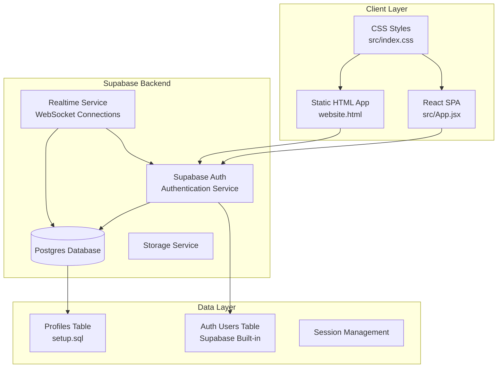
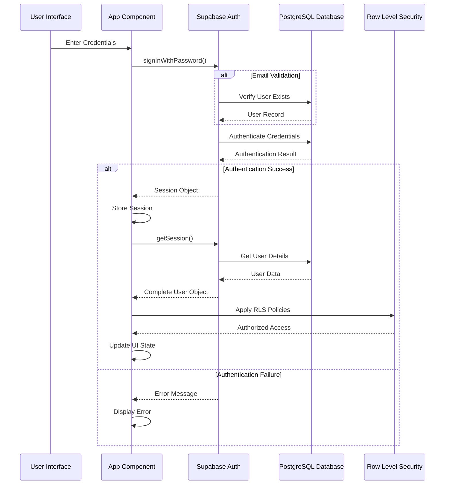
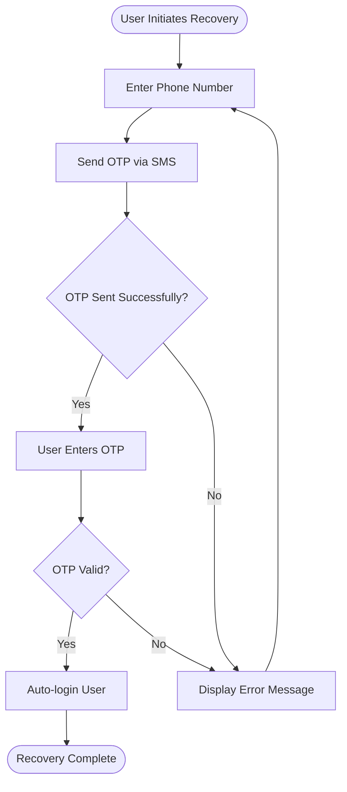
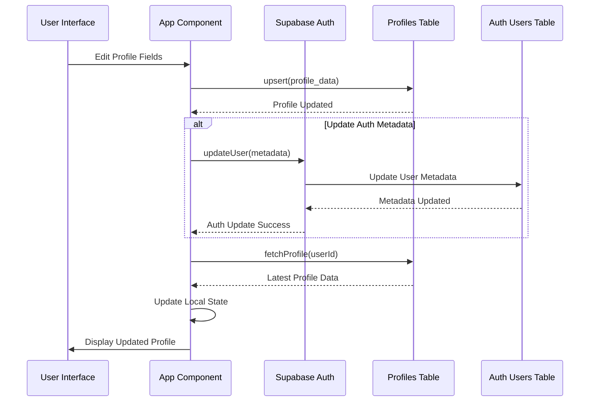
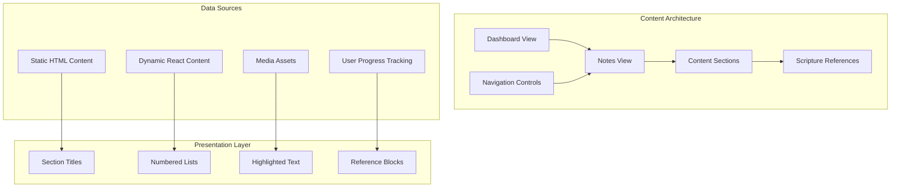
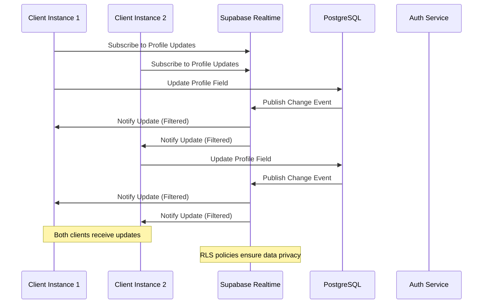
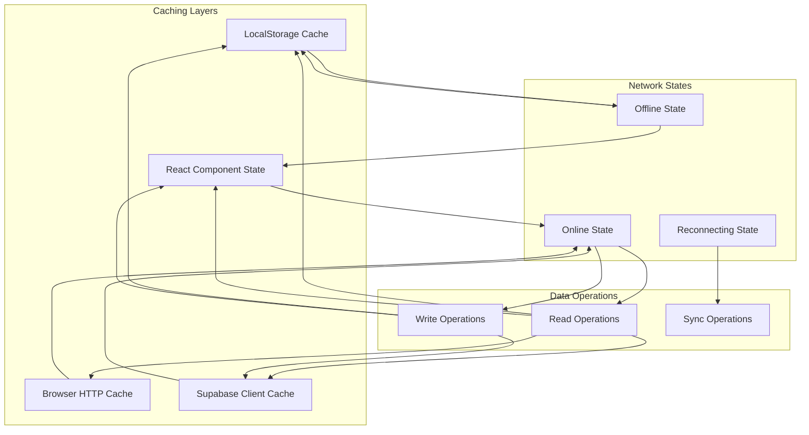
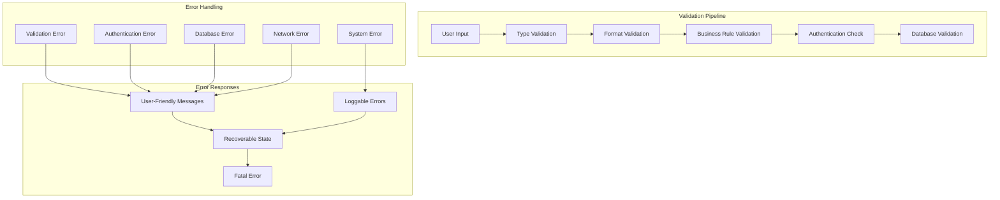
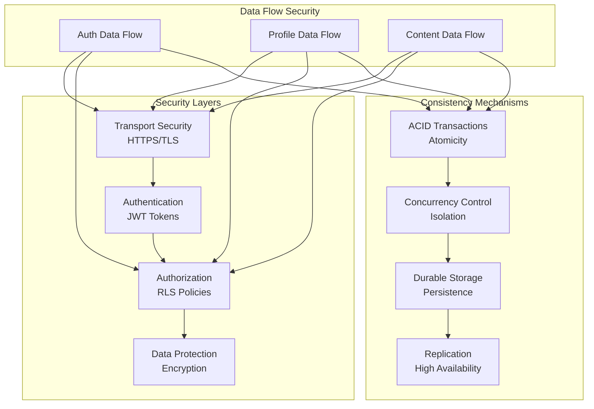

# Data Flow Architecture

<cite>
**Referenced Files in This Document**
- [src/App.jsx](file://src/App.jsx)
- [src/supabaseClient.js](file://src/supabaseClient.js)
- [src/main.jsx](file://src/main.jsx)
- [src/index.css](file://src/index.css)
- [script.js](file://script.js)
- [index.html](file://index.html)
- [website.html](file://website.html)
- [setup.sql](file://setup.sql)
- [package.json](file://package.json)
</cite>

## Table of Contents
1. [Introduction](#introduction)
2. [System Architecture Overview](#system-architecture-overview)
3. [Authentication Data Flow](#authentication-data-flow)
4. [Profile Management Data Flow](#profile-management-data-flow)
5. [Educational Content Delivery Flow](#educational-content-delivery-flow)
6. [Real-time Synchronization](#real-time-synchronization)
7. [Caching and Offline Behavior](#caching-and-offline-behavior)
8. [Data Validation and Error Handling](#data-validation-and-error-handling)
9. [Security and Data Consistency](#security-and-data-consistency)
10. [Performance Considerations](#performance-considerations)
11. [Troubleshooting Guide](#troubleshooting-guide)
12. [Conclusion](#conclusion)

## Introduction

The HMC WEBSITE system is a modern web application built with React and Supabase that provides secure authentication, user profile management, and educational content delivery for the HMCI Waterburg community. The system follows a client-side architecture pattern where user data flows through Supabase Auth and Postgres database services, with real-time synchronization capabilities and robust error handling mechanisms.

The application serves two primary user interfaces: a React-based SPA (Single Page Application) and a traditional HTML/CSS/JavaScript implementation, both leveraging the same Supabase backend infrastructure. This dual-interface approach demonstrates the flexibility of the underlying data flow architecture while maintaining consistent user experience across different deployment scenarios.

## System Architecture Overview

The HMC WEBSITE system follows a client-server architecture with Supabase as the central data management layer. The system consists of three main components:



**Diagram sources**
- [src/App.jsx:1-621](file://src/App.jsx#L1-L621)
- [src/supabaseClient.js:1-11](file://src/supabaseClient.js#L1-L11)
- [setup.sql:1-26](file://setup.sql#L1-L26)

The architecture implements a separation of concerns where:
- **Client Applications**: Two distinct frontends (React SPA and static HTML) consume the same backend services
- **Authentication Service**: Centralized user authentication and session management
- **Data Persistence**: PostgreSQL database with Row Level Security policies
- **Real-time Features**: WebSocket connections for live updates
- **Storage**: File storage capabilities for user uploads

**Section sources**
- [src/App.jsx:1-621](file://src/App.jsx#L1-L621)
- [src/supabaseClient.js:1-11](file://src/supabaseClient.js#L1-L11)
- [setup.sql:1-26](file://setup.sql#L1-L26)

## Authentication Data Flow

The authentication system implements a comprehensive flow that handles user registration, login, password recovery, and session management through Supabase Auth.



**Diagram sources**
- [src/App.jsx:101-138](file://src/App.jsx#L101-L138)
- [src/App.jsx:35-62](file://src/App.jsx#L35-L62)

The authentication flow includes several key validation steps:

### Login Process Flow
1. **Credential Processing**: The system accepts either email or username for login
2. **Username Resolution**: If username is provided, the system resolves it to an email address
3. **Authentication Request**: Supabase Auth validates credentials against stored hashes
4. **Session Establishment**: Successful authentication creates a secure session
5. **Profile Loading**: The system loads user profile data from the profiles table

### Password Recovery Flow


**Diagram sources**
- [src/App.jsx:140-178](file://src/App.jsx#L140-L178)

**Section sources**
- [src/App.jsx:101-138](file://src/App.jsx#L101-L138)
- [src/App.jsx:140-178](file://src/App.jsx#L140-L178)
- [src/App.jsx:35-62](file://src/App.jsx#L35-L62)

## Profile Management Data Flow

The profile management system implements a dual-write pattern that maintains consistency between Supabase Auth metadata and the custom profiles table.



**Diagram sources**
- [src/App.jsx:243-274](file://src/App.jsx#L243-L274)
- [src/App.jsx:82-94](file://src/App.jsx#L82-L94)

### Profile CRUD Operations

The system implements comprehensive CRUD operations for profile management:

**Create Operation** (During Registration):
- Supabase Auth creates user record
- Custom profiles table receives upsert with default values
- Initial profile fields include username, email, phone, location, status, and security level

**Read Operation**:
- Single query fetches complete profile information
- Profile data is cached locally in React state
- Real-time subscriptions provide live updates

**Update Operation**:
- Dual-write pattern ensures consistency between Auth and Profiles
- Profile table updates for persistent storage
- Auth metadata updates for user identification
- Local state refresh triggers UI updates

**Delete Operation**:
- Cascading delete from profiles table when user is deleted
- Automatic cleanup of associated data

### Data Synchronization Patterns

```mermaid
flowchart LR
subgraph "Local State"
LocalProfile[Local Profile State]
LocalAuth[Local Auth State]
end
subgraph "Supabase Services"
ProfilesTable[Profiles Table]
AuthUsers[Auth Users Table]
Realtime[Realtime Subscriptions]
end
subgraph "External Systems"
Webhooks[Webhook Triggers]
Policies[RLS Policies]
end
LocalProfile <- --> ProfilesTable
LocalAuth <- --> AuthUsers
ProfilesTable --> Realtime
AuthUsers --> Realtime
ProfilesTable --> Policies
AuthUsers --> Policies
Realtime --> Webhooks
```

**Diagram sources**
- [src/App.jsx:243-274](file://src/App.jsx#L243-L274)
- [setup.sql:14-26](file://setup.sql#L14-L26)

**Section sources**
- [src/App.jsx:243-274](file://src/App.jsx#L243-L274)
- [src/App.jsx:82-94](file://src/App.jsx#L82-L94)
- [setup.sql:1-26](file://setup.sql#L1-L26)

## Educational Content Delivery Flow

The educational content system delivers structured learning materials through a hierarchical presentation model that separates navigation from content rendering.



**Diagram sources**
- [src/App.jsx:326-441](file://src/App.jsx#L326-L441)
- [website.html:164-288](file://website.html#L164-L288)

### Content Delivery Mechanisms

**Static Content Delivery**:
- Pre-rendered HTML content for junior youth notes
- Embedded scripture references with proper formatting
- Structured content sections with numbered organization
- Responsive design for mobile and desktop access

**Dynamic Content Delivery**:
- React-based content management for interactive features
- Real-time content updates through Supabase subscriptions
- User-specific content personalization
- Progressive enhancement of basic HTML content

**Content Organization**:
- Hierarchical numbering system (sections 1-8)
- Scripture reference integration with biblical citations
- Structured learning progression from foundational to advanced topics
- Cross-references between related concepts

**Section sources**
- [src/App.jsx:326-441](file://src/App.jsx#L326-L441)
- [website.html:164-288](file://website.html#L164-L288)

## Real-time Synchronization

The system implements real-time synchronization through Supabase's real-time capabilities, enabling live updates across multiple client instances and maintaining data consistency.



**Diagram sources**
- [src/App.jsx:48-59](file://src/App.jsx#L48-L59)

### Real-time Implementation Details

**Auth State Monitoring**:
- Continuous monitoring of authentication state changes
- Automatic profile loading when user authenticates
- Session cleanup and UI state reset on logout
- Real-time subscription management for optimal performance

**Subscription Management**:
- Efficient subscription lifecycle management
- Automatic cleanup of unused subscriptions
- Error handling for connection failures
- Reconnection strategies for network interruptions

**Data Filtering**:
- Row Level Security (RLS) policies ensure data privacy
- Client-side filtering prevents unauthorized data access
- Real-time events are filtered based on user permissions
- Subscription scopes are dynamically adjusted based on user roles

**Section sources**
- [src/App.jsx:48-59](file://src/App.jsx#L48-L59)

## Caching and Offline Behavior

The system implements a multi-layered caching strategy that balances performance with data consistency, providing graceful degradation when network connectivity is limited.



### Cache Strategy Implementation

**Local Storage Persistence**:
- Theme preferences stored for immediate UI restoration
- User session data maintained across browser restarts
- Form state preservation during navigation
- Critical user preferences persisted for offline access

**Component State Caching**:
- React state manages UI state and user interface data
- Optimistic updates for immediate user feedback
- Rollback mechanisms for failed operations
- State synchronization with backend data

**Supabase Client Caching**:
- Automatic query result caching for repeated requests
- Smart cache invalidation on data changes
- Background cache warming for improved performance
- Cache expiration and refresh strategies

**Offline Capability Features**:
- Graceful degradation when network is unavailable
- Local operation mode with eventual consistency
- Conflict resolution for concurrent modifications
- Automatic synchronization when connectivity is restored

**Section sources**
- [src/App.jsx:14](file://src/App.jsx#L14)
- [src/App.jsx:73-76](file://src/App.jsx#L73-L76)

## Data Validation and Error Handling

The system implements comprehensive validation and error handling mechanisms to ensure data integrity and provide meaningful feedback to users.



### Validation Strategies

**Input Validation**:
- Client-side validation for immediate feedback
- Server-side validation for data integrity
- Format validation for email, phone, and other field types
- Business rule validation for application-specific constraints

**Authentication Validation**:
- Credential verification against stored hashes
- Session validation for active user sessions
- Rate limiting for authentication attempts
- Account status validation (active/inactive)

**Database Validation**:
- Unique constraint enforcement (username, email)
- Foreign key constraint validation
- Data type and length validation
- Row Level Security policy compliance

### Error Handling Patterns

**Error Propagation**:
- Specific error messages for user feedback
- Generic error messages for security reasons
- Logging of detailed errors for debugging
- User-friendly error surfaces for common issues

**Recovery Strategies**:
- Automatic retry for transient network errors
- Graceful degradation for service unavailability
- Rollback mechanisms for failed transactions
- User session recovery after authentication issues

**Section sources**
- [src/App.jsx:180-236](file://src/App.jsx#L180-L236)
- [src/App.jsx:101-138](file://src/App.jsx#L101-L138)

## Security and Data Consistency

The system implements multiple layers of security and consistency mechanisms to protect user data and maintain system integrity.



### Security Implementation

**Authentication Security**:
- Secure JWT token management
- Session timeout and renewal mechanisms
- Multi-factor authentication support
- Secure credential storage and transmission

**Data Protection**:
- HTTPS encryption for all communications
- Database encryption for sensitive data
- Input sanitization and XSS prevention
- CSRF protection for form submissions

**Authorization Controls**:
- Row Level Security policies prevent unauthorized access
- Role-based access control for administrative functions
- Permission-based access to sensitive operations
- Audit logging for security-relevant events

### Data Consistency Guarantees

**Transaction Management**:
- Atomic operations for profile updates
- Consistent state across Auth and database
- Isolation between concurrent operations
- Durability of committed changes

**Conflict Resolution**:
- Last-write-wins strategy for profile updates
- Manual conflict resolution for critical data
- Version-based concurrency control
- Operational transforms for collaborative editing

**Backup and Recovery**:
- Automated database backups
- Point-in-time recovery capabilities
- Disaster recovery procedures
- Data migration and upgrade procedures

**Section sources**
- [setup.sql:14-26](file://setup.sql#L14-L26)
- [src/App.jsx:243-274](file://src/App.jsx#L243-L274)

## Performance Considerations

The system is designed with performance optimization as a core consideration, implementing various strategies to ensure responsive user experiences and efficient resource utilization.

### Frontend Performance

**Bundle Optimization**:
- Tree shaking for unused code elimination
- Dynamic imports for route-based loading
- Code splitting for improved initial load times
- Asset optimization and compression

**Rendering Optimization**:
- React.memo for component memoization
- useCallback and useMemo hooks for stable references
- Virtual scrolling for large datasets
- Lazy loading for images and content

**State Management**:
- Efficient state updates to minimize re-renders
- Local state caching for frequently accessed data
- Debounced input handling for search and filters
- Optimistic UI updates for perceived performance

### Backend Performance

**Database Optimization**:
- Indexing strategies for frequently queried fields
- Query optimization for profile and auth operations
- Connection pooling for database efficiency
- Caching strategies for hot data

**API Performance**:
- Supabase client-side caching for reduced network calls
- Batch operations for multiple data updates
- Efficient query patterns to minimize database load
- CDN integration for static asset delivery

### Network Performance

**Connection Management**:
- WebSocket connection reuse for real-time features
- Efficient polling intervals for background sync
- Compression for reduced bandwidth usage
- Connection health monitoring and automatic recovery

**Resource Optimization**:
- Image optimization and lazy loading
- CSS and JavaScript minification
- Asset bundling and versioning
- CDN distribution for global accessibility

## Troubleshooting Guide

This section provides guidance for diagnosing and resolving common issues that may arise in the HMC WEBSITE system.

### Authentication Issues

**Common Problems**:
- Login failures due to incorrect credentials
- Email confirmation not received
- Password reset not working
- Session expiration and re-authentication

**Diagnostic Steps**:
1. Verify Supabase credentials and service availability
2. Check browser console for authentication errors
3. Validate email delivery service configuration
4. Test network connectivity to Supabase endpoints

**Resolution Strategies**:
- Clear browser cache and cookies
- Reset password through official recovery process
- Verify email address and spam folder
- Check account status and verification requirements

### Profile Management Issues

**Common Problems**:
- Profile updates not persisting
- Duplicate username or email errors
- Real-time updates not appearing
- Session data inconsistencies

**Diagnostic Steps**:
1. Check database connection and permissions
2. Verify Row Level Security policy compliance
3. Monitor real-time subscription status
4. Validate client-side state synchronization

**Resolution Strategies**:
- Implement proper error handling for database operations
- Add retry logic for transient database errors
- Ensure proper subscription cleanup and recreation
- Validate data consistency between Auth and database

### Content Delivery Issues

**Common Problems**:
- Educational content not loading
- Scriptural references not displaying correctly
- Mobile responsiveness issues
- Performance problems with large content

**Diagnostic Steps**:
1. Verify content file paths and accessibility
2. Check CSS media queries and responsive breakpoints
3. Test content loading across different browsers
4. Monitor network performance and asset delivery

**Resolution Strategies**:
- Implement proper content fallback mechanisms
- Optimize CSS for mobile-first responsive design
- Add lazy loading for large content blocks
- Implement caching strategies for improved performance

### Real-time Synchronization Issues

**Common Problems**:
- Real-time updates not received
- Connection drops and reconnections
- Data conflicts between multiple clients
- Subscription management errors

**Diagnostic Steps**:
1. Monitor WebSocket connection status
2. Check network connectivity and firewall settings
3. Verify Supabase service availability
4. Test subscription filtering and permissions

**Resolution Strategies**:
- Implement exponential backoff for reconnection attempts
- Add proper error handling for connection failures
- Implement conflict resolution strategies
- Monitor and log real-time event processing

**Section sources**
- [src/App.jsx:101-138](file://src/App.jsx#L101-L138)
- [src/App.jsx:243-274](file://src/App.jsx#L243-L274)

## Conclusion

The HMC WEBSITE system demonstrates a robust and scalable architecture for managing user authentication, profile data, and educational content delivery. The implementation leverages Supabase's comprehensive backend-as-a-service capabilities while maintaining flexibility for both modern React applications and traditional HTML implementations.

Key architectural strengths include:

**Data Flow Excellence**: The system implements clear, consistent data flow patterns that ensure reliability and maintainability across all user interactions.

**Security by Design**: Comprehensive security measures including Row Level Security, encrypted communications, and proper authentication controls protect user data and system integrity.

**Real-time Capabilities**: Supabase's real-time features enable live updates and synchronized experiences across multiple client instances.

**Performance Optimization**: Multi-layered caching, efficient state management, and optimized database operations ensure responsive user experiences.

**Scalability Foundation**: The architecture supports growth through Supabase's managed infrastructure and flexible deployment options.

The system serves as an excellent example of modern web application architecture, demonstrating how client-side frameworks can integrate seamlessly with backend services to deliver comprehensive user experiences while maintaining data integrity and security.