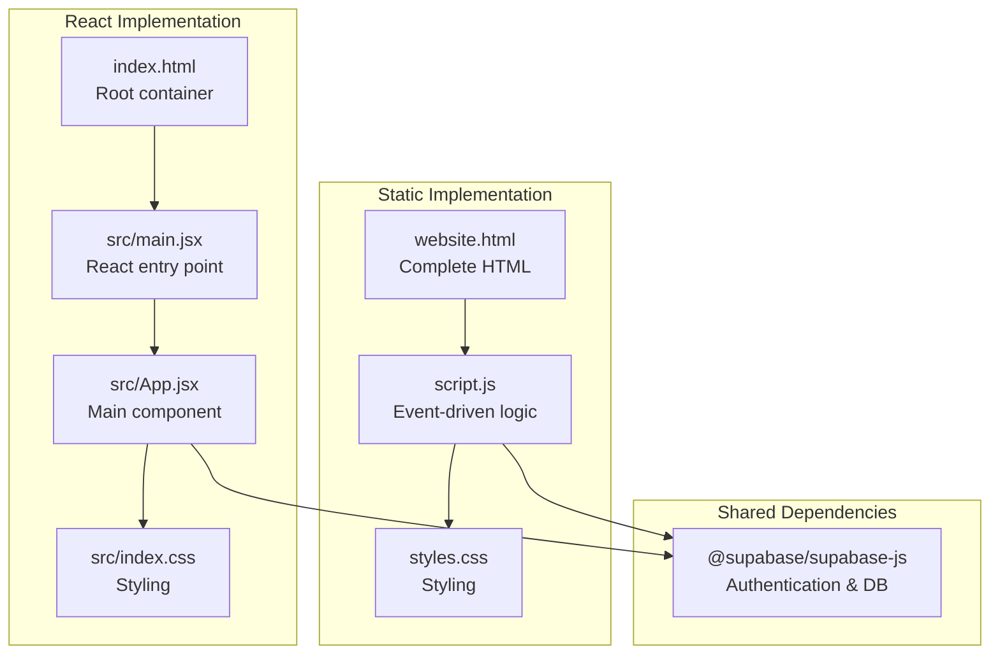
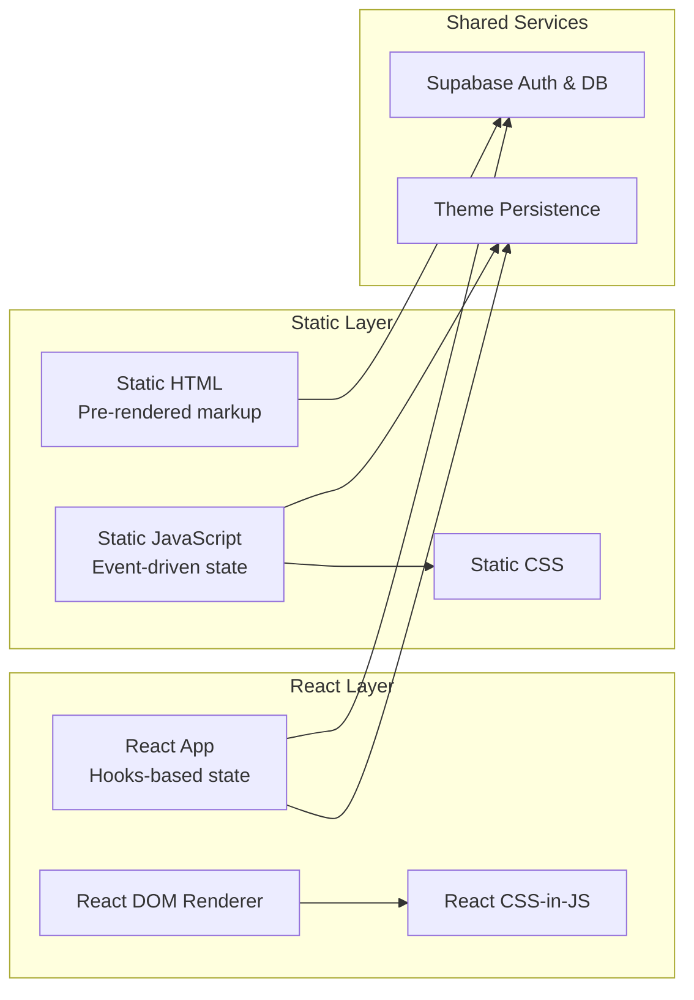
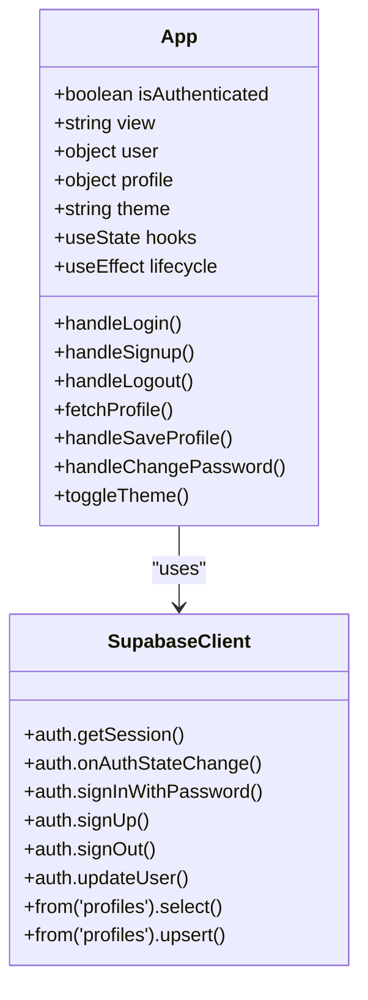
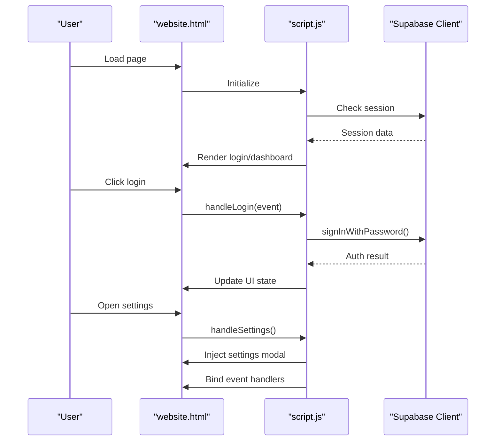
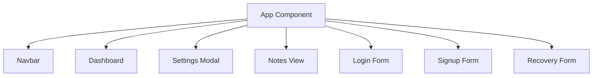
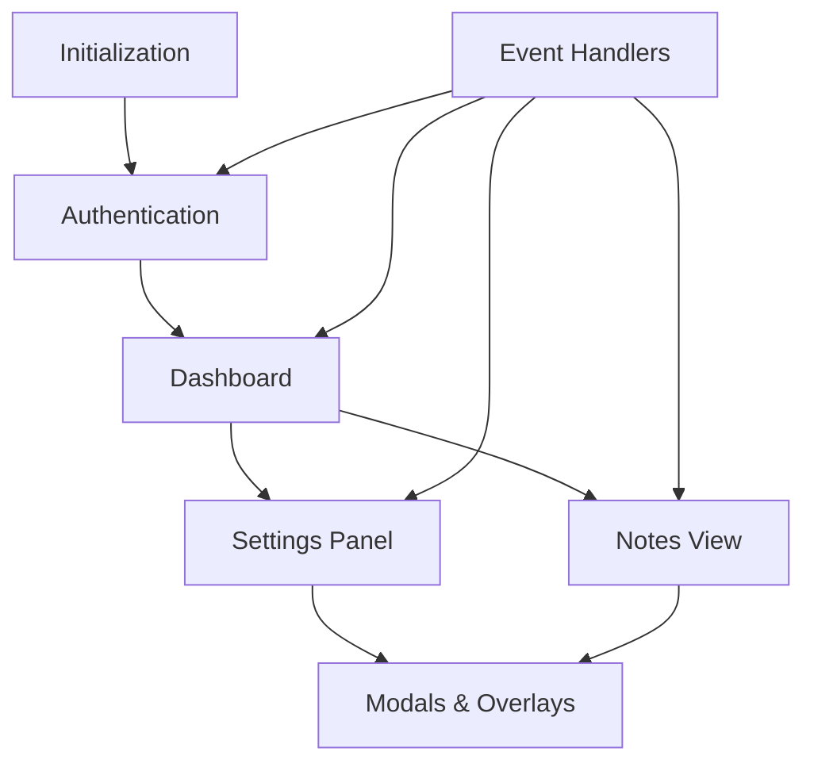
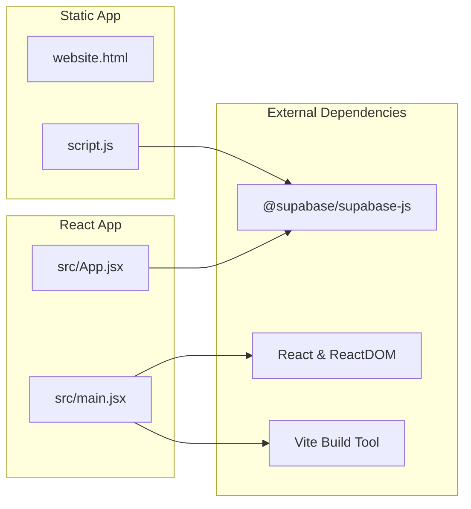

# Dual Implementation Design

<cite>
**Referenced Files in This Document**
- [src/App.jsx](file://src/App.jsx)
- [src/main.jsx](file://src/main.jsx)
- [src/index.css](file://src/index.css)
- [script.js](file://script.js)
- [website.html](file://website.html)
- [index.html](file://index.html)
- [styles.css](file://styles.css)
- [package.json](file://package.json)
</cite>

## Table of Contents
1. [Introduction](#introduction)
2. [Project Structure](#project-structure)
3. [Core Components](#core-components)
4. [Architecture Overview](#architecture-overview)
5. [Detailed Component Analysis](#detailed-component-analysis)
6. [Dependency Analysis](#dependency-analysis)
7. [Performance Considerations](#performance-considerations)
8. [Troubleshooting Guide](#troubleshooting-guide)
9. [Conclusion](#conclusion)

## Introduction
This document explains the dual implementation architecture design that delivers identical functionality using two distinct approaches:
- React-based implementation with hooks-based state management
- Static HTML/CSS/JavaScript implementation with event-driven programming

Both implementations share the same authentication, user profile management, and notes viewing functionality while differing in architectural patterns, development complexity, and runtime behavior.

## Project Structure
The project is organized to support both implementations simultaneously:

**Diagram sources**
- [index.html:11-14](file://index.html#L11-L14)
- [src/main.jsx:6-10](file://src/main.jsx#L6-L10)
- [src/App.jsx:1-621](file://src/App.jsx#L1-L621)
- [src/index.css:1-800](file://src/index.css#L1-L800)
- [website.html:1-303](file://website.html#L1-L303)
- [script.js:1-660](file://script.js#L1-L660)
- [styles.css:1-800](file://styles.css#L1-L800)

**Section sources**
- [index.html:1-16](file://index.html#L1-L16)
- [src/main.jsx:1-11](file://src/main.jsx#L1-L11)
- [src/App.jsx:1-621](file://src/App.jsx#L1-L621)
- [website.html:1-303](file://website.html#L1-L303)
- [script.js:1-660](file://script.js#L1-L660)
- [styles.css:1-800](file://styles.css#L1-L800)

## Core Components
Both implementations provide the same feature set:
- Authentication: login, sign up, password recovery via OTP
- User dashboard with profile information display
- Settings panel for editing personal information and changing passwords
- Theme switching (dark/light mode)
- Notes viewing interface for junior youth materials

Key differences:
- React implementation uses hooks for state management and declarative rendering
- Static implementation uses DOM manipulation and event handlers for state updates

**Section sources**
- [src/App.jsx:5-621](file://src/App.jsx#L5-L621)
- [script.js:105-161](file://script.js#L105-L161)
- [script.js:165-329](file://script.js#L165-L329)
- [script.js:427-571](file://script.js#L427-L571)

## Architecture Overview
The dual architecture ensures functional parity while leveraging different paradigms:

**Diagram sources**
- [src/App.jsx:6-76](file://src/App.jsx#L6-L76)
- [script.js:45-46](file://script.js#L45-L46)
- [script.js:390-401](file://script.js#L390-L401)

## Detailed Component Analysis

### React Implementation Architecture
The React implementation centers around a single App component managing all state and rendering logic:

**Diagram sources**
- [src/App.jsx:5-621](file://src/App.jsx#L5-L621)
- [src/App.jsx:35-62](file://src/App.jsx#L35-L62)
- [src/App.jsx:101-138](file://src/App.jsx#L101-L138)
- [src/App.jsx:180-236](file://src/App.jsx#L180-L236)
- [src/App.jsx:238-241](file://src/App.jsx#L238-L241)
- [src/App.jsx:82-94](file://src/App.jsx#L82-L94)
- [src/App.jsx:243-274](file://src/App.jsx#L243-L274)
- [src/App.jsx:276-299](file://src/App.jsx#L276-L299)
- [src/App.jsx:78-80](file://src/App.jsx#L78-L80)

Key architectural patterns:
- Hooks-based state management for form inputs, authentication state, and UI state
- Effect hooks for initialization and auth state listening
- Declarative rendering with conditional JSX based on state
- Centralized Supabase client integration

**Section sources**
- [src/App.jsx:1-621](file://src/App.jsx#L1-L621)
- [src/main.jsx:1-11](file://src/main.jsx#L1-L11)

### Static Implementation Architecture
The static implementation uses a modular JavaScript approach with explicit DOM manipulation:

**Diagram sources**
- [website.html:25-101](file://website.html#L25-L101)
- [script.js:631-659](file://script.js#L631-L659)
- [script.js:165-191](file://script.js#L165-L191)
- [script.js:427-435](file://script.js#L427-L435)

Key architectural patterns:
- Event-driven programming with explicit DOM manipulation
- Modular functions for each feature area
- Manual element binding and unbinding
- Inline HTML injection for dynamic modals

**Section sources**
- [website.html:1-303](file://website.html#L1-L303)
- [script.js:1-660](file://script.js#L1-L660)

### Component Hierarchy Comparison

#### React Component Hierarchy

**Diagram sources**
- [src/App.jsx:305-528](file://src/App.jsx#L305-L528)
- [src/App.jsx:530-619](file://src/App.jsx#L530-L619)

#### Static Implementation Hierarchy

**Diagram sources**
- [script.js:631-659](file://script.js#L631-L659)
- [script.js:587-629](file://script.js#L587-L629)

## Dependency Analysis
Both implementations share the same external dependencies and service integrations:

**Diagram sources**
- [package.json:12-21](file://package.json#L12-L21)
- [src/App.jsx:1-3](file://src/App.jsx#L1-L3)
- [script.js:1](file://script.js#L1)

**Section sources**
- [package.json:1-22](file://package.json#L1-L22)
- [src/App.jsx:1-6](file://src/App.jsx#L1-L6)
- [script.js:1](file://script.js#L1)

## Performance Considerations
Both implementations leverage Supabase for authentication and database operations, ensuring consistent performance characteristics for network-bound operations.

### React Implementation Advantages:
- Virtual DOM minimizes unnecessary DOM updates
- Efficient re-rendering based on state changes
- Optimized component lifecycle management
- Better memory management through React's reconciliation

### Static Implementation Advantages:
- Minimal runtime overhead
- Direct DOM manipulation reduces abstraction layers
- Lower bundle size for pure HTML/CSS/JS
- Faster initial load in constrained environments

### Shared Performance Factors:
- Supabase client initialization occurs once per page load
- Theme preference persistence via localStorage
- Debounced status message display to prevent UI flicker

## Troubleshooting Guide

### Common Issues and Resolutions

#### Authentication Problems
- **Issue**: Login fails with "Invalid login credentials"
- **Resolution**: Verify email format and password requirements
- **React Path**: [src/App.jsx:128-134](file://src/App.jsx#L128-L134)
- **Static Path**: [script.js:180-187](file://script.js#L180-L187)

#### Password Recovery Issues
- **Issue**: OTP verification fails
- **Resolution**: Check phone number format and OTP validity
- **React Path**: [src/App.jsx:164-178](file://src/App.jsx#L164-L178)
- **Static Path**: [script.js:310-324](file://script.js#L310-L324)

#### Profile Update Failures
- **Issue**: Profile changes not persisting
- **Resolution**: Verify Supabase permissions and network connectivity
- **React Path**: [src/App.jsx:247-274](file://src/App.jsx#L247-L274)
- **Static Path**: [script.js:514-548](file://script.js#L514-L548)

#### Theme Switching Problems
- **Issue**: Theme preference not saved
- **Resolution**: Check localStorage availability and browser settings
- **React Path**: [src/App.jsx:74-76](file://src/App.jsx#L74-L76)
- **Static Path**: [script.js:390-394](file://script.js#L390-L394)

**Section sources**
- [src/App.jsx:101-138](file://src/App.jsx#L101-L138)
- [script.js:165-191](file://script.js#L165-L191)
- [src/App.jsx:243-274](file://src/App.jsx#L243-L274)
- [script.js:514-548](file://script.js#L514-L548)
- [src/App.jsx:74-76](file://src/App.jsx#L74-L76)
- [script.js:390-394](file://script.js#L390-L394)

## Conclusion
The dual implementation architecture demonstrates how identical functionality can be achieved through contrasting architectural approaches:

### Architectural Trade-offs:
- **React Approach**: Higher development complexity with benefits of component composition, state management, and declarative UI
- **Static Approach**: Lower development complexity with direct DOM manipulation and minimal runtime dependencies

### Maintenance Considerations:
- Both implementations integrate with the same Supabase backend, ensuring consistent data management
- Theme preferences and user state are managed consistently across both approaches
- Feature parity requires careful synchronization of UI states and user interactions

### Recommendations:
- Choose React for applications requiring complex state management and component reuse
- Choose Static for lightweight implementations where simplicity and performance are priorities
- Maintain both implementations in parallel to leverage the strengths of each approach