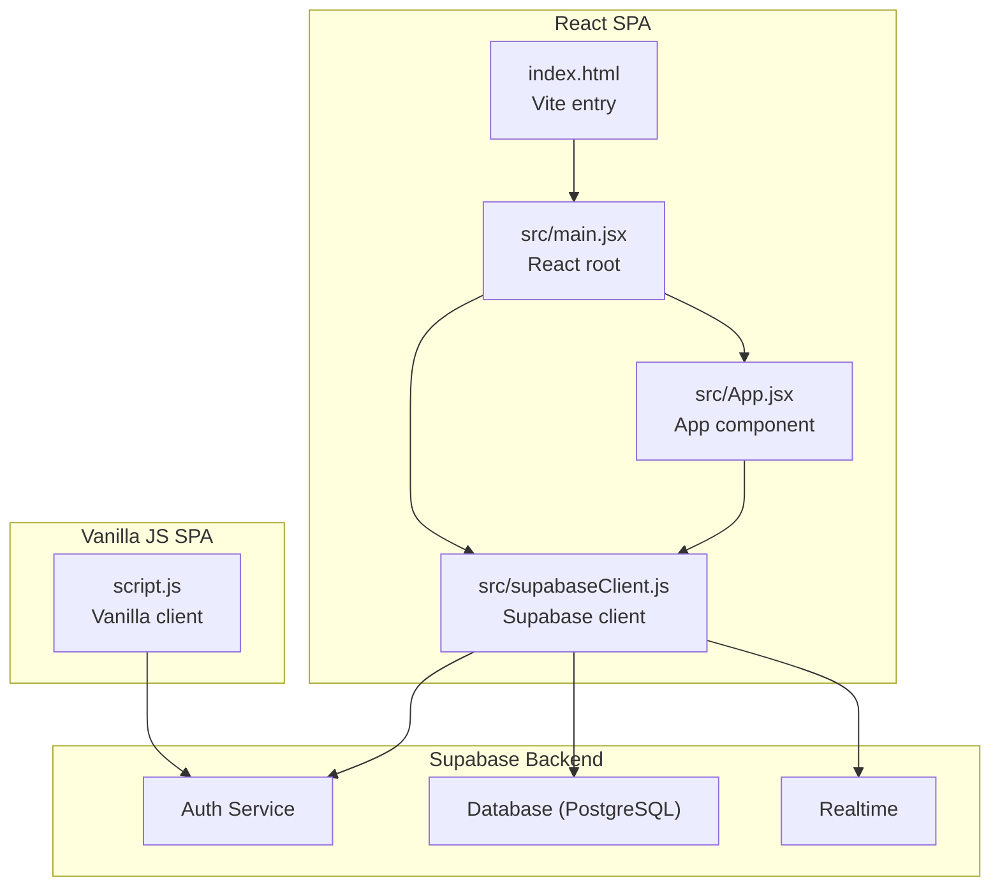
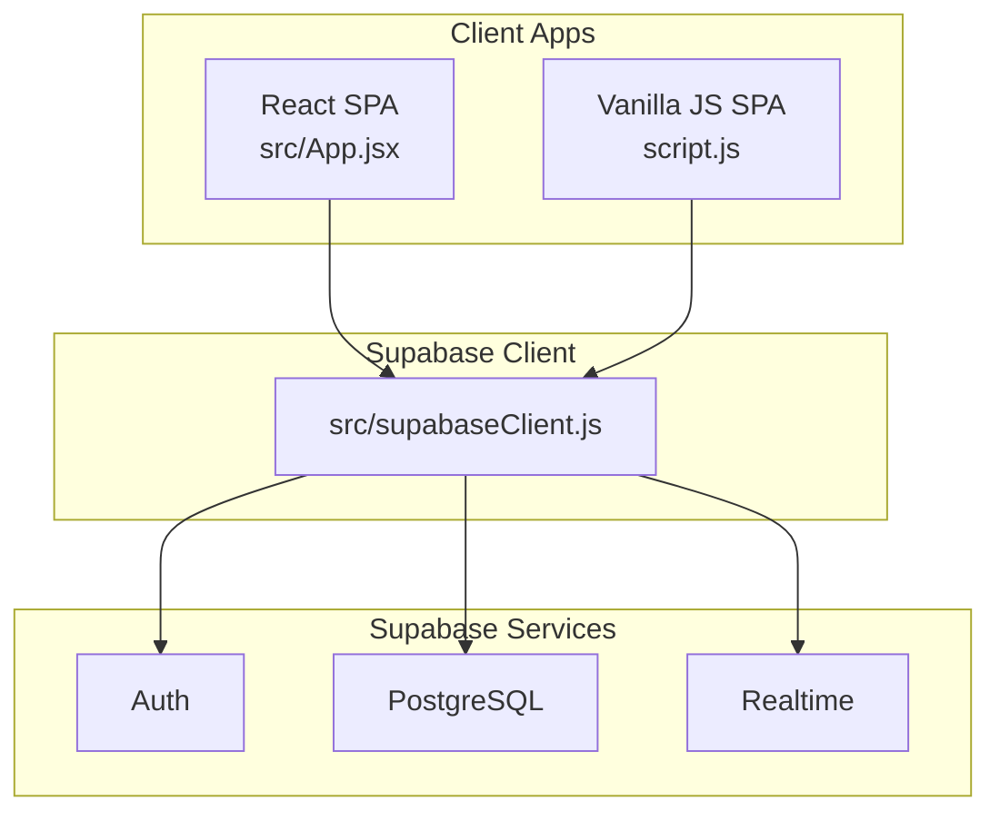
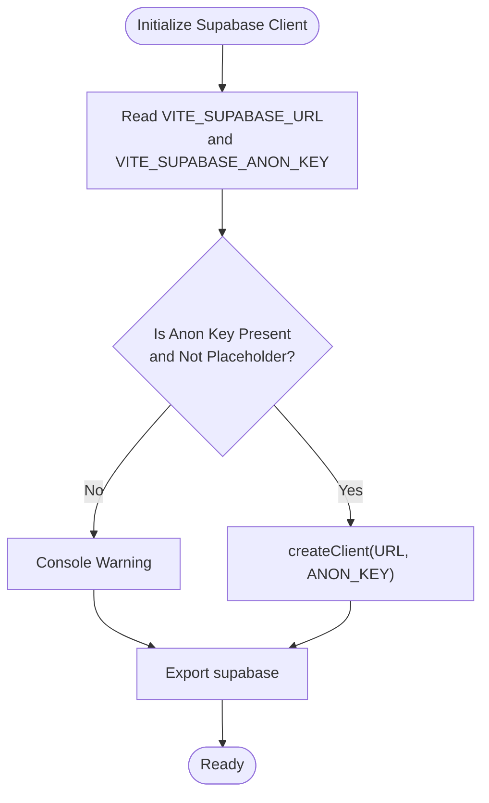
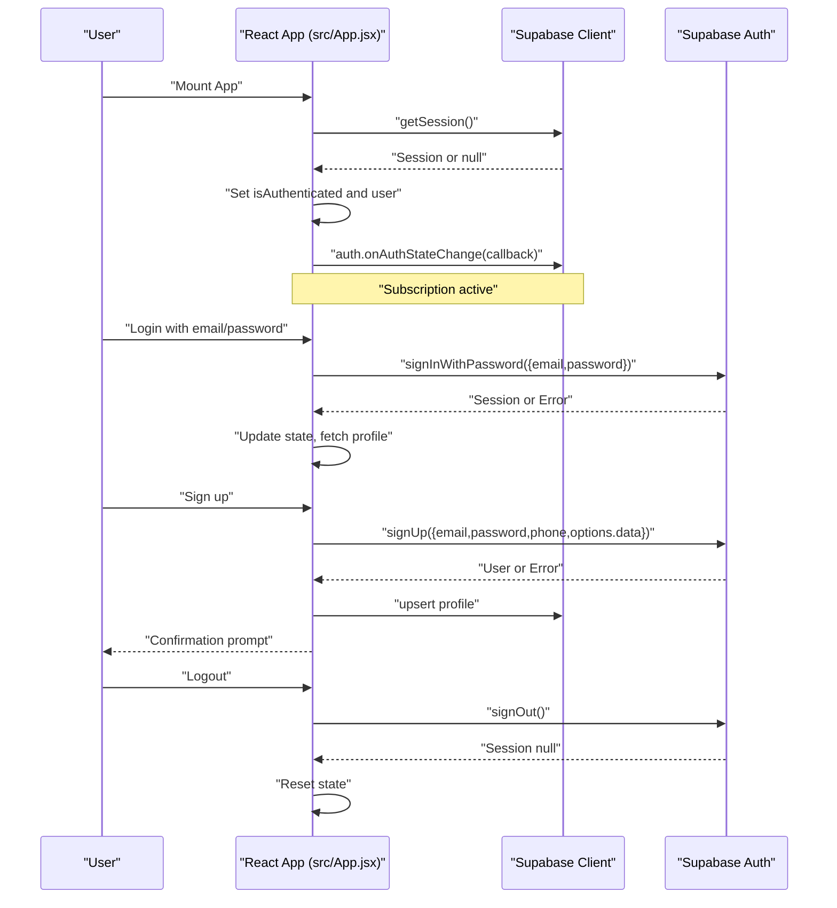
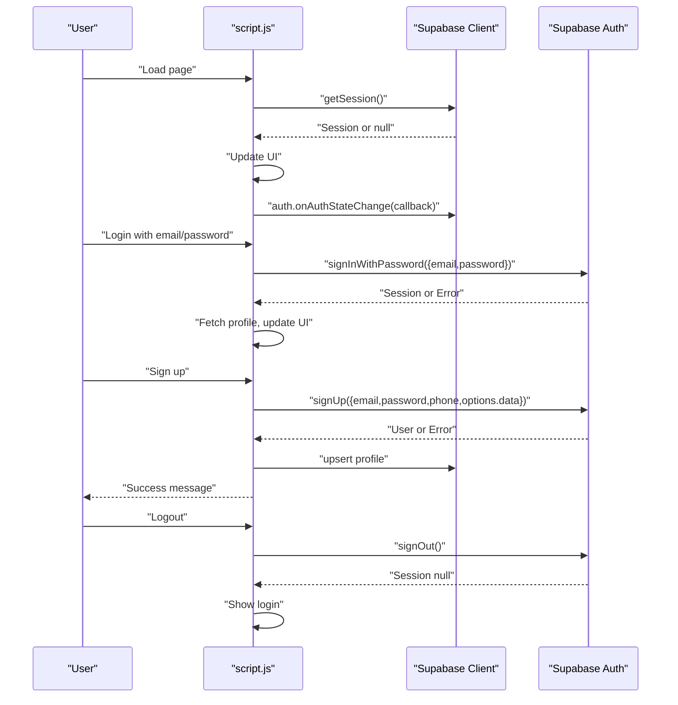
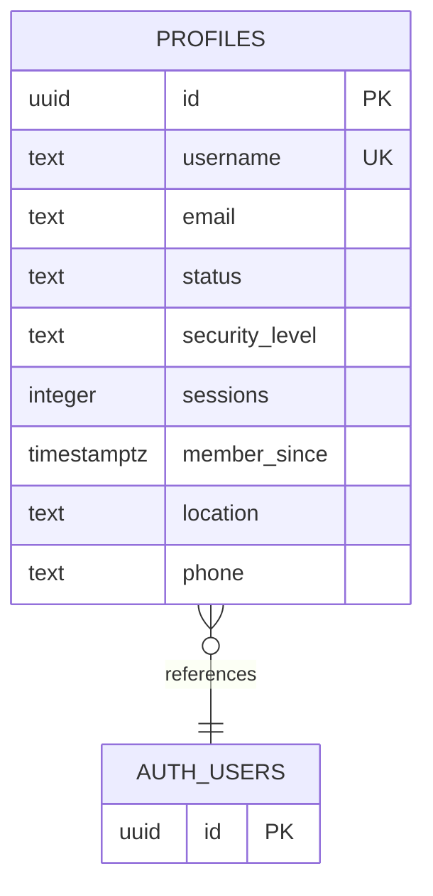
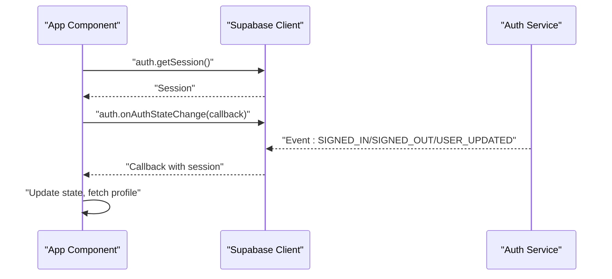
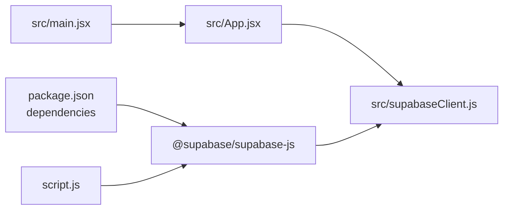

# Supabase Integration Architecture

<cite>
**Referenced Files in This Document**
- [src/supabaseClient.js](file://src/supabaseClient.js)
- [src/App.jsx](file://src/App.jsx)
- [script.js](file://script.js)
- [setup.sql](file://setup.sql)
- [package.json](file://package.json)
- [src/main.jsx](file://src/main.jsx)
- [index.html](file://index.html)
</cite>

## Table of Contents
1. [Introduction](#introduction)
2. [Project Structure](#project-structure)
3. [Core Components](#core-components)
4. [Architecture Overview](#architecture-overview)
5. [Detailed Component Analysis](#detailed-component-analysis)
6. [Dependency Analysis](#dependency-analysis)
7. [Performance Considerations](#performance-considerations)
8. [Troubleshooting Guide](#troubleshooting-guide)
9. [Conclusion](#conclusion)

## Introduction
This document describes the Supabase integration architecture for the HMCI Waterburg website. It covers authentication flows, database connection management, and real-time synchronization patterns. It documents client initialization, environment configuration, authentication state management across two implementations (React and vanilla JavaScript), database schema design with Row Level Security (RLS), and integration patterns for authentication APIs, database operations, and real-time subscriptions. Security considerations, connection pooling, and error handling strategies are also addressed.

## Project Structure
The project consists of two primary Supabase-enabled implementations:
- A React-based SPA using Vite
- A vanilla JavaScript single-page implementation

Both share a common Supabase client initialization pattern and a shared database schema with RLS policies.

**Diagram sources**
- [index.html:11-14](file://index.html#L11-L14)
- [src/main.jsx:6-10](file://src/main.jsx#L6-L10)
- [src/App.jsx:1-3](file://src/App.jsx#L1-L3)
- [src/supabaseClient.js:1-11](file://src/supabaseClient.js#L1-L11)
- [script.js:1-9](file://script.js#L1-L9)

**Section sources**
- [index.html:11-14](file://index.html#L11-L14)
- [src/main.jsx:6-10](file://src/main.jsx#L6-L10)
- [src/App.jsx:1-3](file://src/App.jsx#L1-L3)
- [src/supabaseClient.js:1-11](file://src/supabaseClient.js#L1-L11)
- [script.js:1-9](file://script.js#L1-L9)

## Core Components
- Supabase Client Initialization: Centralized client creation with environment variables for URL and anonymous key.
- Authentication Layer: Password-based login, OTP-based recovery, and session state management.
- Database Layer: PostgreSQL schema with RLS policies and profile management.
- Real-time Layer: Auth state change subscriptions for reactive UI updates.

Key implementation references:
- Client initialization and environment checks: [src/supabaseClient.js:1-11](file://src/supabaseClient.js#L1-L11)
- Authentication handlers (React): [src/App.jsx:101-138](file://src/App.jsx#L101-L138), [src/App.jsx:140-178](file://src/App.jsx#L140-L178), [src/App.jsx:180-236](file://src/App.jsx#L180-L236), [src/App.jsx:238-241](file://src/App.jsx#L238-L241), [src/App.jsx:276-299](file://src/App.jsx#L276-L299)
- Profile operations (React): [src/App.jsx:82-94](file://src/App.jsx#L82-L94), [src/App.jsx:243-274](file://src/App.jsx#L243-L274)
- Auth state subscription (React): [src/App.jsx:35-62](file://src/App.jsx#L35-L62)
- Vanilla client and auth handlers (script.js): [script.js:1-9](file://script.js#L1-L9), [script.js:165-191](file://script.js#L165-L191), [script.js:193-256](file://script.js#L193-L256), [script.js:273-324](file://script.js#L273-L324), [script.js:326-329](file://script.js#L326-L329)
- Database schema and RLS: [setup.sql:1-26](file://setup.sql#L1-L26)

**Section sources**
- [src/supabaseClient.js:1-11](file://src/supabaseClient.js#L1-L11)
- [src/App.jsx:82-94](file://src/App.jsx#L82-L94)
- [src/App.jsx:101-138](file://src/App.jsx#L101-L138)
- [src/App.jsx:140-178](file://src/App.jsx#L140-L178)
- [src/App.jsx:180-236](file://src/App.jsx#L180-L236)
- [src/App.jsx:238-241](file://src/App.jsx#L238-L241)
- [src/App.jsx:243-274](file://src/App.jsx#L243-L274)
- [src/App.jsx:276-299](file://src/App.jsx#L276-L299)
- [src/App.jsx:35-62](file://src/App.jsx#L35-L62)
- [script.js:1-9](file://script.js#L1-L9)
- [script.js:165-191](file://script.js#L165-L191)
- [script.js:193-256](file://script.js#L193-L256)
- [script.js:273-324](file://script.js#L273-L324)
- [script.js:326-329](file://script.js#L326-L329)
- [setup.sql:1-26](file://setup.sql#L1-L26)

## Architecture Overview
The system follows a client-centric architecture:
- React SPA mounts the Supabase client and manages authentication state reactively.
- A vanilla JavaScript SPA demonstrates equivalent functionality for static environments.
- Both implementations rely on Supabase Auth for identity and PostgreSQL for persistence.
- RLS policies enforce row-level access controls on the profiles table.

**Diagram sources**
- [src/App.jsx:1-3](file://src/App.jsx#L1-L3)
- [script.js:1-9](file://script.js#L1-L9)
- [src/supabaseClient.js:1-11](file://src/supabaseClient.js#L1-L11)

## Detailed Component Analysis

### Supabase Client Initialization
The client is initialized with environment variables for URL and anonymous key. A guard warns if the anonymous key is missing or placeholder-like.

**Diagram sources**
- [src/supabaseClient.js:3-10](file://src/supabaseClient.js#L3-L10)

**Section sources**
- [src/supabaseClient.js:1-11](file://src/supabaseClient.js#L1-L11)

### Authentication Flow (React Implementation)
The React app initializes authentication state on mount, subscribes to auth state changes, and provides handlers for login, signup, OTP recovery, and logout.

**Diagram sources**
- [src/App.jsx:35-62](file://src/App.jsx#L35-L62)
- [src/App.jsx:101-138](file://src/App.jsx#L101-L138)
- [src/App.jsx:180-236](file://src/App.jsx#L180-L236)
- [src/App.jsx:238-241](file://src/App.jsx#L238-L241)

**Section sources**
- [src/App.jsx:35-62](file://src/App.jsx#L35-L62)
- [src/App.jsx:101-138](file://src/App.jsx#L101-L138)
- [src/App.jsx:180-236](file://src/App.jsx#L180-L236)
- [src/App.jsx:238-241](file://src/App.jsx#L238-L241)

### Authentication Flow (Vanilla JavaScript Implementation)
The vanilla implementation mirrors the React flow with similar handlers and state management.

**Diagram sources**
- [script.js:631-659](file://script.js#L631-L659)
- [script.js:165-191](file://script.js#L165-L191)
- [script.js:193-256](file://script.js#L193-L256)
- [script.js:326-329](file://script.js#L326-L329)

**Section sources**
- [script.js:631-659](file://script.js#L631-L659)
- [script.js:165-191](file://script.js#L165-L191)
- [script.js:193-256](file://script.js#L193-L256)
- [script.js:326-329](file://script.js#L326-L329)

### Database Schema and RLS Policies
The profiles table stores user metadata linked to Supabase Auth users. RLS policies define who can select, insert, and update profiles.

**Diagram sources**
- [setup.sql:2-12](file://setup.sql#L2-L12)

**Section sources**
- [setup.sql:1-26](file://setup.sql#L1-L26)

### Data Access Patterns
- Profile retrieval by user ID: [src/App.jsx:82-94](file://src/App.jsx#L82-L94), [script.js:105-117](file://script.js#L105-L117)
- Upsert profile on signup: [src/App.jsx:215-236](file://src/App.jsx#L215-L236), [script.js:238-256](file://script.js#L238-L256)
- Update profile and auth metadata: [src/App.jsx:243-274](file://src/App.jsx#L243-L274), [script.js:500-548](file://script.js#L500-L548)
- Update password: [src/App.jsx:276-299](file://src/App.jsx#L276-L299), [script.js:550-560](file://script.js#L550-L560)

**Section sources**
- [src/App.jsx:82-94](file://src/App.jsx#L82-L94)
- [src/App.jsx:215-236](file://src/App.jsx#L215-L236)
- [src/App.jsx:243-274](file://src/App.jsx#L243-L274)
- [src/App.jsx:276-299](file://src/App.jsx#L276-L299)
- [script.js:105-117](file://script.js#L105-L117)
- [script.js:238-256](file://script.js#L238-L256)
- [script.js:500-548](file://script.js#L500-L548)
- [script.js:550-560](file://script.js#L550-L560)

### Real-time Subscriptions
Both implementations subscribe to auth state changes to keep the UI synchronized with authentication status.

**Diagram sources**
- [src/App.jsx:35-62](file://src/App.jsx#L35-L62)
- [script.js:653-656](file://script.js#L653-L656)

**Section sources**
- [src/App.jsx:35-62](file://src/App.jsx#L35-L62)
- [script.js:653-656](file://script.js#L653-L656)

## Dependency Analysis
- Runtime dependencies include the Supabase JavaScript client.
- The React app depends on the Supabase client module and React runtime.
- The vanilla implementation dynamically imports the Supabase client from CDN.

**Diagram sources**
- [package.json:12-16](file://package.json#L12-L16)
- [src/main.jsx:1-11](file://src/main.jsx#L1-L11)
- [src/App.jsx:1-3](file://src/App.jsx#L1-L3)
- [src/supabaseClient.js:1-11](file://src/supabaseClient.js#L1-L11)
- [script.js:1-1](file://script.js#L1-L1)

**Section sources**
- [package.json:12-16](file://package.json#L12-L16)
- [src/main.jsx:1-11](file://src/main.jsx#L1-L11)
- [src/App.jsx:1-3](file://src/App.jsx#L1-L3)
- [src/supabaseClient.js:1-11](file://src/supabaseClient.js#L1-L11)
- [script.js:1-1](file://script.js#L1-L1)

## Performance Considerations
- Client initialization: Keep the Supabase client as a singleton to avoid redundant connections.
- Auth state subscriptions: Ensure subscriptions are properly cleaned up to prevent memory leaks.
- Database queries: Use targeted selects with equality filters (e.g., by user ID) to minimize payload and improve response times.
- Batch operations: Combine profile updates with auth metadata updates where appropriate to reduce round trips.
- Environment configuration: Avoid exposing secrets in client-side code; use environment variables loaded by the bundler.

[No sources needed since this section provides general guidance]

## Troubleshooting Guide
Common issues and resolutions:
- Missing or invalid anonymous key: The client logs a warning when the key is missing or placeholder-like. Verify environment variables and build configuration.
  - Reference: [src/supabaseClient.js:6-8](file://src/supabaseClient.js#L6-L8)
- Authentication errors: Map common messages to user-friendly feedback (e.g., unconfirmed email, invalid credentials).
  - References: [src/App.jsx:128-133](file://src/App.jsx#L128-L133), [script.js:180-187](file://script.js#L180-L187)
- Rate limit exceeded during signup: Provide clear messaging and suggest retry timing.
  - Reference: [src/App.jsx:204-211](file://src/App.jsx#L204-L211)
- Profile update failures: Log errors and notify users; re-fetch profile after successful updates.
  - References: [src/App.jsx:266-272](file://src/App.jsx#L266-L272), [script.js:128-134](file://script.js#L128-L134)
- Auth state subscription cleanup: Unsubscribe from auth state changes when components unmount.
  - Reference: [src/App.jsx:61](file://src/App.jsx#L61)

**Section sources**
- [src/supabaseClient.js:6-8](file://src/supabaseClient.js#L6-L8)
- [src/App.jsx:128-133](file://src/App.jsx#L128-L133)
- [src/App.jsx:204-211](file://src/App.jsx#L204-L211)
- [src/App.jsx:266-272](file://src/App.jsx#L266-L272)
- [script.js:128-134](file://script.js#L128-L134)
- [script.js:180-187](file://script.js#L180-L187)
- [src/App.jsx:61](file://src/App.jsx#L61)

## Conclusion
The Supabase integration employs a clean separation of concerns: a centralized client initialization, robust authentication handlers, a normalized database schema with RLS, and reactive UI updates via auth state subscriptions. The dual implementation (React and vanilla) demonstrates consistent patterns across environments. Adhering to the outlined security and performance recommendations will help maintain a reliable and scalable system.