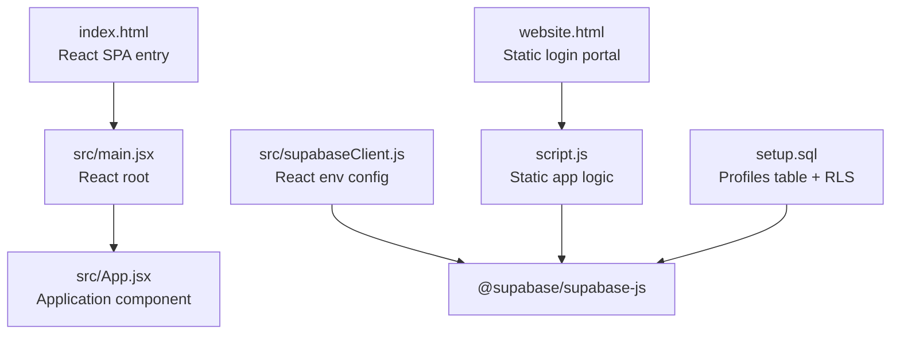
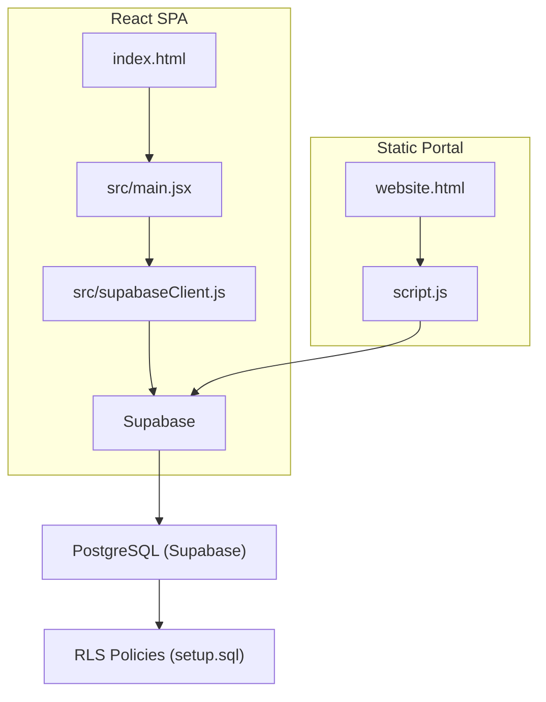
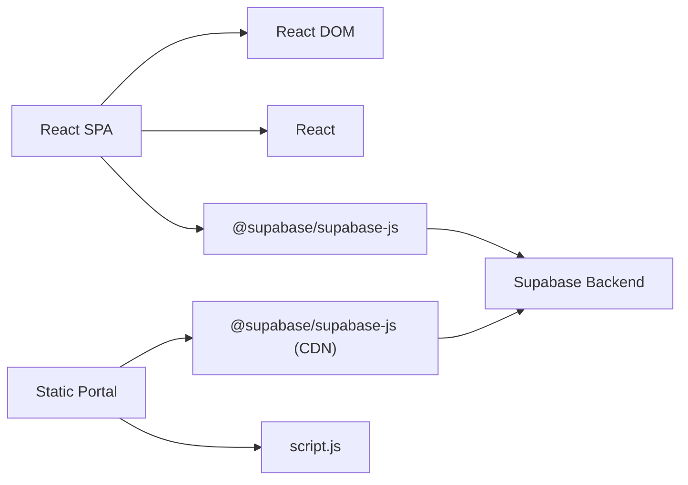

# Build and Deployment

<cite>
**Referenced Files in This Document**
- [vite.config.js](file://vite.config.js)
- [package.json](file://package.json)
- [index.html](file://index.html)
- [src/main.jsx](file://src/main.jsx)
- [src/supabaseClient.js](file://src/supabaseClient.js)
- [script.js](file://script.js)
- [website.html](file://website.html)
- [styles.css](file://styles.css)
- [setup.sql](file://setup.sql)
- [README.md](file://README.md)
</cite>

## Table of Contents
1. [Introduction](#introduction)
2. [Project Structure](#project-structure)
3. [Core Components](#core-components)
4. [Architecture Overview](#architecture-overview)
5. [Detailed Component Analysis](#detailed-component-analysis)
6. [Dependency Analysis](#dependency-analysis)
7. [Performance Considerations](#performance-considerations)
8. [Troubleshooting Guide](#troubleshooting-guide)
9. [Conclusion](#conclusion)
10. [Appendices](#appendices)

## Introduction
This document provides comprehensive build and deployment guidance for the HMC WEBSITE project. It covers Vite configuration, development and production builds, dual-implementation deployment (React SPA and static HTML), Supabase integration and environment configuration, database setup, deployment workflows across environments, CI/CD considerations, performance optimization, and troubleshooting.

## Project Structure
The project consists of:
- A React SPA built with Vite and React
- A separate static HTML login/portal page with embedded JavaScript and CSS
- Supabase client initialization and environment variables
- SQL schema for user profiles and Row Level Security (RLS)

**Diagram sources**
- [index.html:1-16](file://index.html#L1-L16)
- [src/main.jsx:1-11](file://src/main.jsx#L1-L11)
- [website.html:1-303](file://website.html#L1-L303)
- [script.js:1-660](file://script.js#L1-L660)
- [src/supabaseClient.js:1-11](file://src/supabaseClient.js#L1-L11)
- [setup.sql:1-26](file://setup.sql#L1-L26)

**Section sources**
- [README.md:1-1](file://README.md#L1-L1)
- [index.html:1-16](file://index.html#L1-L16)
- [website.html:1-303](file://website.html#L1-L303)
- [src/main.jsx:1-11](file://src/main.jsx#L1-L11)
- [src/supabaseClient.js:1-11](file://src/supabaseClient.js#L1-L11)
- [script.js:1-660](file://script.js#L1-L660)
- [setup.sql:1-26](file://setup.sql#L1-L26)

## Core Components
- Vite configuration enables React plugin and default dev/build behavior.
- React SPA entry renders the application root and loads styles.
- Static HTML login portal provides a self-contained user interface with JavaScript logic.
- Supabase client is initialized differently for React and static versions, using environment variables and CDN imports respectively.
- Database schema defines a profiles table with RLS policies for row-level access control.

**Section sources**
- [vite.config.js:1-8](file://vite.config.js#L1-L8)
- [package.json:1-22](file://package.json#L1-L22)
- [index.html:1-16](file://index.html#L1-L16)
- [src/main.jsx:1-11](file://src/main.jsx#L1-L11)
- [src/supabaseClient.js:1-11](file://src/supabaseClient.js#L1-L11)
- [script.js:1-660](file://script.js#L1-L660)
- [website.html:1-303](file://website.html#L1-L303)
- [setup.sql:1-26](file://setup.sql#L1-L26)

## Architecture Overview
The system supports two deployment modes:
- React SPA: served by Vite dev server during development and via a static host in production.
- Static HTML portal: standalone HTML/CSS/JS for login and basic user actions.

Both implementations integrate with Supabase for authentication and profile storage. The React app reads environment variables at runtime, while the static app embeds Supabase client via CDN and uses local configuration.

**Diagram sources**
- [index.html:1-16](file://index.html#L1-L16)
- [src/main.jsx:1-11](file://src/main.jsx#L1-L11)
- [src/supabaseClient.js:1-11](file://src/supabaseClient.js#L1-L11)
- [website.html:1-303](file://website.html#L1-L303)
- [script.js:1-660](file://script.js#L1-L660)
- [setup.sql:1-26](file://setup.sql#L1-L26)

## Detailed Component Analysis

### Vite Build Configuration
- Purpose: Configure React plugin and default build pipeline.
- Behavior: Development server runs on Vite default port; production build emits optimized assets to dist.

Recommended enhancements for production:
- Add output directory and asset hashing for cache busting.
- Enable code splitting and dynamic imports for lazy loading.
- Integrate compression plugins for JS/CSS/HTML.
- Set base path if deploying under a subpath.

**Section sources**
- [vite.config.js:1-8](file://vite.config.js#L1-L8)
- [package.json:6-11](file://package.json#L6-L11)

### React SPA Entry and Rendering
- The HTML entry point mounts the React root and loads global styles.
- The React app initializes the Supabase client using environment variables.

Deployment considerations:
- Ensure environment variables are present at build time or injected at runtime.
- For static hosting, verify asset paths and base path configuration.

**Section sources**
- [index.html:1-16](file://index.html#L1-L16)
- [src/main.jsx:1-11](file://src/main.jsx#L1-L11)
- [src/supabaseClient.js:1-11](file://src/supabaseClient.js#L1-L11)

### Static HTML Portal and Script Logic
- The static page provides a login, sign-up, recovery, and dashboard experience.
- JavaScript handles authentication flows, profile updates, theme switching, and UI toggles.
- Supabase client is imported from CDN and configured with local keys.

Key behaviors:
- Authentication state change listener updates UI accordingly.
- Profile data is fetched and displayed after login.
- Modal and settings views are rendered dynamically.

**Section sources**
- [website.html:1-303](file://website.html#L1-L303)
- [script.js:1-660](file://script.js#L1-L660)

### Supabase Client Configuration
- React app: Reads Supabase URL and anonymous key from environment variables and warns if the key is missing or placeholder-like.
- Static app: Uses CDN import and local configuration; ensure keys are kept secret and rotated regularly.

Environment variables:
- VITE_SUPABASE_URL
- VITE_SUPABASE_ANON_KEY

Best practices:
- Store secrets in environment-specific configuration (local .env, CI secrets, and hosting provider secrets).
- Restrict anonymous key usage and enable RLS on tables.

**Section sources**
- [src/supabaseClient.js:1-11](file://src/supabaseClient.js#L1-L11)
- [script.js:1-10](file://script.js#L1-L10)

### Database Schema and RLS Setup
- Profiles table stores user metadata with foreign key to auth.users.
- RLS enabled with policies allowing public viewing, insertion/updating by owners, and enforcement of ownership checks.

Deployment steps:
- Apply schema to Supabase SQL editor or via migrations.
- Verify policies are active and test access controls.

**Section sources**
- [setup.sql:1-26](file://setup.sql#L1-L26)

### Asset Management and Styling
- Global CSS defines dark/light themes and responsive layouts.
- Static assets (e.g., logo images) are referenced in HTML and script logic.

Recommendations:
- Preload critical fonts and assets.
- Minimize and split CSS for faster rendering.
- Use hashed filenames for long-term caching.

**Section sources**
- [styles.css:1-1071](file://styles.css#L1-L1071)
- [website.html:19,20,30,107,118,158-160:19-20](file://website.html#L19-L20)
- [script.js:104-161](file://script.js#L104-L161)

### Dual-Implementation Deployment Strategy
- React SPA: Build with Vite, deploy to static host (e.g., GitHub Pages, Netlify, Vercel).
- Static portal: Deploy standalone HTML/CSS/JS to the same host or a subdirectory.
- Both implementations share Supabase backend and database schema.

Operational guidance:
- Maintain separate environment configurations per implementation.
- Ensure consistent domain and CORS settings for Supabase.

**Section sources**
- [package.json:6-11](file://package.json#L6-L11)
- [index.html:1-16](file://index.html#L1-L16)
- [website.html:1-303](file://website.html#L1-L303)

### Development Server Setup
- Scripts:
  - dev: starts Vite dev server
  - build: produces production build
  - preview: serves built assets locally
- The React SPA relies on Vite’s dev server during development.

**Section sources**
- [package.json:6-11](file://package.json#L6-L11)

### Production Build Optimization
- Recommended Vite plugins and settings:
  - Output directory and asset hashing
  - Code splitting and dynamic imports
  - Compression for JS/CSS/HTML
  - Minification and tree-shaking
- Bundle analysis:
  - Use Vite’s built-in analyzer or external tools to inspect bundle composition.
- Asset compression:
  - Enable gzip or brotli on the web server.
  - Optimize images and fonts.

Note: Current configuration is minimal; enhance for production deployments.

**Section sources**
- [vite.config.js:1-8](file://vite.config.js#L1-L8)
- [package.json:6-11](file://package.json#L6-L11)

### Environment Configuration
- React app:
  - VITE_SUPABASE_URL
  - VITE_SUPABASE_ANON_KEY
- Static app:
  - Local configuration in script.js; ensure keys are not committed to source control.

Secret management:
- Use environment-specific files (.env.development, .env.production) and CI/CD secrets.
- Avoid embedding sensitive keys in client-side code.

**Section sources**
- [src/supabaseClient.js:1-11](file://src/supabaseClient.js#L1-L11)
- [script.js:3-9](file://script.js#L3-L9)

### Supabase Deployment Requirements
- Supabase project must be created and configured.
- Database schema applied via setup.sql.
- Authentication providers enabled (email/password, SMS OTP).
- RLS policies enforced on profiles table.

Verification checklist:
- Tables and policies created successfully.
- Auth state change callbacks functioning.
- Profile CRUD operations working.

**Section sources**
- [setup.sql:1-26](file://setup.sql#L1-L26)
- [script.js:105-135](file://script.js#L105-L135)
- [src/supabaseClient.js:1-11](file://src/supabaseClient.js#L1-L11)

### Database Setup Procedures
- Connect to Supabase SQL editor.
- Run setup.sql to create profiles table and policies.
- Confirm RLS is enabled and policies are active.

Testing:
- Create test users and verify profile creation/updating.
- Test auth flows (login, sign-up, OTP).

**Section sources**
- [setup.sql:1-26](file://setup.sql#L1-L26)

### Deployment Workflows Across Environments
- Development:
  - Use Vite dev server locally.
  - Keep environment variables in .env files.
- Staging:
  - Build with Vite and serve from a staging host.
  - Point to staging Supabase project and database.
- Production:
  - Build with Vite and deploy to production host.
  - Use production Supabase project and database.
  - Enable HTTPS, caching headers, and compression.

CI/CD considerations:
- Automated testing and linting in CI.
- Build and preview on pull requests.
- Deploy on main branch pushes with environment-specific secrets.

**Section sources**
- [package.json:6-11](file://package.json#L6-L11)

### Automated Deployment Processes
- Recommended CI/CD steps:
  - Install dependencies
  - Lint and test
  - Build artifacts
  - Deploy to staging; run smoke tests
  - Deploy to production on approval

Secrets handling:
- Store Supabase URLs and keys in CI/CD secret managers.
- Inject environment variables during build and deploy stages.

**Section sources**
- [package.json:9-10](file://package.json#L9-L10)

### Performance Optimization Techniques
- Bundle size reduction:
  - Split vendor and application code.
  - Remove unused dependencies.
- Runtime performance:
  - Lazy-load heavy components.
  - Debounce or throttle frequent UI updates.
- Network optimization:
  - Enable compression and caching.
  - Preload critical resources.
- Observability:
  - Monitor bundle sizes and load metrics.
  - Use profiling tools to identify bottlenecks.

**Section sources**
- [vite.config.js:1-8](file://vite.config.js#L1-L8)

### Asset Compression Strategies
- Enable compression on the web server (gzip/brotli).
- Optimize images and fonts; consider modern formats (AVIF/WebP).
- Minify CSS and JavaScript in production builds.

**Section sources**
- [package.json:6-11](file://package.json#L6-L11)

## Dependency Analysis
High-level dependencies:
- React SPA depends on React, React DOM, and @supabase/supabase-js.
- Static portal depends on @supabase/supabase-js loaded from CDN and local script logic.
- Both depend on Supabase backend for authentication and data.

**Diagram sources**
- [package.json:12-16](file://package.json#L12-L16)
- [src/supabaseClient.js:1-11](file://src/supabaseClient.js#L1-L11)
- [script.js:1-10](file://script.js#L1-L10)

**Section sources**
- [package.json:12-16](file://package.json#L12-L16)
- [src/supabaseClient.js:1-11](file://src/supabaseClient.js#L1-L11)
- [script.js:1-10](file://script.js#L1-L10)

## Performance Considerations
- Bundle analysis: Use Vite analyzer or similar to inspect chunk sizes and dependencies.
- Code splitting: Split routes and heavy components to reduce initial payload.
- Asset optimization: Compress and cache static assets; preload critical fonts.
- Runtime efficiency: Avoid unnecessary re-renders; memoize expensive computations.

[No sources needed since this section provides general guidance]

## Troubleshooting Guide
Common build and deployment issues:
- Missing Supabase keys:
  - React app logs a warning when the anonymous key is missing or placeholder-like.
  - Static app requires a valid anonymous key; ensure it is configured and not empty.
- Build failures:
  - Verify Vite and plugin versions match expectations.
  - Check for syntax errors and missing dependencies.
- Preview differences:
  - Vite preview serves built assets; ensure base path and asset URLs are correct.
- Static portal not loading:
  - Confirm CDN import of @supabase/supabase-js is reachable.
  - Check browser console for network or CORS errors.
- Authentication issues:
  - Verify Supabase project settings and RLS policies.
  - Ensure auth state change listeners are firing and UI updates accordingly.

**Section sources**
- [src/supabaseClient.js:6-8](file://src/supabaseClient.js#L6-L8)
- [script.js:1-10](file://script.js#L1-L10)
- [package.json:6-11](file://package.json#L6-L11)

## Conclusion
The HMC WEBSITE project supports two deployment modes: a React SPA and a static HTML portal, both integrating with Supabase for authentication and data. By enhancing Vite configuration for production, managing environment variables securely, applying database schema and RLS policies, and establishing robust CI/CD practices, teams can reliably deploy and maintain the application across environments.

[No sources needed since this section summarizes without analyzing specific files]

## Appendices

### Appendix A: Environment Variables Reference
- VITE_SUPABASE_URL: Supabase project URL
- VITE_SUPABASE_ANON_KEY: Supabase anonymous public key

**Section sources**
- [src/supabaseClient.js:3-4](file://src/supabaseClient.js#L3-L4)

### Appendix B: Supabase RLS Policy Summary
- Profiles table with RLS enabled
- Policies:
  - Public profiles selectable by everyone
  - Users can insert/update their own profile
  - Ownership enforced via auth.uid()

**Section sources**
- [setup.sql:14-25](file://setup.sql#L14-L25)