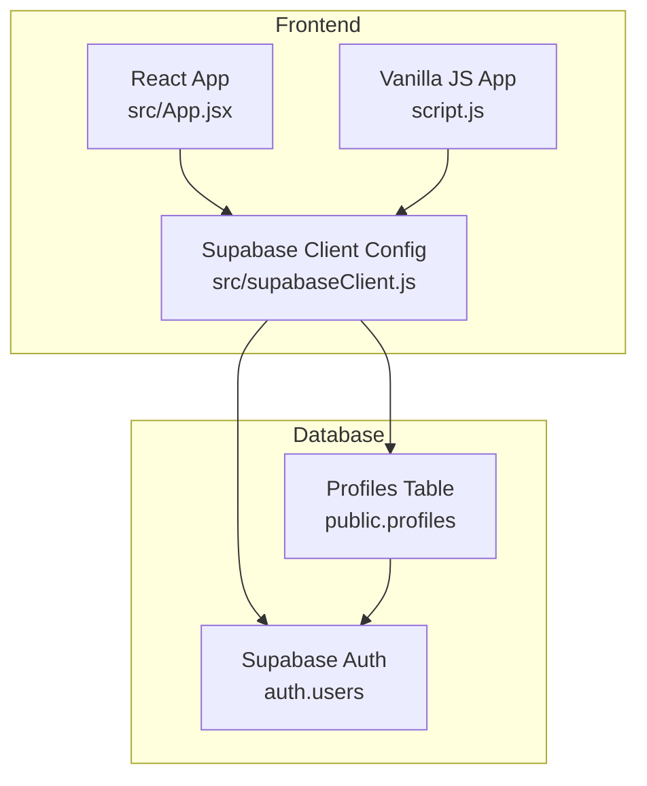
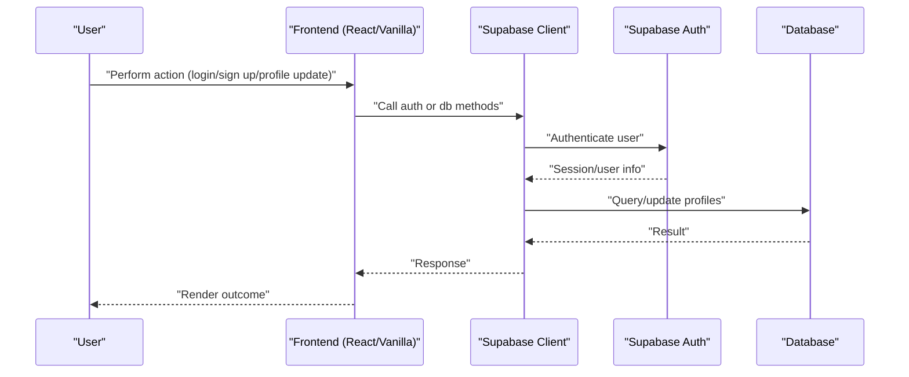
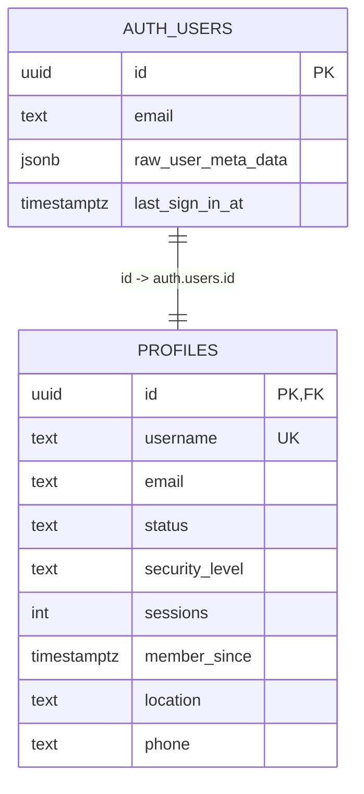
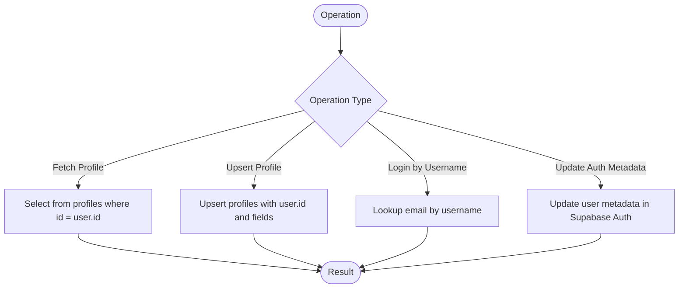
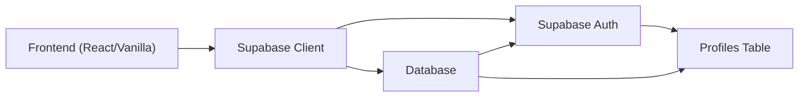

# Database Schema and Setup

<cite>
**Referenced Files in This Document**
- [setup.sql](file://setup.sql)
- [App.jsx](file://src/App.jsx)
- [script.js](file://script.js)
- [supabaseClient.js](file://src/supabaseClient.js)
- [package.json](file://package.json)
</cite>

## Table of Contents
1. [Introduction](#introduction)
2. [Project Structure](#project-structure)
3. [Core Components](#core-components)
4. [Architecture Overview](#architecture-overview)
5. [Detailed Component Analysis](#detailed-component-analysis)
6. [Dependency Analysis](#dependency-analysis)
7. [Performance Considerations](#performance-considerations)
8. [Troubleshooting Guide](#troubleshooting-guide)
9. [Conclusion](#conclusion)
10. [Appendices](#appendices)

## Introduction
This document provides comprehensive data model documentation for the HMC WEBSITE database schema, focusing on the profiles table and its integration with Supabase Auth. It explains the table structure, constraints, relationships with the auth.users table, Row Level Security (RLS) policies, indexing strategies, and performance considerations. It also documents data validation rules, business logic enforcement, access control mechanisms, typical data operations, query patterns, and operational guidance for migrations, backups, and maintenance in a Supabase environment.

## Project Structure
The repository contains a minimal client-side application that interacts with Supabase for authentication and profile storage. The database schema is defined in a single SQL script, while the frontend code demonstrates how the application reads and writes profile data.



**Diagram sources**
- [setup.sql:1-25](file://setup.sql#L1-L25)
- [App.jsx:1-649](file://src/App.jsx#L1-L649)
- [script.js:1-660](file://script.js#L1-L660)
- [supabaseClient.js:1-11](file://src/supabaseClient.js#L1-L11)

**Section sources**
- [setup.sql:1-25](file://setup.sql#L1-L25)
- [App.jsx:1-649](file://src/App.jsx#L1-L649)
- [script.js:1-660](file://script.js#L1-L660)
- [supabaseClient.js:1-11](file://src/supabaseClient.js#L1-L11)
- [package.json:1-22](file://package.json#L1-L22)

## Core Components
- Profiles table: Stores user metadata linked to Supabase Auth users.
- Supabase Auth: Provides authentication and user identity used by the profiles table.
- RLS Policies: Enforce access control at the database level for the profiles table.

**Section sources**
- [setup.sql:1-25](file://setup.sql#L1-L25)

## Architecture Overview
The application architecture integrates two frontends (React and vanilla JS) with Supabase. Authentication is handled by Supabase Auth, and user profile data is stored in the public.profiles table. The profiles table is tightly coupled to auth.users via a foreign key relationship and enforces RLS policies to control access.



**Diagram sources**
- [App.jsx:82-94](file://src/App.jsx#L82-L94)
- [script.js:105-135](file://script.js#L105-L135)
- [supabaseClient.js:1-11](file://src/supabaseClient.js#L1-L11)

## Detailed Component Analysis

### Profiles Table Schema
The profiles table stores user metadata and is linked to Supabase Auth users. Below is the complete schema definition with field definitions, data types, constraints, and defaults.

- Table: public.profiles
- Columns:
  - id: UUID, Primary Key, References auth.users(id), On Delete: CASCADE
  - username: TEXT, Unique
  - email: TEXT
  - status: TEXT, Default: 'Active'
  - security_level: TEXT, Default: 'Medium'
  - sessions: INTEGER, Default: 1
  - member_since: TIMESTAMP WITH TIME ZONE, Default: NOW()
  - location: TEXT
  - phone: TEXT

Constraints and Defaults:
- Primary Key: id
- Foreign Key: id references auth.users(id) with ON DELETE CASCADE
- Unique Constraint: username
- Default Values: status, security_level, sessions, member_since

Notes:
- The table enables Row Level Security (RLS) to enforce fine-grained access control.
- RLS policies restrict operations to the authenticated user’s own profile.

**Section sources**
- [setup.sql:1-25](file://setup.sql#L1-L25)

### Relationships with Supabase Auth.users
- The profiles.id column is a foreign key referencing auth.users.id.
- When a user is deleted from auth.users, the corresponding profile record is automatically removed due to ON DELETE CASCADE.
- The application uses auth.uid() within RLS policies to ensure users can only access and modify their own records.



**Diagram sources**
- [setup.sql:2-12](file://setup.sql#L2-L12)

**Section sources**
- [setup.sql:2-12](file://setup.sql#L2-L12)

### Row Level Security (RLS) Policies
RLS is enabled on the profiles table. The policies define who can perform operations and under what conditions.

- Policy: Public profiles are viewable by everyone
  - Operation: SELECT
  - Condition: true
- Policy: Users can insert their own profile
  - Operation: INSERT
  - Condition: auth.uid() = id
  - Uses WITH CHECK to enforce the condition
- Policy: Users can update their own profile
  - Operation: UPDATE
  - Condition: auth.uid() = id

These policies ensure that:
- Any user can read any profile (SELECT with true).
- Insertions and updates are restricted to the authenticated user’s own id.

**Section sources**
- [setup.sql:14-25](file://setup.sql#L14-L25)

### Indexing Strategies
- Primary Key Index: Automatically created on id.
- Unique Index: Automatically created on username due to UNIQUE constraint.
- Additional Indexes:
  - Consider adding an index on email for frequent lookups (e.g., login by email).
  - Consider adding an index on location for filtering by branch/location.
  - Consider adding an index on member_since for sorting by join date.

Note: These recommendations are for performance optimization and should be evaluated against actual query patterns and data volume.

**Section sources**
- [setup.sql:2-12](file://setup.sql#L2-L12)

### Data Validation Rules and Business Logic
- Authentication-driven profile creation:
  - On sign-up, the application inserts/upserts a profile record with defaults for status, security_level, sessions, and member_since.
- Login flexibility:
  - The application supports logging in with either email or username. If a username is provided, it resolves to the associated email before attempting authentication.
- Profile updates:
  - The application performs upserts to ensure a profile exists and updates fields such as username, email, phone, and location.
  - It also synchronizes user metadata in Supabase Auth for consistency.

**Section sources**
- [App.jsx:180-236](file://src/App.jsx#L180-L236)
- [App.jsx:243-274](file://src/App.jsx#L243-L274)
- [script.js:193-256](file://script.js#L193-L256)

### Access Control Mechanisms
- Supabase Auth manages identities and sessions.
- RLS policies on profiles enforce per-user access.
- Frontend code relies on auth.uid() and session checks to determine visibility and editability of profile data.

**Section sources**
- [setup.sql:14-25](file://setup.sql#L14-L25)
- [App.jsx:35-62](file://src/App.jsx#L35-L62)

### Typical Data Operations and Query Patterns
- Fetch a user’s profile by id:
  - Single-row select filtered by id.
- Upsert profile data:
  - Insert or update profile fields for the authenticated user.
- Resolve login by username:
  - Lookup email by username prior to authentication.
- Update user metadata:
  - Synchronize profile changes with Supabase Auth user metadata.



**Diagram sources**
- [App.jsx:82-94](file://src/App.jsx#L82-L94)
- [App.jsx:243-274](file://src/App.jsx#L243-L274)
- [App.jsx:101-138](file://src/App.jsx#L101-L138)

**Section sources**
- [App.jsx:82-94](file://src/App.jsx#L82-L94)
- [App.jsx:101-138](file://src/App.jsx#L101-L138)
- [App.jsx:243-274](file://src/App.jsx#L243-L274)

### Data Lifecycle Management
- Creation:
  - Profile created upon successful sign-up via upsert.
- Updates:
  - Profile updated via upsert and synchronized with Supabase Auth metadata.
- Deletion:
  - Profile deletion follows auth.users cascade delete.

**Section sources**
- [App.jsx:180-236](file://src/App.jsx#L180-L236)
- [App.jsx:243-274](file://src/App.jsx#L243-L274)
- [setup.sql:2-12](file://setup.sql#L2-L12)

## Dependency Analysis
- Frontend depends on Supabase client for authentication and database operations.
- Profiles table depends on Supabase Auth users for identity and cascading deletes.
- RLS policies depend on auth.uid() to enforce per-user access.



**Diagram sources**
- [supabaseClient.js:1-11](file://src/supabaseClient.js#L1-L11)
- [setup.sql:14-25](file://setup.sql#L14-L25)

**Section sources**
- [supabaseClient.js:1-11](file://src/supabaseClient.js#L1-L11)
- [setup.sql:14-25](file://setup.sql#L14-L25)

## Performance Considerations
- Indexing:
  - Add indexes on frequently queried columns such as email, location, and member_since to improve query performance.
- Query Patterns:
  - Prefer equality filters on id and username for fast lookups.
  - Minimize wide scans on profiles; leverage indexes and selective WHERE clauses.
- RLS Overhead:
  - RLS adds minimal overhead; ensure policies remain simple and avoid expensive expressions.
- Data Volume:
  - Monitor growth of profiles and consider partitioning or materialized views if needed.
- Network:
  - Batch updates where possible to reduce round-trips (e.g., upsert profile and update auth metadata together).

[No sources needed since this section provides general guidance]

## Troubleshooting Guide
Common issues and resolutions:

- Missing Supabase credentials:
  - Ensure VITE_SUPABASE_URL and VITE_SUPABASE_ANON_KEY are configured in the environment.
- Authentication failures:
  - Verify email confirmation status and credential correctness.
- Profile not found:
  - Confirm that a profile record exists for the user id; perform an upsert on sign-up.
- Permission denied:
  - Ensure RLS policies are enabled and auth.uid() matches the targeted id for insert/update operations.
- Session state:
  - Use Supabase auth listeners to keep UI state synchronized after login/logout.

**Section sources**
- [supabaseClient.js:6-8](file://src/supabaseClient.js#L6-L8)
- [App.jsx:101-138](file://src/App.jsx#L101-L138)
- [setup.sql:14-25](file://setup.sql#L14-L25)

## Conclusion
The HMC WEBSITE database schema centers on a compact profiles table integrated with Supabase Auth. The design leverages a foreign key relationship to auth.users, enforces RLS policies for per-user access, and defaults for common fields. The frontend code demonstrates practical patterns for authentication, profile retrieval/upsert, and metadata synchronization. For production, consider adding strategic indexes, monitoring query performance, and maintaining robust RLS policies aligned with evolving access requirements.

[No sources needed since this section summarizes without analyzing specific files]

## Appendices

### Complete SQL Schema
Below is the complete SQL schema for the profiles table and RLS policies as defined in the repository.

```sql
-- Create a profiles table for user metadata
CREATE TABLE IF NOT EXISTS public.profiles (
  id UUID REFERENCES auth.users(id) ON DELETE CASCADE PRIMARY KEY,
  username TEXT UNIQUE,
  email TEXT,
  status TEXT DEFAULT 'Active',
  security_level TEXT DEFAULT 'Medium',
  sessions INTEGER DEFAULT 1,
  member_since TIMESTAMP WITH TIME ZONE DEFAULT NOW(),
  location TEXT,
  phone TEXT
);

-- Enable RLS (Row Level Security)
ALTER TABLE public.profiles ENABLE ROW LEVEL SECURITY;

-- Create policies
CREATE POLICY "Public profiles are viewable by everyone." ON public.profiles
  FOR SELECT USING (true);

CREATE POLICY "Users can insert their own profile." ON public.profiles
  FOR INSERT WITH CHECK (auth.uid() = id);

CREATE POLICY "Users can update own profile." ON public.profiles
  FOR UPDATE USING (auth.uid() = id);
```

**Section sources**
- [setup.sql:1-25](file://setup.sql#L1-L25)

### Typical Frontend Interactions
- Fetch profile by id
- Upsert profile fields
- Resolve login by username lookup
- Update Supabase Auth user metadata

**Section sources**
- [App.jsx:82-94](file://src/App.jsx#L82-L94)
- [App.jsx:180-236](file://src/App.jsx#L180-L236)
- [App.jsx:243-274](file://src/App.jsx#L243-L274)

### Supabase Client Configuration
- Initializes Supabase client with environment variables for URL and anonymous key.
- Validates presence of the anonymous key and logs a warning if missing.

**Section sources**
- [supabaseClient.js:1-11](file://src/supabaseClient.js#L1-L11)

### Dependencies
- @supabase/supabase-js is used by the application for Supabase client operations.

**Section sources**
- [package.json:12-13](file://package.json#L12-L13)