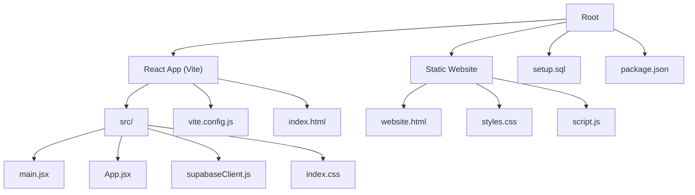
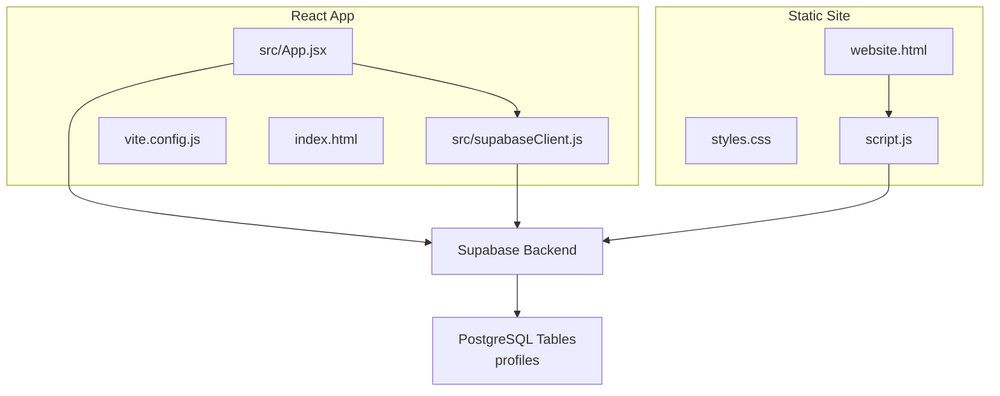
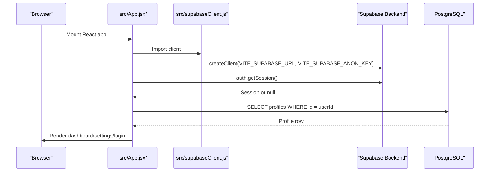
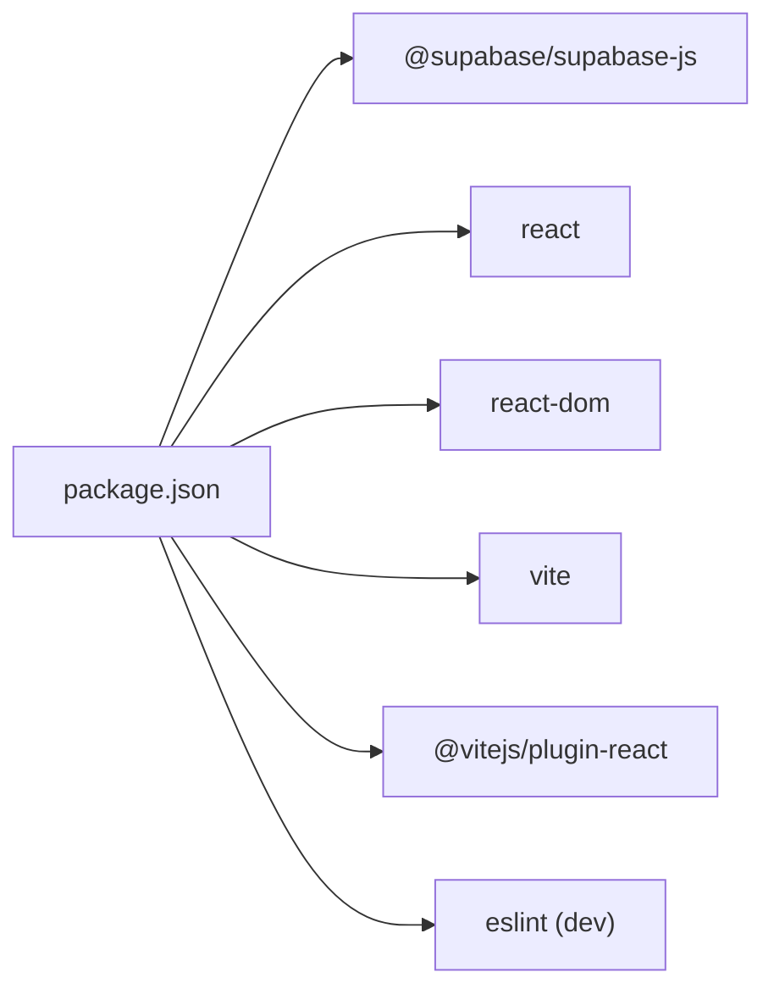

# Getting Started

<cite>
**Referenced Files in This Document**
- [README.md](file://README.md)
- [package.json](file://package.json)
- [vite.config.js](file://vite.config.js)
- [src/supabaseClient.js](file://src/supabaseClient.js)
- [src/App.jsx](file://src/App.jsx)
- [src/main.jsx](file://src/main.jsx)
- [src/index.css](file://src/index.css)
- [index.html](file://index.html)
- [website.html](file://website.html)
- [styles.css](file://styles.css)
- [script.js](file://script.js)
- [setup.sql](file://setup.sql)
</cite>

## Table of Contents
1. [Introduction](#introduction)
2. [Project Structure](#project-structure)
3. [Core Components](#core-components)
4. [Architecture Overview](#architecture-overview)
5. [Detailed Component Analysis](#detailed-component-analysis)
6. [Dependency Analysis](#dependency-analysis)
7. [Performance Considerations](#performance-considerations)
8. [Troubleshooting Guide](#troubleshooting-guide)
9. [Conclusion](#conclusion)
10. [Appendices](#appendices)

## Introduction
This guide helps you install, configure, and run the HMC WEBSITE project locally. It covers two implementation paths:
- React-based modern app with Vite and Supabase client
- Static HTML/CSS/JS version with embedded Supabase client

You will set up prerequisites, configure Supabase credentials, initialize the database schema, and start the development server. Verification steps and troubleshooting tips are included to ensure a smooth setup.

## Project Structure
The repository contains both a React/Vite app and a static HTML site. The React app is located under src and built with Vite. The static site is a standalone HTML page with its own CSS and JavaScript.

**Diagram sources**
- [src/main.jsx:1-11](file://src/main.jsx#L1-L11)
- [src/App.jsx:1-650](file://src/App.jsx#L1-L650)
- [src/supabaseClient.js:1-11](file://src/supabaseClient.js#L1-L11)
- [src/index.css:1-1148](file://src/index.css#L1-L1148)
- [vite.config.js:1-8](file://vite.config.js#L1-L8)
- [index.html:1-16](file://index.html#L1-L16)
- [website.html:1-303](file://website.html#L1-L303)
- [styles.css:1-1071](file://styles.css#L1-L1071)
- [script.js:1-660](file://script.js#L1-L660)
- [setup.sql:1-26](file://setup.sql#L1-L26)
- [package.json:1-22](file://package.json#L1-L22)

**Section sources**
- [README.md:1-1](file://README.md#L1-L1)
- [package.json:1-22](file://package.json#L1-L22)
- [vite.config.js:1-8](file://vite.config.js#L1-L8)
- [src/main.jsx:1-11](file://src/main.jsx#L1-L11)
- [src/App.jsx:1-650](file://src/App.jsx#L1-L650)
- [src/supabaseClient.js:1-11](file://src/supabaseClient.js#L1-L11)
- [src/index.css:1-1148](file://src/index.css#L1-L1148)
- [index.html:1-16](file://index.html#L1-L16)
- [website.html:1-303](file://website.html#L1-L303)
- [styles.css:1-1071](file://styles.css#L1-L1071)
- [script.js:1-660](file://script.js#L1-L660)
- [setup.sql:1-26](file://setup.sql#L1-L26)

## Core Components
- React/Vite app
  - Entry point: [src/main.jsx:1-11](file://src/main.jsx#L1-L11)
  - Root component: [src/App.jsx:1-650](file://src/App.jsx#L1-L650)
  - Supabase client: [src/supabaseClient.js:1-11](file://src/supabaseClient.js#L1-L11)
  - Styles: [src/index.css:1-1148](file://src/index.css#L1-L1148)
  - HTML shell: [index.html:1-16](file://index.html#L1-L16)
  - Build config: [vite.config.js:1-8](file://vite.config.js#L1-L8)
  - Package scripts and dependencies: [package.json:1-22](file://package.json#L1-L22)

- Static website
  - HTML: [website.html:1-303](file://website.html#L1-L303)
  - Styles: [styles.css:1-1071](file://styles.css#L1-L1071)
  - JavaScript: [script.js:1-660](file://script.js#L1-L660)

**Section sources**
- [src/main.jsx:1-11](file://src/main.jsx#L1-L11)
- [src/App.jsx:1-650](file://src/App.jsx#L1-L650)
- [src/supabaseClient.js:1-11](file://src/supabaseClient.js#L1-L11)
- [src/index.css:1-1148](file://src/index.css#L1-L1148)
- [index.html:1-16](file://index.html#L1-L16)
- [vite.config.js:1-8](file://vite.config.js#L1-L8)
- [package.json:1-22](file://package.json#L1-L22)
- [website.html:1-303](file://website.html#L1-L303)
- [styles.css:1-1071](file://styles.css#L1-L1071)
- [script.js:1-660](file://script.js#L1-L660)

## Architecture Overview
Both implementations integrate with Supabase for authentication and profile storage. The React app loads Supabase credentials from environment variables, while the static site embeds Supabase URLs and keys directly in JavaScript.

**Diagram sources**
- [src/App.jsx:1-650](file://src/App.jsx#L1-L650)
- [src/supabaseClient.js:1-11](file://src/supabaseClient.js#L1-L11)
- [vite.config.js:1-8](file://vite.config.js#L1-L8)
- [index.html:1-16](file://index.html#L1-L16)
- [website.html:1-303](file://website.html#L1-L303)
- [styles.css:1-1071](file://styles.css#L1-L1071)
- [script.js:1-660](file://script.js#L1-L660)
- [setup.sql:1-26](file://setup.sql#L1-L26)

## Detailed Component Analysis

### Prerequisites
- Node.js and npm
  - Install Node.js LTS and npm from https://nodejs.org/
  - Verify with: node --version and npm --version

- Supabase account
  - Create a free account at https://app.supabase.com/
  - Obtain your project’s Supabase URL and Anonymous Key from Project Settings > API

- Git (optional)
  - Clone the repository if you have not already

**Section sources**
- [package.json:1-22](file://package.json#L1-L22)

### Step-by-Step Installation

1) Install dependencies
- Open a terminal in the project root
- Run: npm install

2) Configure environment variables
- Create a .env file in the project root with the following keys:
  - VITE_SUPABASE_URL=your_supabase_project_url
  - VITE_SUPABASE_ANON_KEY=your_supabase_anon_key
- Replace placeholders with your actual Supabase project values

3) Initialize the database schema
- Connect to your Supabase SQL editor
- Paste and run the schema from [setup.sql:1-26](file://setup.sql#L1-L26)

4) Start the development server
- Run: npm run dev
- Open http://localhost:5173 in your browser

Verification
- You should see the React landing screen with options to enter the dashboard or open the static website.
- Logging in/out and updating profile settings should work against your Supabase backend.

**Section sources**
- [src/supabaseClient.js:1-11](file://src/supabaseClient.js#L1-L11)
- [setup.sql:1-26](file://setup.sql#L1-L26)
- [package.json:6-11](file://package.json#L6-L11)
- [vite.config.js:1-8](file://vite.config.js#L1-L8)
- [index.html:1-16](file://index.html#L1-L16)

### Static Implementation Setup Path

1) Prepare Supabase credentials
- In [script.js:6-9](file://script.js#L6-L9), replace the placeholder anonymous key with your Supabase Anon Key
- Ensure SUPABASE_URL points to your project

2) Open the static site
- Open [website.html:1-303](file://website.html#L1-L303) in a browser
- The static site uses the same Supabase backend as the React app

Notes
- The static site does not require building; it runs directly from the HTML file.
- Authentication and profile updates are handled by the Supabase client loaded via CDN.

**Section sources**
- [script.js:1-660](file://script.js#L1-L660)
- [website.html:1-303](file://website.html#L1-L303)

### Environment Configuration with Supabase Credentials

- React app
  - Load-time configuration: [src/supabaseClient.js:1-11](file://src/supabaseClient.js#L1-L11)
  - Vite injects environment variables prefixed with VITE_
  - Example .env keys:
    - VITE_SUPABASE_URL
    - VITE_SUPABASE_ANON_KEY

- Static app
  - Hardcoded configuration in [script.js:6-9](file://script.js#L6-L9)
  - Replace the placeholder key with your Supabase Anon Key

Validation
- On load, the app checks for a missing or default anonymous key and logs a warning if not configured.

**Section sources**
- [src/supabaseClient.js:1-11](file://src/supabaseClient.js#L1-L11)
- [script.js:1-660](file://script.js#L1-L660)

### Database Schema Setup Using setup.sql

- Purpose
  - Creates the profiles table and enables Row Level Security (RLS)
  - Adds policies for public viewing and user self-management

- Steps
  - Open your Supabase project
  - Go to SQL Editor
  - Paste and run [setup.sql:1-26](file://setup.sql#L1-L26)

- Expected outcome
  - A public.profiles table exists with RLS enabled
  - Policies allow users to select their own profile and update it

**Section sources**
- [setup.sql:1-26](file://setup.sql#L1-L26)

### Local Development Server Startup

- React app
  - Scripts: [package.json:6-11](file://package.json#L6-L11)
  - Build tool: [vite.config.js:1-8](file://vite.config.js#L1-L8)
  - Entry: [src/main.jsx:1-11](file://src/main.jsx#L1-L11)
  - HTML shell: [index.html:1-16](file://index.html#L1-L16)

- Static app
  - No build step required
  - Open [website.html:1-303](file://website.html#L1-L303) directly in a browser

- Starting the server
  - Run: npm run dev
  - Visit http://localhost:5173

**Section sources**
- [package.json:6-11](file://package.json#L6-L11)
- [vite.config.js:1-8](file://vite.config.js#L1-L8)
- [src/main.jsx:1-11](file://src/main.jsx#L1-L11)
- [index.html:1-16](file://index.html#L1-L16)
- [website.html:1-303](file://website.html#L1-L303)

### Code-Level Architecture and Data Flow

**Diagram sources**
- [src/App.jsx:1-650](file://src/App.jsx#L1-L650)
- [src/supabaseClient.js:1-11](file://src/supabaseClient.js#L1-L11)
- [setup.sql:1-26](file://setup.sql#L1-L26)

## Dependency Analysis

**Diagram sources**
- [package.json:1-22](file://package.json#L1-L22)

**Section sources**
- [package.json:1-22](file://package.json#L1-L22)

## Performance Considerations
- Keep Supabase credentials in environment variables to avoid bundling secrets
- Minimize unnecessary re-renders in React components
- Use Vite’s built-in hot module replacement for fast reloads during development
- Prefer lightweight CSS and defer heavy assets until needed

[No sources needed since this section provides general guidance]

## Troubleshooting Guide

Common issues and fixes
- Missing or invalid Supabase credentials
  - Symptom: Warning about missing anonymous key or auth errors
  - Fix: Add VITE_SUPABASE_URL and VITE_SUPABASE_ANON_KEY to .env
  - Reference: [src/supabaseClient.js:1-11](file://src/supabaseClient.js#L1-L11)

- Database schema not initialized
  - Symptom: Profile fetch fails or table not found
  - Fix: Run [setup.sql:1-26](file://setup.sql#L1-L26) in the Supabase SQL editor
  - Reference: [setup.sql:1-26](file://setup.sql#L1-L26)

- Port already in use
  - Symptom: Dev server fails to start on port 5173
  - Fix: Change the port in Vite config or kill the process using the port
  - Reference: [vite.config.js:1-8](file://vite.config.js#L1-L8)

- Static site not loading Supabase
  - Symptom: Static site shows blank screen or auth errors
  - Fix: Update the anonymous key in [script.js:6-9](file://script.js#L6-L9)
  - Reference: [script.js:1-660](file://script.js#L1-L660)

- CORS or network errors
  - Symptom: Network requests blocked
  - Fix: Ensure your Supabase project allows requests from localhost and your domain
  - Reference: Supabase project settings

**Section sources**
- [src/supabaseClient.js:1-11](file://src/supabaseClient.js#L1-L11)
- [setup.sql:1-26](file://setup.sql#L1-L26)
- [vite.config.js:1-8](file://vite.config.js#L1-L8)
- [script.js:1-660](file://script.js#L1-L660)

## Conclusion
You now have two fully functional paths to run the HMC WEBSITE project locally:
- React/Vite app with environment-driven Supabase configuration
- Static HTML/JS site with embedded Supabase credentials

Follow the steps above to install dependencies, configure Supabase, initialize the schema, and start the development server. Use the verification steps and troubleshooting tips to resolve common issues quickly.

[No sources needed since this section summarizes without analyzing specific files]

## Appendices

### Appendix A: Environment Variables Reference
- VITE_SUPABASE_URL: Supabase project URL
- VITE_SUPABASE_ANON_KEY: Supabase Anonymous Key

**Section sources**
- [src/supabaseClient.js:1-11](file://src/supabaseClient.js#L1-L11)

### Appendix B: Static Site Credentials
- SUPABASE_URL and SUPABASE_ANON_KEY in [script.js:6-9](file://script.js#L6-L9)

**Section sources**
- [script.js:1-660](file://script.js#L1-L660)