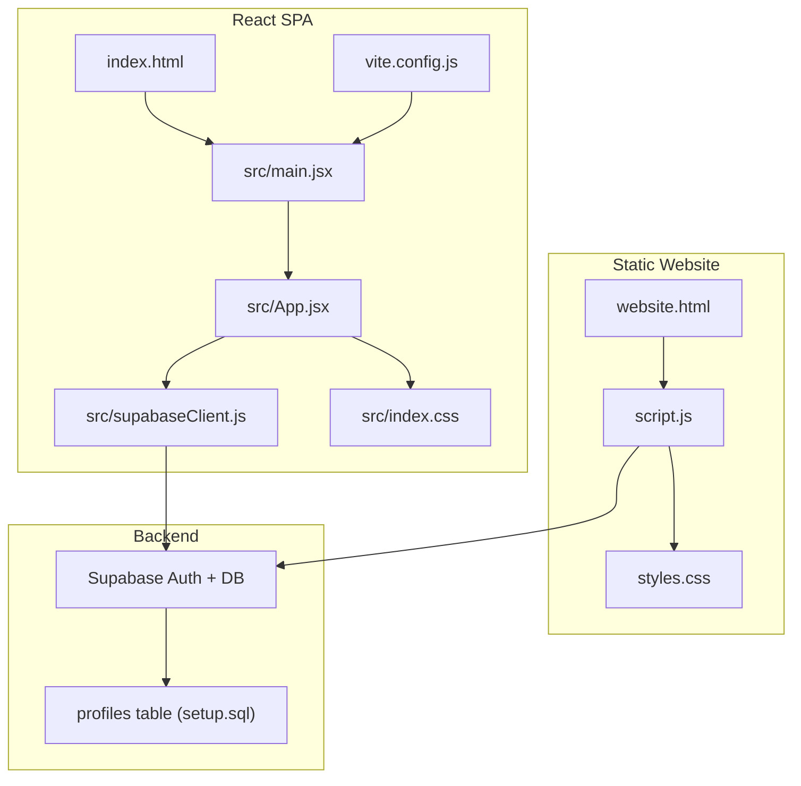
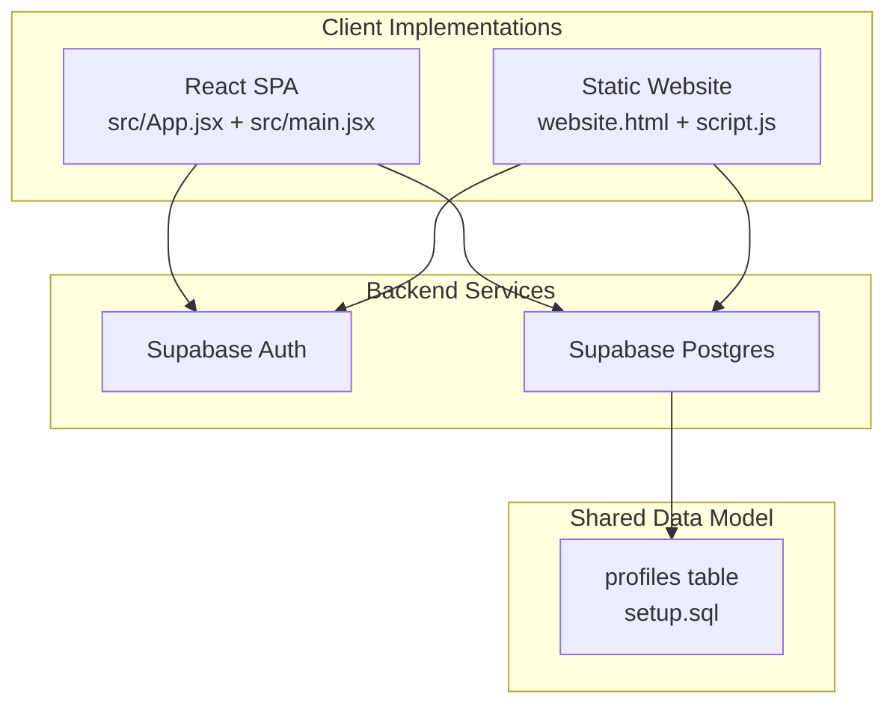
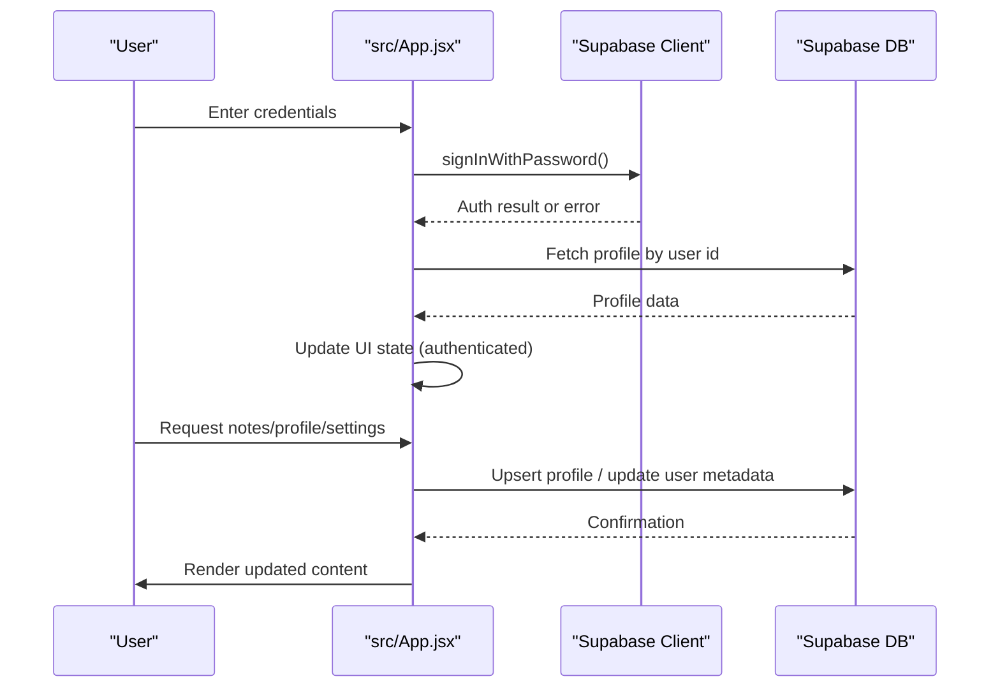
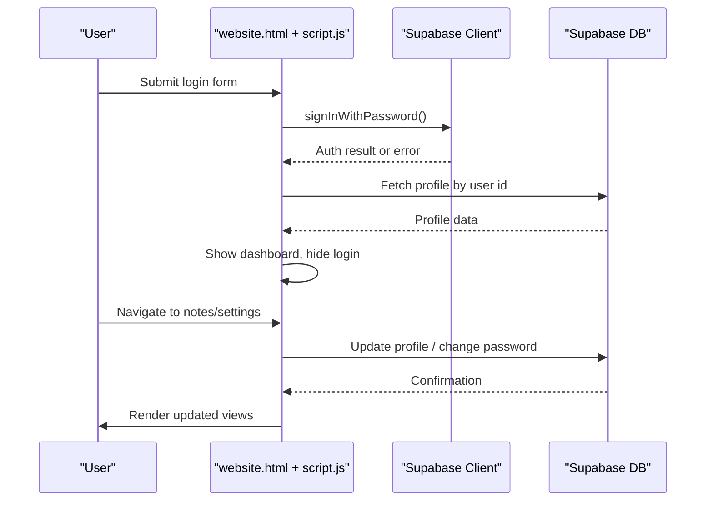
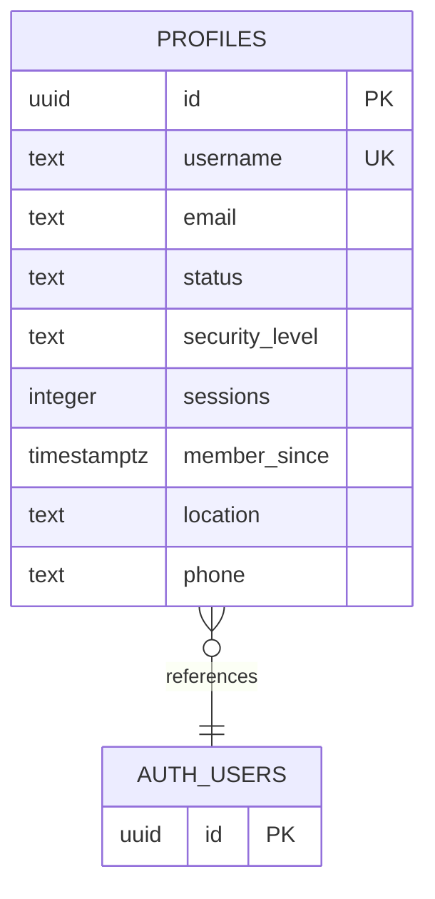
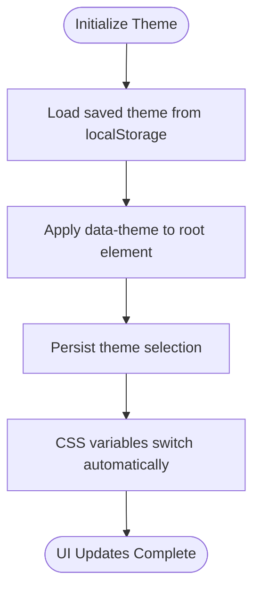
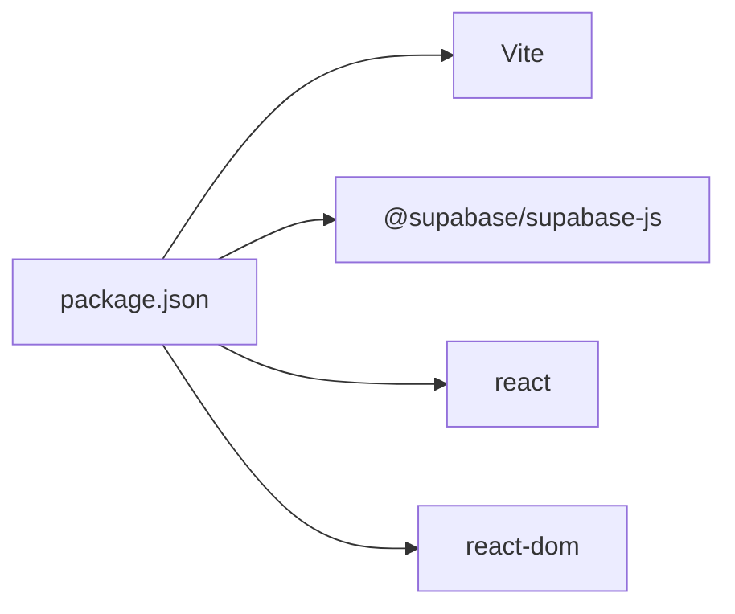

# Project Overview

<cite>
**Referenced Files in This Document**
- [README.md](file://README.md)
- [package.json](file://package.json)
- [vite.config.js](file://vite.config.js)
- [index.html](file://index.html)
- [src/main.jsx](file://src/main.jsx)
- [src/App.jsx](file://src/App.jsx)
- [src/supabaseClient.js](file://src/supabaseClient.js)
- [src/index.css](file://src/index.css)
- [website.html](file://website.html)
- [script.js](file://script.js)
- [styles.css](file://styles.css)
- [setup.sql](file://setup.sql)
</cite>

## Table of Contents
1. [Introduction](#introduction)
2. [Project Structure](#project-structure)
3. [Core Components](#core-components)
4. [Architecture Overview](#architecture-overview)
5. [Detailed Component Analysis](#detailed-component-analysis)
6. [Dependency Analysis](#dependency-analysis)
7. [Performance Considerations](#performance-considerations)
8. [Troubleshooting Guide](#troubleshooting-guide)
9. [Conclusion](#conclusion)

## Introduction
The HMC WEBSITE project is an educational platform designed for junior youth aged 13–15. It serves as a centralized hub for accessing age-appropriate session materials and managing personal profiles while maintaining a safe, engaging, and responsive user experience. The platform emphasizes two complementary implementations:
- A modern React-based SPA with real-time authentication and dynamic content delivery
- A static HTML/CSS/JavaScript version preserving the original interface and functionality

Both implementations share the same backend authentication and data model powered by Supabase, enabling consistent user experiences across platforms.

Target audience:
- Junior youth (13–15 years old) participating in the Healing Ministry Church (HMC) Waterburg program
- Leaders and facilitators who support the educational sessions
- Families and guardians seeking a structured, faith-aligned learning environment

Educational focus:
- Delivering session notes and resources tailored to the 13–15 age group
- Encouraging reflection, growth, and spiritual development through curated content
- Providing a safe, accessible, and intuitive digital space for engagement

## Project Structure
The repository organizes frontend assets and configurations across two primary implementations with shared backend logic and styling:

**Diagram sources**
- [index.html:1-16](file://index.html#L1-L16)
- [src/main.jsx:1-11](file://src/main.jsx#L1-L11)
- [src/App.jsx:1-650](file://src/App.jsx#L1-L650)
- [src/supabaseClient.js:1-11](file://src/supabaseClient.js#L1-L11)
- [src/index.css:1-800](file://src/index.css#L1-L800)
- [vite.config.js:1-8](file://vite.config.js#L1-L8)
- [website.html:1-303](file://website.html#L1-L303)
- [script.js:1-660](file://script.js#L1-L660)
- [styles.css:1-800](file://styles.css#L1-L800)
- [setup.sql:1-26](file://setup.sql#L1-L26)

Key observations:
- The React SPA is bootstrapped via Vite and renders a single-page application with a root element defined in index.html.
- The static website provides a traditional multi-view layout with explicit DOM manipulation for login, dashboard, settings, and notes.
- Both implementations integrate with Supabase for authentication and profile storage, ensuring consistent user data and permissions.

**Section sources**
- [index.html:1-16](file://index.html#L1-L16)
- [src/main.jsx:1-11](file://src/main.jsx#L1-L11)
- [src/App.jsx:1-650](file://src/App.jsx#L1-L650)
- [src/supabaseClient.js:1-11](file://src/supabaseClient.js#L1-L11)
- [src/index.css:1-800](file://src/index.css#L1-L800)
- [vite.config.js:1-8](file://vite.config.js#L1-L8)
- [website.html:1-303](file://website.html#L1-L303)
- [script.js:1-660](file://script.js#L1-L660)
- [styles.css:1-800](file://styles.css#L1-L800)
- [setup.sql:1-26](file://setup.sql#L1-L26)

## Core Components
This section outlines the principal features and capabilities delivered by the platform, aligned with the educational mission for junior youth.

- Authentication system
  - Email/password login and sign-up
  - Phone-based OTP recovery flow
  - Session persistence and real-time auth state synchronization
  - Integration with Supabase Auth for secure user lifecycle management

- Profile management
  - Personal information updates (names, email, phone, branch/location)
  - Password change functionality
  - Theme preference toggling (dark/light mode)
  - Real-time profile sync across both implementations

- Educational content delivery
  - “Junior Youth Notes” resource area tailored for ages 13–15
  - Faith-centered curriculum content presented in digestible sections
  - Responsive design ensuring accessibility on mobile devices

- Responsive design
  - Dark/light theme with persistent user preference
  - Adaptive layouts for smaller screens
  - Consistent visual language across both implementations

- Dual-implementation architecture
  - React SPA for modern UX and real-time updates
  - Static HTML/CSS/JS site for broad compatibility and simplicity
  - Shared backend and database schema for unified data

**Section sources**
- [src/App.jsx:1-650](file://src/App.jsx#L1-L650)
- [script.js:1-660](file://script.js#L1-L660)
- [src/supabaseClient.js:1-11](file://src/supabaseClient.js#L1-L11)
- [setup.sql:1-26](file://setup.sql#L1-L26)

## Architecture Overview
The platform employs a client-server architecture with Supabase as the backend service provider. The frontend consists of two independent implementations that share the same authentication and data model.

**Diagram sources**
- [src/App.jsx:1-650](file://src/App.jsx#L1-L650)
- [src/main.jsx:1-11](file://src/main.jsx#L1-L11)
- [website.html:1-303](file://website.html#L1-L303)
- [script.js:1-660](file://script.js#L1-L660)
- [src/supabaseClient.js:1-11](file://src/supabaseClient.js#L1-L11)
- [setup.sql:1-26](file://setup.sql#L1-L26)

Technology stack highlights:
- Frontend frameworks: React (SPA) and vanilla HTML/CSS/JavaScript (static)
- Build tooling: Vite for the React SPA
- Backend: Supabase (authentication, database, row-level security)
- Styling: CSS custom properties for theme switching and responsive breakpoints

**Section sources**
- [package.json:1-22](file://package.json#L1-L22)
- [vite.config.js:1-8](file://vite.config.js#L1-L8)
- [src/supabaseClient.js:1-11](file://src/supabaseClient.js#L1-L11)
- [setup.sql:1-26](file://setup.sql#L1-L26)

## Detailed Component Analysis

### React SPA Authentication Flow
The React SPA integrates Supabase for authentication and profile management. The flow includes login, sign-up, OTP recovery, and session state management.

Key behaviors:
- Real-time auth state listener keeps UI synchronized
- Profile data is fetched upon successful login
- OTP recovery flow supports phone-based verification
- Theme preference is persisted locally and reflected immediately

**Diagram sources**
- [src/App.jsx:1-650](file://src/App.jsx#L1-L650)
- [src/supabaseClient.js:1-11](file://src/supabaseClient.js#L1-L11)

**Section sources**
- [src/App.jsx:1-650](file://src/App.jsx#L1-L650)
- [src/supabaseClient.js:1-11](file://src/supabaseClient.js#L1-L11)

### Static Website Authentication Flow
The static website mirrors the React SPA’s authentication features using native JavaScript and DOM manipulation.

Key behaviors:
- Manual DOM updates for login, recovery, and settings modals
- Local storage for theme preference
- Consistent error messaging and status notifications

**Diagram sources**
- [website.html:1-303](file://website.html#L1-L303)
- [script.js:1-660](file://script.js#L1-L660)

**Section sources**
- [website.html:1-303](file://website.html#L1-L303)
- [script.js:1-660](file://script.js#L1-L660)

### Data Model and Permissions
The backend relies on a dedicated profiles table with row-level security policies to enforce user isolation and controlled access.

Policies:
- Public profiles are readable by everyone
- Users can insert/update their own profile records
- Row-level security prevents unauthorized access

**Diagram sources**
- [setup.sql:1-26](file://setup.sql#L1-L26)

**Section sources**
- [setup.sql:1-26](file://setup.sql#L1-L26)

### Responsive Design and Theming
Both implementations leverage CSS custom properties to support dark/light themes and responsive breakpoints.

Responsive considerations:
- Breakpoints adapt content layout for tablets and phones
- Visual hierarchy remains clear across themes
- Interactive elements maintain accessibility affordances

**Diagram sources**
- [src/index.css:1-800](file://src/index.css#L1-L800)
- [styles.css:1-800](file://styles.css#L1-L800)

**Section sources**
- [src/index.css:1-800](file://src/index.css#L1-L800)
- [styles.css:1-800](file://styles.css#L1-L800)

## Dependency Analysis
The project’s dependencies are minimal and focused, enabling fast builds and straightforward maintenance.

**Diagram sources**
- [package.json:1-22](file://package.json#L1-L22)

Additional runtime dependencies:
- Supabase client initialization in both implementations
- Static site imports the Supabase client via CDN for demonstration

**Section sources**
- [package.json:1-22](file://package.json#L1-L22)
- [src/supabaseClient.js:1-11](file://src/supabaseClient.js#L1-L11)
- [script.js:1-10](file://script.js#L1-L10)

## Performance Considerations
- Build optimization: Vite provides fast development and optimized production builds for the React SPA
- Lightweight static site: Minimal JavaScript reduces payload and improves load times
- Theme persistence: Local storage avoids unnecessary server requests for theme preferences
- Conditional rendering: React SPA minimizes DOM churn by rendering only necessary views
- Database efficiency: Single-row profile queries and upserts keep latency low

## Troubleshooting Guide
Common issues and resolutions:

- Missing Supabase keys
  - Symptom: Console warnings about missing anonymous key
  - Resolution: Ensure environment variables are configured for the React SPA and update the static site’s Supabase client accordingly

- Authentication errors
  - Symptom: Incorrect credentials or unconfirmed email messages
  - Resolution: Verify email confirmation and retry login; use OTP recovery if needed

- Profile update failures
  - Symptom: Status messages indicating update failure
  - Resolution: Confirm network connectivity and retry; check Supabase logs for policy violations

- Theme not persisting
  - Symptom: Theme resets on reload
  - Resolution: Confirm local storage availability and correct key usage

- Static site not loading
  - Symptom: Blank page or missing styles
  - Resolution: Verify CDN availability for the Supabase client import and correct asset paths

**Section sources**
- [src/supabaseClient.js:1-11](file://src/supabaseClient.js#L1-L11)
- [script.js:1-10](file://script.js#L1-L10)
- [src/App.jsx:1-650](file://src/App.jsx#L1-L650)

## Conclusion
The HMC WEBSITE project delivers a robust, dual-implementation educational platform tailored for junior youth. By combining modern React development practices with a reliable static website, it ensures broad accessibility and a consistent user experience. Supabase powers secure authentication and data management, while thoughtful theming and responsive design enhance usability across devices. Together, these elements support the platform’s mission to provide meaningful, faith-centered learning resources for young people aged 13–15.