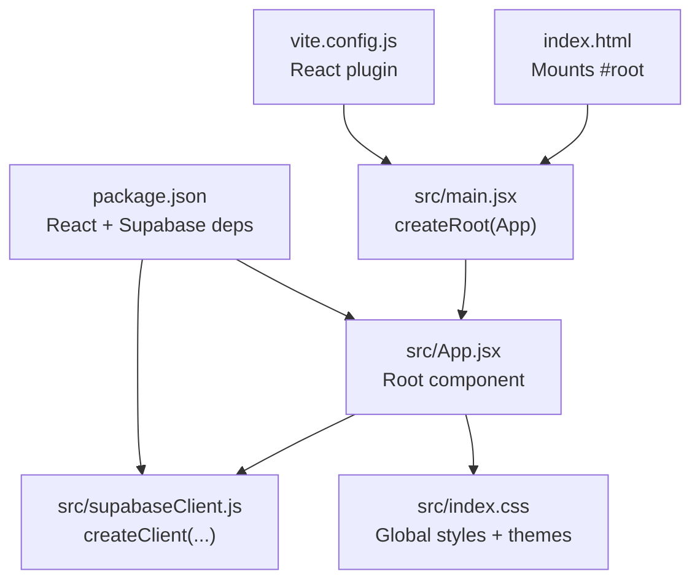
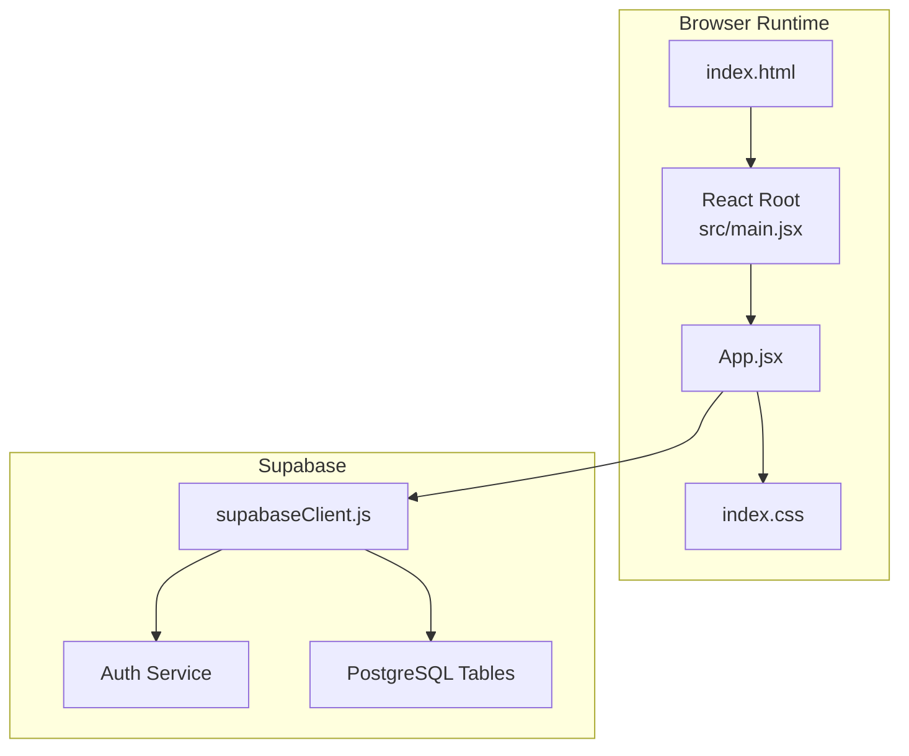
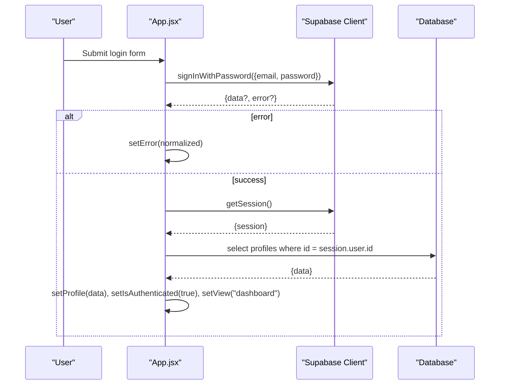
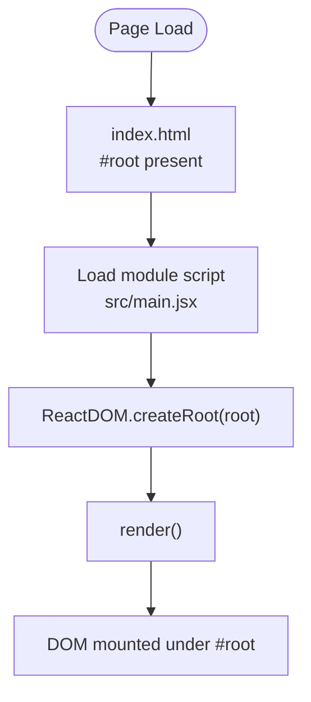
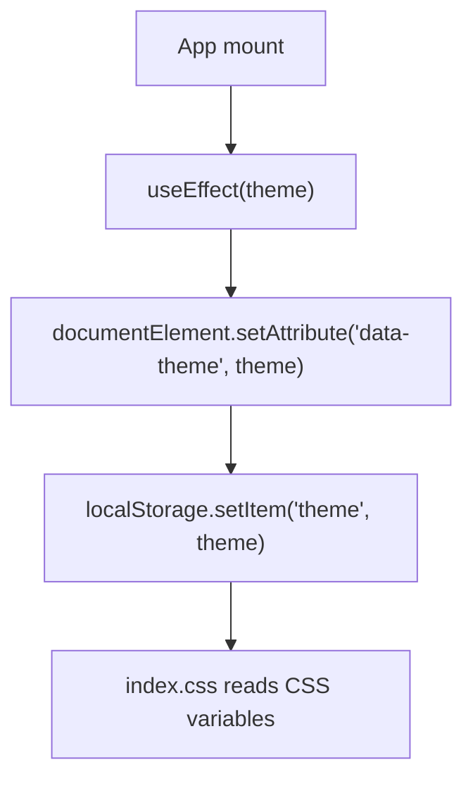
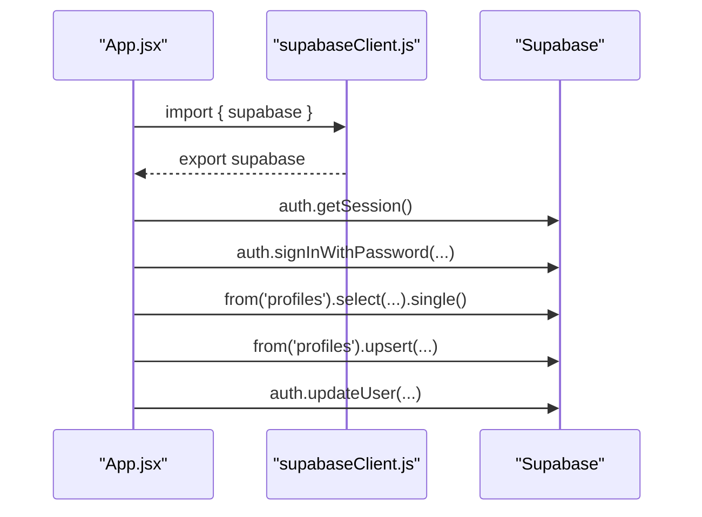
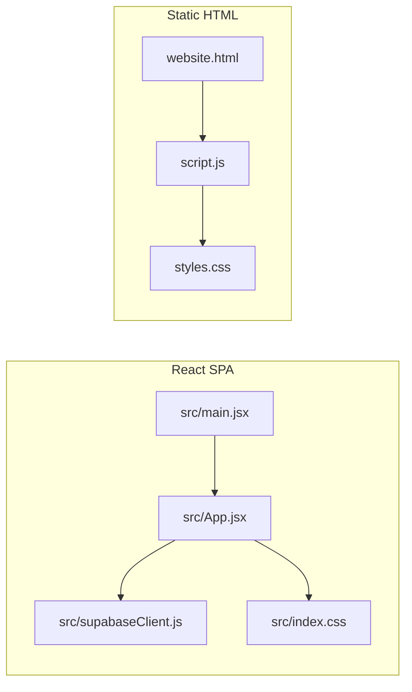
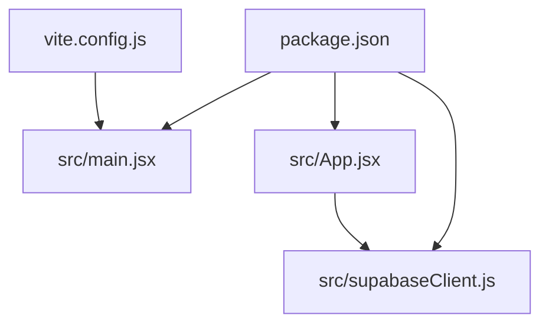

# Application Structure

<cite>
**Referenced Files in This Document**
- [main.jsx](file://src/main.jsx)
- [App.jsx](file://src/App.jsx)
- [index.css](file://src/index.css)
- [supabaseClient.js](file://src/supabaseClient.js)
- [index.html](file://index.html)
- [vite.config.js](file://vite.config.js)
- [package.json](file://package.json)
- [website.html](file://website.html)
- [styles.css](file://styles.css)
- [script.js](file://script.js)
</cite>

## Table of Contents
1. [Introduction](#introduction)
2. [Project Structure](#project-structure)
3. [Core Components](#core-components)
4. [Architecture Overview](#architecture-overview)
5. [Detailed Component Analysis](#detailed-component-analysis)
6. [Dependency Analysis](#dependency-analysis)
7. [Performance Considerations](#performance-considerations)
8. [Troubleshooting Guide](#troubleshooting-guide)
9. [Conclusion](#conclusion)

## Introduction
This document explains the React application structure for the HMC WEBSITE project. It focuses on the component hierarchy starting with App.jsx as the main application component, the state management using React hooks (useState, useEffect), and how the files work together to create the application shell. It also documents the dual-implementation architecture decision, contrasting the React SPA with the static HTML version, and highlights the integration with the Supabase client for authentication and profile management.

## Project Structure
The project follows a Vite-powered React application layout with a single-page application shell. The entry point initializes the React root and mounts the App component. Styling is centralized in a single CSS file with theme-aware variables. Supabase client initialization is isolated for clean separation of concerns.

**Diagram sources**
- [index.html:11-13](file://index.html#L11-L13)
- [src/main.jsx:1-11](file://src/main.jsx#L1-L11)
- [src/App.jsx:1-621](file://src/App.jsx#L1-L621)
- [src/supabaseClient.js:1-11](file://src/supabaseClient.js#L1-L11)
- [src/index.css:1-1148](file://src/index.css#L1-L1148)
- [vite.config.js:1-8](file://vite.config.js#L1-L8)
- [package.json:1-22](file://package.json#L1-L22)

**Section sources**
- [index.html:1-16](file://index.html#L1-L16)
- [src/main.jsx:1-11](file://src/main.jsx#L1-L11)
- [src/App.jsx:1-621](file://src/App.jsx#L1-L621)
- [src/supabaseClient.js:1-11](file://src/supabaseClient.js#L1-L11)
- [src/index.css:1-1148](file://src/index.css#L1-L1148)
- [vite.config.js:1-8](file://vite.config.js#L1-L8)
- [package.json:1-22](file://package.json#L1-L22)

## Core Components
- App.jsx
  - Central state container for authentication, navigation, forms, and UI views.
  - Uses React hooks for local state and effects for session and theme synchronization.
  - Integrates with Supabase for auth state changes, sign-in/sign-up, OTP recovery, profile retrieval/upsert, and user metadata updates.
  - Renders either the login/signup/recovery shell or the authenticated dashboard with notes and settings overlays.

- main.jsx
  - Creates the React root and renders the App component inside React.StrictMode.

- index.css
  - Provides global styles, theme CSS variables, and component-specific layouts for login, dashboard, notes, and settings.

- supabaseClient.js
  - Initializes the Supabase client using environment variables and exports it for use across the app.

- index.html
  - Minimal HTML scaffold with a #root element and module script tag pointing to the React entry point.

- vite.config.js
  - Enables the React plugin for JSX transformations and fast refresh.

- package.json
  - Declares React, React DOM, Vite, @vitejs/plugin-react, and @supabase/supabase-js as dependencies.

**Section sources**
- [src/App.jsx:1-621](file://src/App.jsx#L1-L621)
- [src/main.jsx:1-11](file://src/main.jsx#L1-L11)
- [src/index.css:1-1148](file://src/index.css#L1-L1148)
- [src/supabaseClient.js:1-11](file://src/supabaseClient.js#L1-L11)
- [index.html:1-16](file://index.html#L1-L16)
- [vite.config.js:1-8](file://vite.config.js#L1-L8)
- [package.json:1-22](file://package.json#L1-L22)

## Architecture Overview
The React SPA architecture centers around a single App component that orchestrates:
- Authentication lifecycle via Supabase auth state listeners.
- Local state for UI views, forms, and loading indicators.
- Theme persistence and dynamic CSS variable updates.
- Profile CRUD through Supabase database operations.

**Diagram sources**
- [index.html:11-13](file://index.html#L11-L13)
- [src/main.jsx:6-10](file://src/main.jsx#L6-L10)
- [src/App.jsx:1-621](file://src/App.jsx#L1-L621)
- [src/supabaseClient.js:1-11](file://src/supabaseClient.js#L1-L11)
- [src/index.css:1-1148](file://src/index.css#L1-L1148)

## Detailed Component Analysis

### App.jsx: State Management and Lifecycle
- State initialization
  - Authentication and user/session state: isAuthenticated, user, profile.
  - Navigation and UI state: view, showSignup, showRecovery, recoveryStep.
  - Loading and error states: loading, authLoading, error, statusMsg.
  - Theme preference persisted in localStorage and synchronized to DOM.
  - Form fields for login, signup, profile editing, and OTP recovery.

- Lifecycle and subscriptions
  - One-time session check and cleanup subscription on unmount.
  - Auth state listener updates user/profile and resets view accordingly.
  - Theme effect persists to localStorage and applies to documentElement.

- Event handlers and flows
  - handleLogin: resolves username to email if needed, invokes Supabase sign-in, normalizes error messages, and triggers status feedback.
  - handleSendRecoveryOTP and handleVerifyOTP: manage OTP-based recovery flow with step transitions.
  - handleSignup: validates password confirmation, creates user via Supabase auth, upserts profile record, and notifies user.
  - handleSaveProfile: upserts profile and updates Supabase auth metadata atomically.
  - handleChangePassword: updates user password via Supabase.
  - handleLogout: signs out and resets view.

- Conditional rendering
  - Loading skeleton while checking session.
  - Authenticated dashboard with action cards and notes view.
  - Settings overlay with personal info, password change, and theme toggle.
  - Login/signup/recovery forms with error/status messaging.

**Diagram sources**
- [src/App.jsx:101-138](file://src/App.jsx#L101-L138)
- [src/App.jsx:35-62](file://src/App.jsx#L35-L62)
- [src/App.jsx:82-94](file://src/App.jsx#L82-L94)

**Section sources**
- [src/App.jsx:1-621](file://src/App.jsx#L1-L621)

### main.jsx and index.html: Application Shell
- main.jsx
  - Imports React, ReactDOM, App, and global styles.
  - Creates the root and renders App inside StrictMode.

- index.html
  - Provides the #root element and loads the module script for the React entry point.

**Diagram sources**
- [index.html:11-13](file://index.html#L11-L13)
- [src/main.jsx:6-10](file://src/main.jsx#L6-L10)

**Section sources**
- [src/main.jsx:1-11](file://src/main.jsx#L1-L11)
- [index.html:1-16](file://index.html#L1-L16)

### Styling and Theming
- index.css
  - Defines CSS custom properties for dark/light themes.
  - Applies transitions for smooth theme switching.
  - Provides base styles for login, dashboard, notes, and settings views.
  - Uses data-theme attribute on documentElement to switch palettes.

**Diagram sources**
- [src/App.jsx:73-76](file://src/App.jsx#L73-L76)
- [src/index.css:7-29](file://src/index.css#L7-L29)

**Section sources**
- [src/index.css:1-1148](file://src/index.css#L1-L1148)
- [src/App.jsx:73-76](file://src/App.jsx#L73-L76)

### Supabase Integration
- supabaseClient.js
  - Reads Vite environment variables for Supabase URL and anonymous key.
  - Exports a singleton client instance for use across the app.
  - Includes a warning when the anonymous key is missing.

**Diagram sources**
- [src/supabaseClient.js:1-11](file://src/supabaseClient.js#L1-L11)
- [src/App.jsx:35-62](file://src/App.jsx#L35-L62)
- [src/App.jsx:82-94](file://src/App.jsx#L82-L94)
- [src/App.jsx:101-138](file://src/App.jsx#L101-L138)
- [src/App.jsx:243-274](file://src/App.jsx#L243-L274)
- [src/App.jsx:276-299](file://src/App.jsx#L276-L299)

**Section sources**
- [src/supabaseClient.js:1-11](file://src/supabaseClient.js#L1-L11)
- [src/App.jsx:1-621](file://src/App.jsx#L1-L621)

### Dual-Implementation Architecture Decision
- React SPA (this project)
  - Single-page application with client-side routing via view state.
  - Reactive UI updates driven by React hooks and Supabase auth state changes.
  - Modern toolchain with Vite and JSX transforms.

- Static HTML version (website.html + script.js)
  - Pure HTML/CSS/JavaScript with DOM manipulation for UI state.
  - Manual event binding and manual DOM updates for login, signup, settings, and notes.
  - Separate styles.css and script.js for styling and logic respectively.

**Diagram sources**
- [src/main.jsx:1-11](file://src/main.jsx#L1-L11)
- [src/App.jsx:1-621](file://src/App.jsx#L1-L621)
- [src/supabaseClient.js:1-11](file://src/supabaseClient.js#L1-L11)
- [src/index.css:1-1148](file://src/index.css#L1-L1148)
- [website.html:1-303](file://website.html#L1-L303)
- [styles.css:1-1071](file://styles.css#L1-L1071)
- [script.js:1-660](file://script.js#L1-L660)

**Section sources**
- [website.html:1-303](file://website.html#L1-L303)
- [styles.css:1-1071](file://styles.css#L1-L1071)
- [script.js:1-660](file://script.js#L1-L660)
- [src/App.jsx:1-621](file://src/App.jsx#L1-L621)

## Dependency Analysis
- Internal dependencies
  - App.jsx depends on supabaseClient.js for auth and database operations.
  - main.jsx depends on App.jsx and index.css for mounting and styling.
  - index.html depends on main.jsx for the module entry point.

- External dependencies
  - React and React DOM for UI rendering.
  - @supabase/supabase-js for backend integration.
  - Vite and @vitejs/plugin-react for development and build.

**Diagram sources**
- [package.json:12-20](file://package.json#L12-L20)
- [vite.config.js:1-8](file://vite.config.js#L1-L8)
- [src/main.jsx:1-11](file://src/main.jsx#L1-L11)
- [src/App.jsx:1-621](file://src/App.jsx#L1-L621)
- [src/supabaseClient.js:1-11](file://src/supabaseClient.js#L1-L11)

**Section sources**
- [package.json:1-22](file://package.json#L1-L22)
- [vite.config.js:1-8](file://vite.config.js#L1-L8)
- [src/main.jsx:1-11](file://src/main.jsx#L1-L11)
- [src/App.jsx:1-621](file://src/App.jsx#L1-L621)
- [src/supabaseClient.js:1-11](file://src/supabaseClient.js#L1-L11)

## Performance Considerations
- Minimize re-renders by consolidating related form states and avoiding unnecessary props drilling.
- Debounce or throttle frequent UI updates (e.g., theme toggle) to reduce layout thrashing.
- Lazy-load heavy assets and defer non-critical scripts where applicable.
- Keep Supabase queries scoped (e.g., select only required fields) to reduce payload sizes.
- Use CSS containment and isolation for complex views (e.g., notes) to improve paint performance.

## Troubleshooting Guide
- Supabase anonymous key missing
  - Symptom: Warning logged indicating missing anonymous key.
  - Action: Set VITE_SUPABASE_URL and VITE_SUPABASE_ANON_KEY in environment variables.

- Auth state not updating
  - Symptom: UI remains in login state despite successful sign-in.
  - Action: Verify onAuthStateChange subscription is active and not unsubscribed prematurely.

- Profile not loading after login
  - Symptom: User authenticated but profile fields empty.
  - Action: Confirm database row exists for user.id and query returns a single record.

- Theme not persisting
  - Symptom: Theme resets on reload.
  - Action: Ensure localStorage theme value is set and documentElement attribute is applied.

- Styling inconsistencies
  - Symptom: Styles appear incorrect in light/dark mode.
  - Action: Verify CSS variables are defined for both dark and light themes and data-theme attribute is set.

**Section sources**
- [src/supabaseClient.js:6-8](file://src/supabaseClient.js#L6-L8)
- [src/App.jsx:35-62](file://src/App.jsx#L35-L62)
- [src/App.jsx:82-94](file://src/App.jsx#L82-L94)
- [src/App.jsx:73-76](file://src/App.jsx#L73-L76)
- [src/index.css:7-29](file://src/index.css#L7-L29)

## Conclusion
The HMC WEBSITE React application is structured around a single App component that manages authentication, navigation, and UI state using React hooks. Supabase provides seamless auth state synchronization and profile persistence. The styling system leverages CSS custom properties for theme-aware visuals. The project’s dual-implementation architecture demonstrates two complementary approaches: a modern React SPA and a traditional static HTML/JS version, each suited to different deployment and maintenance contexts.