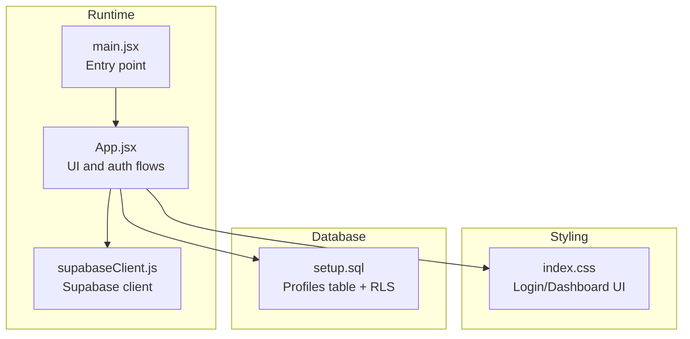
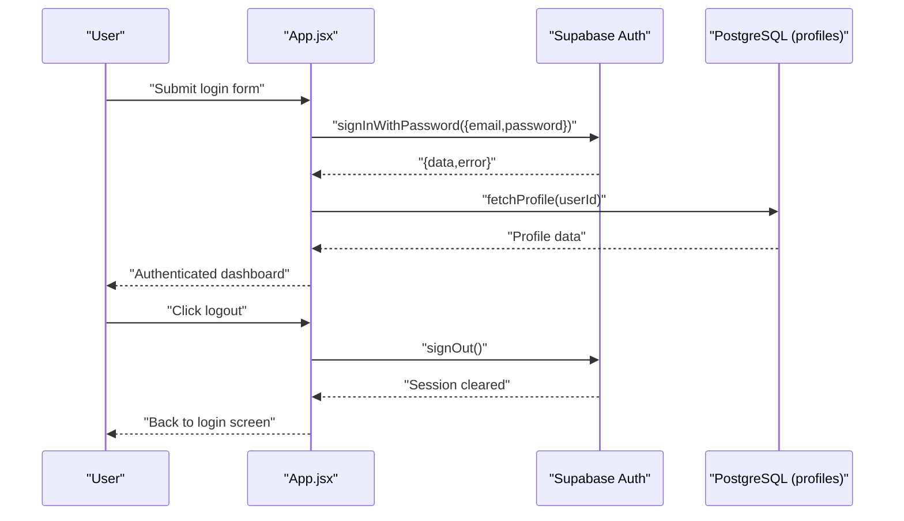
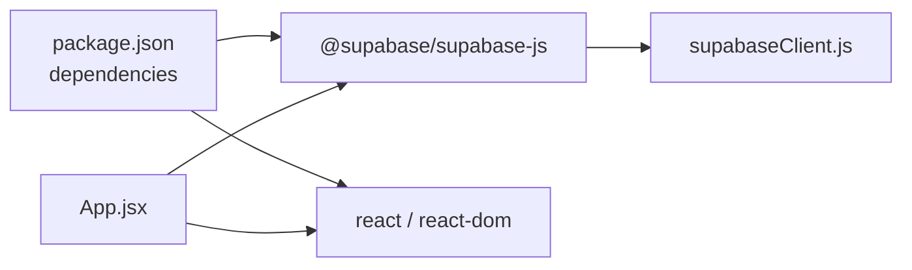

# Authentication System

<cite>
**Referenced Files in This Document**
- [App.jsx](file://src/App.jsx)
- [supabaseClient.js](file://src/supabaseClient.js)
- [index.css](file://src/index.css)
- [setup.sql](file://setup.sql)
- [package.json](file://package.json)
- [main.jsx](file://src/main.jsx)
</cite>

## Table of Contents
1. [Introduction](#introduction)
2. [Project Structure](#project-structure)
3. [Core Components](#core-components)
4. [Architecture Overview](#architecture-overview)
5. [Detailed Component Analysis](#detailed-component-analysis)
6. [Dependency Analysis](#dependency-analysis)
7. [Performance Considerations](#performance-considerations)
8. [Troubleshooting Guide](#troubleshooting-guide)
9. [Conclusion](#conclusion)

## Introduction
This document explains the authentication system implemented in the React application using Supabase Auth. It covers login and signup flows, session management, authentication state handling, and the dual authentication methods: email/password login with username fallback support, and SMS OTP recovery. It also documents the React hooks used for state management, error handling, loading states, and logout functionality. Security considerations, input validation, and user experience patterns are addressed throughout.

## Project Structure
The authentication system spans a small set of focused files:
- Application entry and UI rendering
- Supabase client initialization
- Styling for login and dashboard views
- Database schema for user profiles and row-level security
- Package dependencies for Supabase and React

**Diagram sources**
- [main.jsx:1-11](file://src/main.jsx#L1-L11)
- [App.jsx:1-621](file://src/App.jsx#L1-L621)
- [supabaseClient.js:1-11](file://src/supabaseClient.js#L1-L11)
- [index.css:1-1148](file://src/index.css#L1-L1148)
- [setup.sql:1-26](file://setup.sql#L1-L26)

**Section sources**
- [main.jsx:1-11](file://src/main.jsx#L1-L11)
- [App.jsx:1-621](file://src/App.jsx#L1-L621)
- [supabaseClient.js:1-11](file://src/supabaseClient.js#L1-L11)
- [index.css:1-1148](file://src/index.css#L1-L1148)
- [setup.sql:1-26](file://setup.sql#L1-L26)

## Core Components
- Supabase client initialization and environment configuration
- Authentication state management with React hooks
- Login flow with username fallback to email resolution
- Signup flow with profile creation and user metadata
- SMS OTP recovery flow (send OTP and verify)
- Session persistence and auth state change subscription
- Logout functionality

Key implementation references:
- Supabase client creation and environment checks
- Auth state subscription and session retrieval
- Login handler with username fallback
- OTP send and verify handlers
- Signup handler with profile upsert
- Logout handler

**Section sources**
- [supabaseClient.js:1-11](file://src/supabaseClient.js#L1-L11)
- [App.jsx:35-62](file://src/App.jsx#L35-L62)
- [App.jsx:101-138](file://src/App.jsx#L101-L138)
- [App.jsx:140-178](file://src/App.jsx#L140-L178)
- [App.jsx:180-236](file://src/App.jsx#L180-L236)
- [App.jsx:238-241](file://src/App.jsx#L238-L241)

## Architecture Overview
The authentication architecture integrates Supabase Auth with a React SPA. The app initializes the Supabase client, subscribes to auth state changes, and manages local React state for user, profile, and UI views. Authentication flows are handled by calling Supabase Auth methods, while user metadata is stored in a dedicated profiles table with Row Level Security enabled.

**Diagram sources**
- [App.jsx:101-138](file://src/App.jsx#L101-L138)
- [App.jsx:238-241](file://src/App.jsx#L238-L241)
- [App.jsx:82-94](file://src/App.jsx#L82-L94)

## Detailed Component Analysis

### Supabase Client Initialization
- Creates a Supabase client using Vite environment variables for URL and anon key.
- Includes a runtime warning if the anon key is missing or placeholder-like.

Implementation highlights:
- Environment variable usage for client creation
- Warning for missing/anon key

**Section sources**
- [supabaseClient.js:1-11](file://src/supabaseClient.js#L1-L11)

### Authentication State Management and Session Persistence
- On mount, retrieves the current session and sets local state accordingly.
- Subscribes to auth state changes to keep UI synchronized with Supabase’s session.
- Unsubscribes on component unmount to prevent leaks.

Key behaviors:
- Initial session check and profile fetch
- Auth state change subscription and cleanup
- Reset to dashboard view when logged out

**Section sources**
- [App.jsx:35-62](file://src/App.jsx#L35-L62)

### Login Flow (Email/Username + Password)
- Accepts either an email or a username in the email field.
- If the input lacks an "@" symbol, resolves the username to an email via the profiles table.
- Calls Supabase Auth signInWithPassword with the resolved email.
- Handles errors with user-friendly messages and toggles loading state.

User experience:
- Clear error messaging for invalid credentials and unconfirmed emails
- Loading state prevents double submission

**Section sources**
- [App.jsx:101-138](file://src/App.jsx#L101-L138)

### SMS OTP Recovery Flow
- Two-step process:
  1) Send OTP: submits a phone number to Supabase Auth to trigger an SMS.
  2) Verify OTP: submits the received code to Supabase Auth to authenticate.
- On successful verification, transitions back to the dashboard and displays a status message.

UX patterns:
- Step-based UI switching between phone entry and OTP verification
- Status messages and loading states during OTP operations

**Section sources**
- [App.jsx:140-178](file://src/App.jsx#L140-L178)

### Signup Flow
- Validates password confirmation match.
- Calls Supabase Auth signUp with email, password, and phone.
- On success, upserts a profile record with username, phone, branch, and defaults.
- Displays a success message and switches back to the login view.

Security and UX:
- Prevents mismatched passwords
- Upserts profile with defaults and timestamps
- Alerts user to check email for confirmation

**Section sources**
- [App.jsx:180-236](file://src/App.jsx#L180-L236)

### Logout
- Calls Supabase Auth signOut to clear the session.
- Resets view to dashboard.

**Section sources**
- [App.jsx:238-241](file://src/App.jsx#L238-L241)

### UI Styling and Theming
- Login and dashboard views are styled with CSS variables for dark/light themes.
- Glassmorphism login box, responsive layout, and theme toggle integration.

**Section sources**
- [index.css:1-1148](file://src/index.css#L1-L1148)

### Database Schema and Row Level Security
- Profiles table stores user metadata linked to Supabase Auth users.
- Row Level Security policies enable public select, restrict inserts/updates to the owning user.

**Section sources**
- [setup.sql:1-26](file://setup.sql#L1-L26)

## Dependency Analysis
- React and Supabase JS SDK are declared as dependencies.
- The app imports the Supabase client and uses it for all auth operations.
- No circular dependencies detected among the analyzed files.

**Diagram sources**
- [package.json:12-21](file://package.json#L12-L21)
- [App.jsx:1-621](file://src/App.jsx#L1-L621)
- [supabaseClient.js:1-11](file://src/supabaseClient.js#L1-L11)

**Section sources**
- [package.json:12-21](file://package.json#L12-L21)
- [App.jsx:1-621](file://src/App.jsx#L1-L621)
- [supabaseClient.js:1-11](file://src/supabaseClient.js#L1-L11)

## Performance Considerations
- Minimize re-renders by consolidating auth-related state updates in the auth state change subscription.
- Debounce or disable form submissions during network requests to avoid redundant calls.
- Keep profile fetches efficient by selecting only required fields.
- Use CSS variables and minimal DOM nodes for theme switching to reduce layout thrash.

## Troubleshooting Guide
Common issues and resolutions:
- Missing or placeholder Supabase keys
  - Symptom: Warning in console about missing anon key.
  - Resolution: Set VITE_SUPABASE_URL and VITE_SUPABASE_ANON_KEY in environment.
  - Reference: [supabaseClient.js:6-8](file://src/supabaseClient.js#L6-L8)

- Login fails with “Email not confirmed”
  - Symptom: Error message indicates email confirmation required.
  - Resolution: Prompt user to check email for confirmation link.
  - Reference: [App.jsx:129-132](file://src/App.jsx#L129-L132)

- Login fails with “Invalid login credentials”
  - Symptom: Incorrect email or password.
  - Resolution: Prompt user to correct credentials.
  - Reference: [App.jsx:130-132](file://src/App.jsx#L130-L132)

- OTP send/verify errors
  - Symptom: Error messages from Supabase Auth.
  - Resolution: Validate phone number format and ensure SMS provider is configured.
  - Reference: [App.jsx:149-151](file://src/App.jsx#L149-L151), [App.jsx:170-172](file://src/App.jsx#L170-L172)

- Profile fetch failures
  - Symptom: Console errors when retrieving profile.
  - Resolution: Ensure RLS policies allow select and user ID is present.
  - Reference: [App.jsx:89-94](file://src/App.jsx#L89-L94), [setup.sql:18-25](file://setup.sql#L18-L25)

- Logout not clearing UI
  - Symptom: Stuck on dashboard after logout.
  - Resolution: Confirm signOut is called and auth state subscription resets state.
  - Reference: [App.jsx:238-241](file://src/App.jsx#L238-L241), [App.jsx:53-58](file://src/App.jsx#L53-L58)

## Conclusion
The authentication system integrates Supabase Auth seamlessly with a React SPA. It supports robust login via email or username, secure signup with profile creation, and a practical SMS OTP recovery flow. Session persistence and real-time auth state synchronization ensure a smooth user experience. The system leverages Supabase’s built-in security features and RLS policies to protect user data. Following the documented patterns and troubleshooting steps will help maintain reliability and usability.