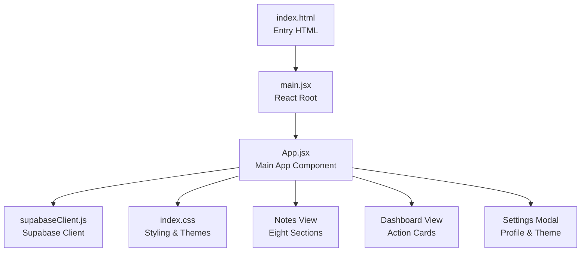
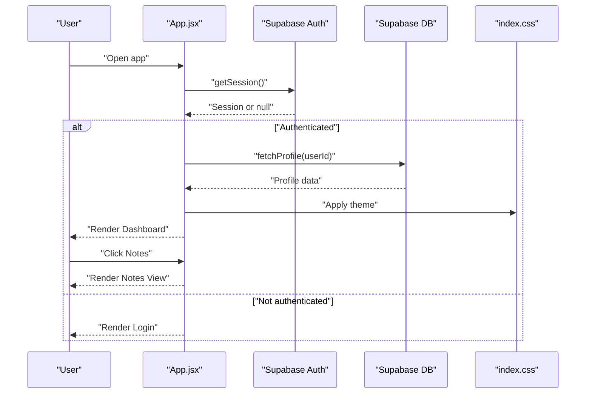
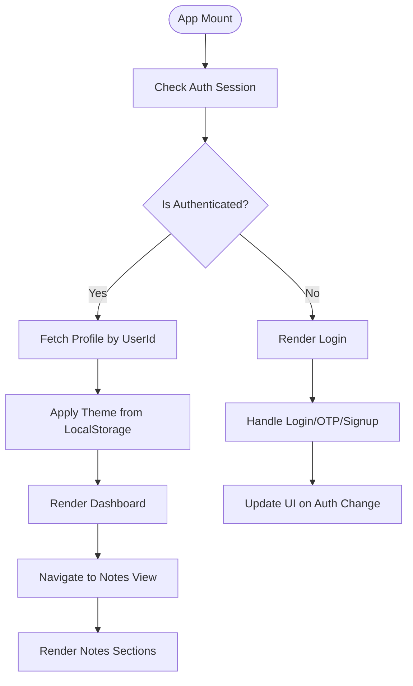
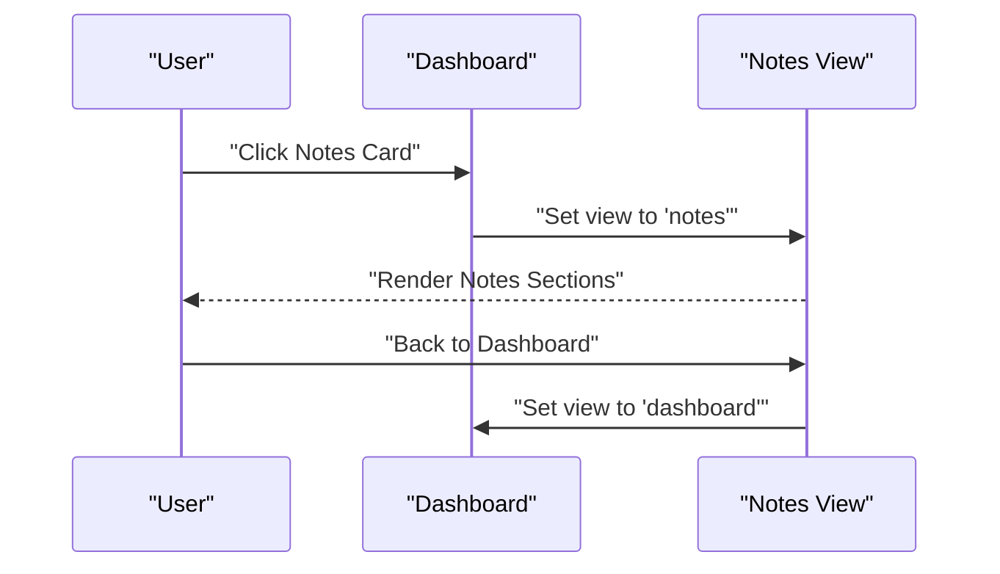
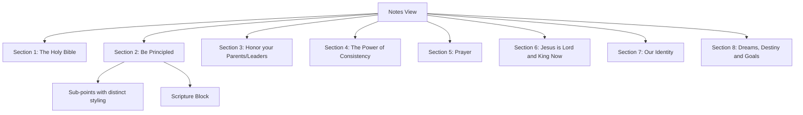
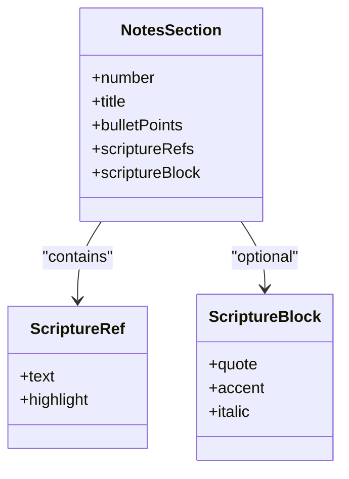
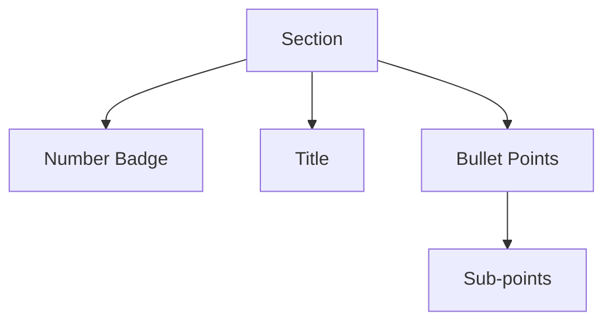
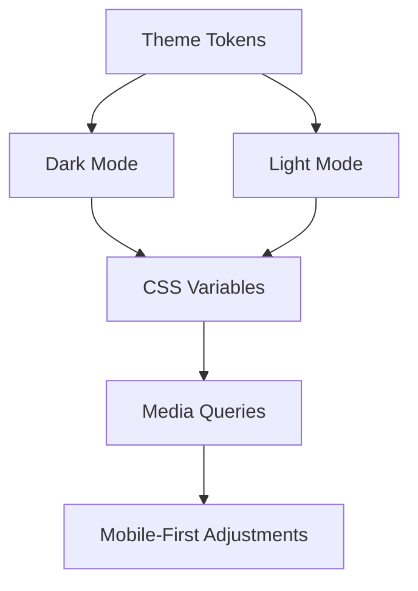
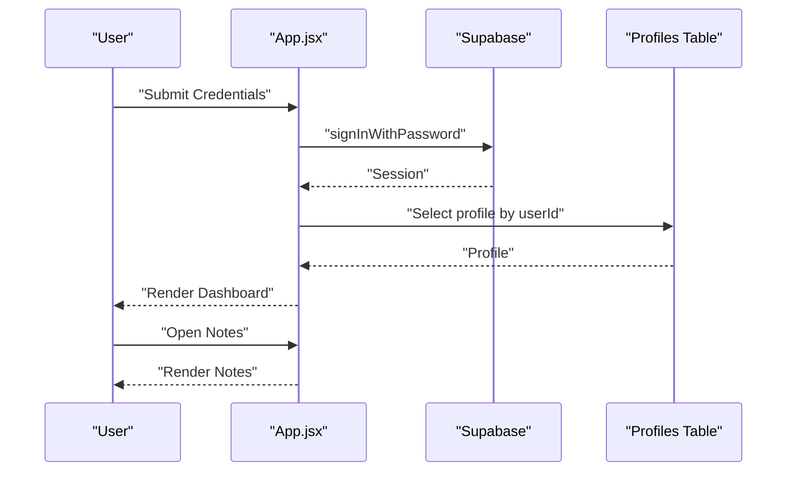
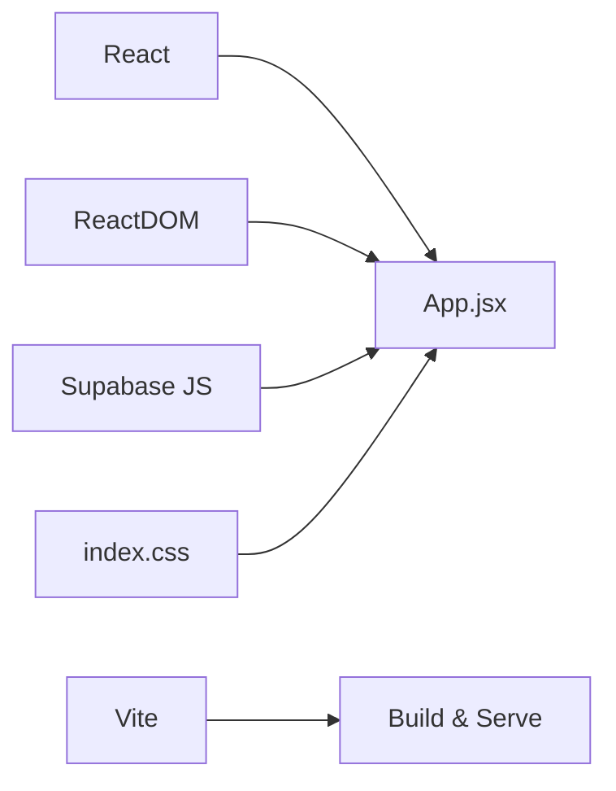

# Educational Content System

<cite>
**Referenced Files in This Document**
- [App.jsx](file://src/App.jsx)
- [main.jsx](file://src/main.jsx)
- [supabaseClient.js](file://src/supabaseClient.js)
- [index.css](file://src/index.css)
- [index.html](file://index.html)
- [vite.config.js](file://vite.config.js)
- [setup.sql](file://setup.sql)
- [website.html](file://website.html)
- [script.js](file://script.js)
</cite>

## Table of Contents
1. [Introduction](#introduction)
2. [Project Structure](#project-structure)
3. [Core Components](#core-components)
4. [Architecture Overview](#architecture-overview)
5. [Detailed Component Analysis](#detailed-component-analysis)
6. [Dependency Analysis](#dependency-analysis)
7. [Performance Considerations](#performance-considerations)
8. [Troubleshooting Guide](#troubleshooting-guide)
9. [Conclusion](#conclusion)
10. [Appendices](#appendices)

## Introduction
This document describes an educational content delivery system tailored for junior youth aged 13–15. It focuses on:
- Content structure across eight biblical teaching sections
- Content rendering and presentation
- Mobile-first responsive design
- Integration with a dashboard interface
- Scripture reference system using embedded references
- Section numbering and organization
- Navigation between dashboard and notes view
- Styling patterns for educational materials
- Relationship between content access and user authentication status

## Project Structure
The system is a React application bootstrapped with Vite and styled with CSS. Authentication is powered by Supabase. The application renders either a login interface or a dashboard with a “Junior Youth Notes” view containing structured lessons.

**Diagram sources**
- [index.html:1-16](file://index.html#L1-L16)
- [main.jsx:1-11](file://src/main.jsx#L1-L11)
- [App.jsx:5-621](file://src/App.jsx#L5-L621)
- [supabaseClient.js:1-11](file://src/supabaseClient.js#L1-L11)
- [index.css:1-1148](file://src/index.css#L1-L1148)

**Section sources**
- [index.html:1-16](file://index.html#L1-L16)
- [main.jsx:1-11](file://src/main.jsx#L1-L11)
- [vite.config.js:1-8](file://vite.config.js#L1-L8)

## Core Components
- Authentication and session management via Supabase
- Dashboard with a single action card leading to notes
- Notes view presenting eight structured teaching sections
- Settings modal for profile updates and theme preferences
- Responsive CSS with dark/light theme support

**Section sources**
- [App.jsx:5-621](file://src/App.jsx#L5-L621)
- [supabaseClient.js:1-11](file://src/supabaseClient.js#L1-L11)
- [index.css:1-1148](file://src/index.css#L1-L1148)

## Architecture Overview
The system follows a client-side React architecture with Supabase for authentication and user metadata storage. The notes content is rendered statically within the notes view, while the dashboard and settings views are interactive.

**Diagram sources**
- [App.jsx:35-62](file://src/App.jsx#L35-L62)
- [App.jsx:82-94](file://src/App.jsx#L82-L94)
- [index.css:7-29](file://src/index.css#L7-L29)

## Detailed Component Analysis

### Authentication and Session Management
- Initializes Supabase client using environment variables
- Subscribes to auth state changes to update UI and profile data
- Supports login via email/password, OTP recovery, and sign-up with profile creation
- Stores theme preference locally and applies it to the document element

**Diagram sources**
- [App.jsx:35-62](file://src/App.jsx#L35-L62)
- [App.jsx:82-94](file://src/App.jsx#L82-L94)
- [App.jsx:74-76](file://src/App.jsx#L74-L76)

**Section sources**
- [supabaseClient.js:1-11](file://src/supabaseClient.js#L1-L11)
- [App.jsx:35-62](file://src/App.jsx#L35-L62)
- [App.jsx:74-76](file://src/App.jsx#L74-L76)

### Dashboard and Navigation
- Single action card labeled “JUNIOR YOUTH NOTES”
- Clicking navigates to the notes view
- Navbar displays branding and theme toggle
- Logout clears session and resets view

**Diagram sources**
- [App.jsx:442-456](file://src/App.jsx#L442-L456)
- [App.jsx:326-332](file://src/App.jsx#L326-L332)

**Section sources**
- [App.jsx:442-456](file://src/App.jsx#L442-L456)
- [App.jsx:326-332](file://src/App.jsx#L326-L332)

### Notes View: Content Structure and Rendering
The notes view presents eight sections with:
- Section numbering and titles
- Bullet points with embedded scripture references
- Optional scripture blocks and reference lines
- Sub-points with distinct styling

**Diagram sources**
- [App.jsx:334-441](file://src/App.jsx#L334-L441)

**Section sources**
- [App.jsx:334-441](file://src/App.jsx#L334-L441)

### Scripture Reference System
- Embedded references use a dedicated class for highlighting
- Some sections include a separate reference line
- Scripture blocks provide emphasized, italicized content with a left accent

**Diagram sources**
- [App.jsx:334-441](file://src/App.jsx#L334-L441)
- [index.css:926-947](file://src/index.css#L926-L947)

**Section sources**
- [App.jsx:334-441](file://src/App.jsx#L334-L441)
- [index.css:926-947](file://src/index.css#L926-L947)

### Section Numbering and Organization
- Each section has a circular number badge
- Titles are styled consistently
- Sub-points are visually differentiated with indentation and lighter color

**Diagram sources**
- [App.jsx:862-892](file://src/App.jsx#L862-L892)
- [index.css:869-925](file://src/index.css#L869-L925)

**Section sources**
- [App.jsx:862-892](file://src/App.jsx#L862-L892)
- [index.css:869-925](file://src/index.css#L869-L925)

### Responsive Design and Mobile-First Experience
- CSS variables define theme tokens for dark/light modes
- Media queries adjust spacing and typography for smaller screens
- Glassmorphism-inspired cards and subtle shadows enhance readability
- Navigation remains accessible with a sticky navbar and clear back buttons

**Diagram sources**
- [index.css:7-29](file://src/index.css#L7-L29)
- [index.css:777-814](file://src/index.css#L777-L814)

**Section sources**
- [index.css:7-29](file://src/index.css#L7-L29)
- [index.css:777-814](file://src/index.css#L777-L814)

### Styling Patterns for Educational Materials
- Accent color highlights scripture references and key actions
- Subtle borders and backgrounds distinguish content sections
- Emphasis via bold and italic text for key phrases
- Consistent spacing and typography improve readability

**Section sources**
- [index.css:926-947](file://src/index.css#L926-L947)
- [index.css:869-925](file://src/index.css#L869-L925)

### Relationship Between Content Access and Authentication Status
- Unauthenticated users see the login screen
- On successful login, the app fetches profile data and renders the dashboard
- Access to notes requires authentication; unauthorized users cannot navigate to notes

**Diagram sources**
- [App.jsx:101-138](file://src/App.jsx#L101-L138)
- [App.jsx:82-94](file://src/App.jsx#L82-L94)
- [setup.sql:1-26](file://setup.sql#L1-L26)

**Section sources**
- [App.jsx:101-138](file://src/App.jsx#L101-L138)
- [App.jsx:82-94](file://src/App.jsx#L82-L94)
- [setup.sql:1-26](file://setup.sql#L1-L26)

## Dependency Analysis
- React and ReactDOM power the UI
- Vite builds and serves the app
- Supabase handles authentication and database operations
- CSS variables and media queries enable theming and responsiveness

**Diagram sources**
- [main.jsx:1-11](file://src/main.jsx#L1-L11)
- [vite.config.js:1-8](file://vite.config.js#L1-L8)
- [supabaseClient.js:1-11](file://src/supabaseClient.js#L1-L11)
- [index.css:1-1148](file://src/index.css#L1-L1148)

**Section sources**
- [package.json:12-21](file://package.json#L12-L21)
- [vite.config.js:1-8](file://vite.config.js#L1-L8)

## Performance Considerations
- Keep DOM updates minimal by leveraging React state and conditional rendering
- Use CSS variables for theme switching to avoid layout thrashing
- Lazy load images if additional assets are introduced
- Optimize media queries for efficient rendering on mobile devices

## Troubleshooting Guide
- Authentication errors: Check Supabase credentials and environment variables
- Profile fetch failures: Verify row-level security policies and user ID correctness
- Theme not applying: Confirm theme state persistence and CSS variable usage
- Notes not rendering: Ensure the notes view state is set correctly and JSX structure is intact

**Section sources**
- [supabaseClient.js:1-11](file://src/supabaseClient.js#L1-L11)
- [setup.sql:14-26](file://setup.sql#L14-L26)
- [App.jsx:74-76](file://src/App.jsx#L74-L76)
- [App.jsx:326-332](file://src/App.jsx#L326-L332)

## Conclusion
This educational content system provides a focused, mobile-first experience for junior youth with structured biblical lessons, embedded scripture references, and a clean dashboard-driven navigation. Authentication integrates seamlessly with Supabase, enabling personalized access and profile management. The responsive design and thematic flexibility ensure accessibility and engagement across devices.

## Appendices

### Appendix A: Database Schema Notes
- Profiles table stores user metadata and is protected by row-level security
- Policies allow public selection and restrict inserts/updates to the owning user

**Section sources**
- [setup.sql:1-26](file://setup.sql#L1-L26)

### Appendix B: Static Website Alternative
- A separate HTML/CSS/JS implementation exists with similar functionality
- Demonstrates equivalent authentication, routing, and notes rendering

**Section sources**
- [website.html:164-288](file://website.html#L164-L288)
- [script.js:403-425](file://script.js#L403-L425)