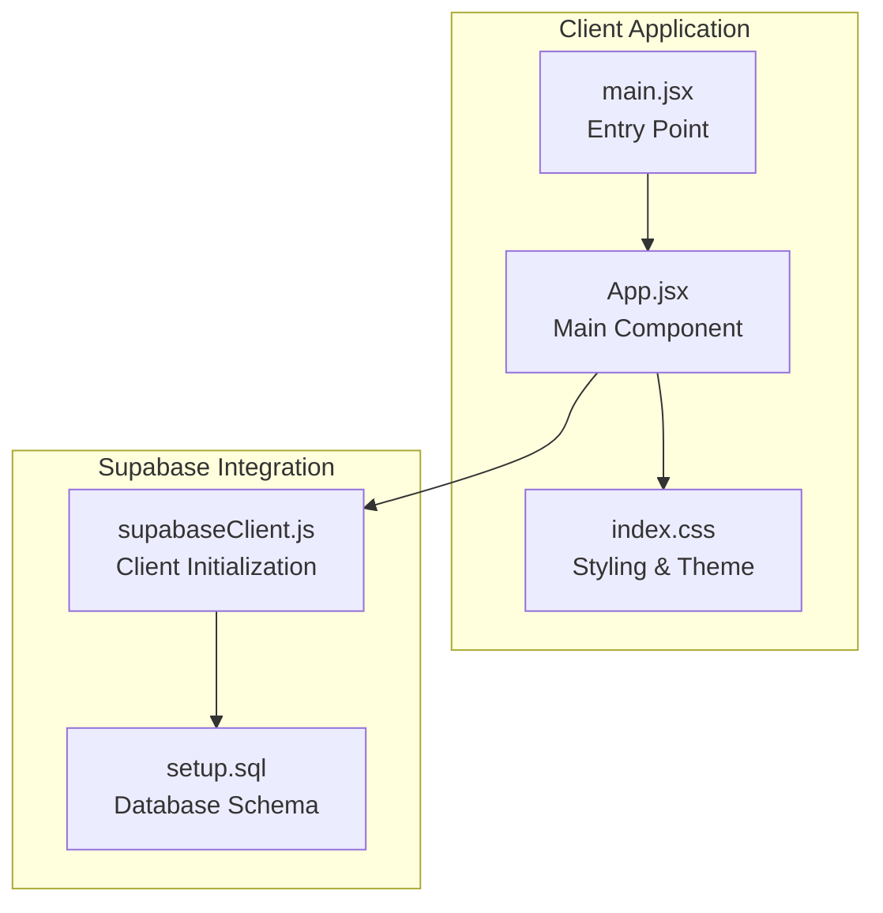
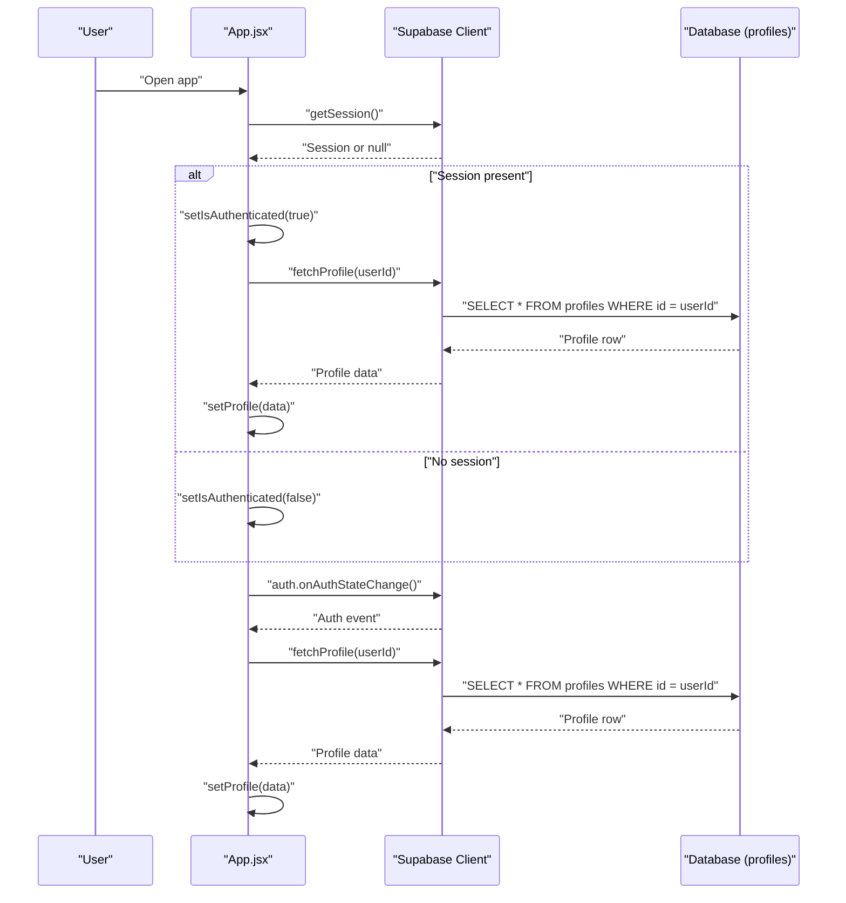
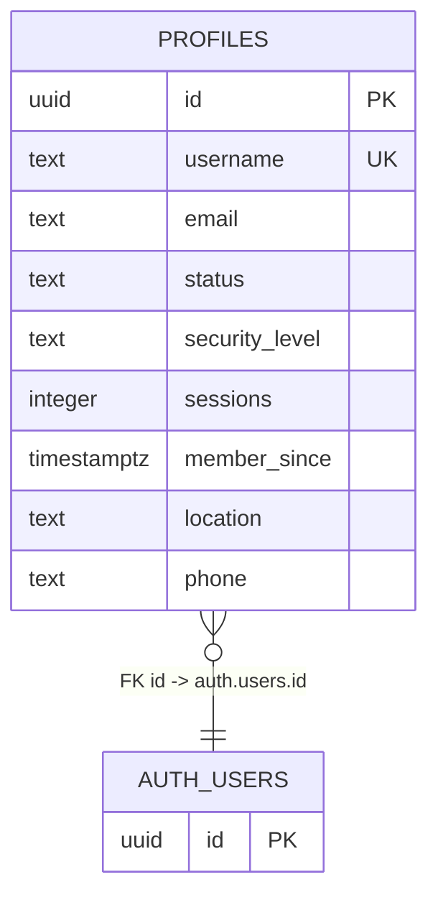
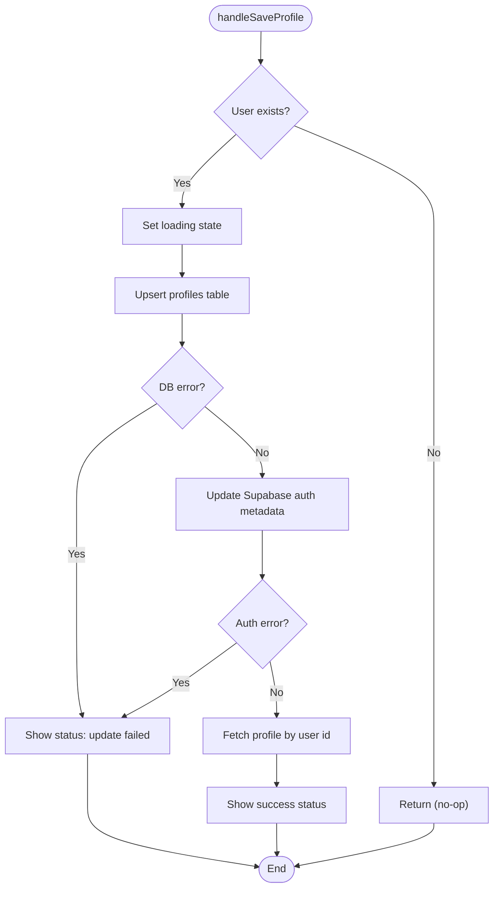
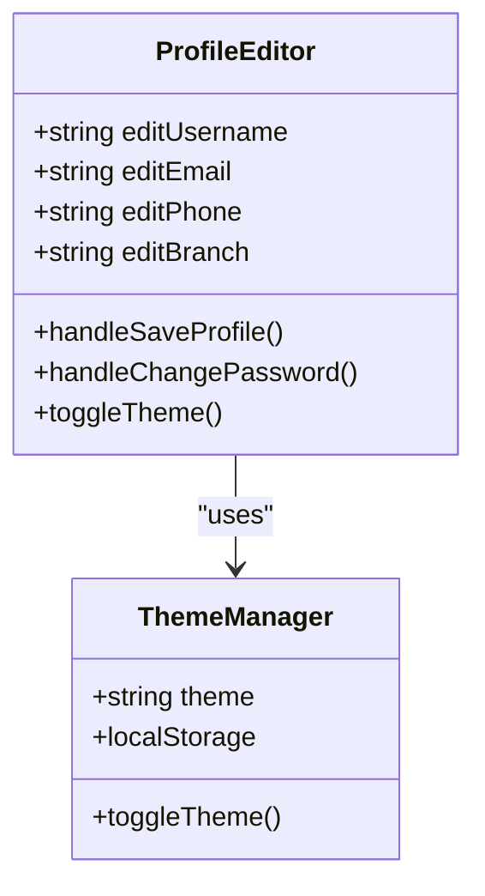
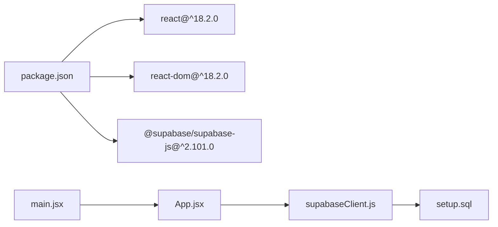

# Profile Management

<cite>
**Referenced Files in This Document**
- [App.jsx](file://src/App.jsx)
- [supabaseClient.js](file://src/supabaseClient.js)
- [setup.sql](file://setup.sql)
- [index.css](file://src/index.css)
- [main.jsx](file://src/main.jsx)
- [package.json](file://package.json)
</cite>

## Table of Contents
1. [Introduction](#introduction)
2. [Project Structure](#project-structure)
3. [Core Components](#core-components)
4. [Architecture Overview](#architecture-overview)
5. [Detailed Component Analysis](#detailed-component-analysis)
6. [Dependency Analysis](#dependency-analysis)
7. [Performance Considerations](#performance-considerations)
8. [Troubleshooting Guide](#troubleshooting-guide)
9. [Conclusion](#conclusion)

## Introduction
This document describes the profile management system implemented in the React application. It covers the database schema integration with the profiles table, real-time data synchronization with Supabase, and CRUD operations for user profiles. It documents the profile editing interface, including personal information updates, password changes, and theme preferences. It explains upsert operations for profile creation and updates, the relationship between Supabase auth metadata and database profiles, and the dual-write strategy for maintaining data consistency. Practical examples of handleSaveProfile, handleChangePassword, and fetchProfile functions are included, along with form validation, error handling, loading states, and the integration with local storage for theme persistence. Finally, it documents the educational content delivery system for junior youth notes and how profile data influences content access.

## Project Structure
The project is a Vite + React application with Supabase integration. The main application logic resides in a single React component that orchestrates authentication, profile management, and content delivery.

**Diagram sources**
- [main.jsx:1-11](file://src/main.jsx#L1-L11)
- [App.jsx:1-621](file://src/App.jsx#L1-L621)
- [supabaseClient.js:1-11](file://src/supabaseClient.js#L1-L11)
- [setup.sql:1-26](file://setup.sql#L1-L26)

**Section sources**
- [main.jsx:1-11](file://src/main.jsx#L1-L11)
- [package.json:1-22](file://package.json#L1-L22)

## Core Components
- Supabase client initialization and configuration
- Authentication state management and real-time subscription
- Profile data fetching and upsert operations
- Profile editing interface with personal information, password changes, and theme preferences
- Educational content delivery for junior youth notes

**Section sources**
- [supabaseClient.js:1-11](file://src/supabaseClient.js#L1-L11)
- [App.jsx:1-621](file://src/App.jsx#L1-L621)
- [setup.sql:1-26](file://setup.sql#L1-L26)

## Architecture Overview
The application uses Supabase for authentication and database operations. The main App component manages:
- Authentication lifecycle and real-time session updates
- Profile data synchronization via Supabase queries and upserts
- Dual-write strategy to keep Supabase auth metadata and database profiles consistent
- Local storage integration for theme persistence
- Educational content access controlled by profile presence

**Diagram sources**
- [App.jsx:35-62](file://src/App.jsx#L35-L62)
- [App.jsx:82-94](file://src/App.jsx#L82-L94)

## Detailed Component Analysis

### Database Schema Integration (profiles table)
The profiles table stores user metadata and is integrated with Supabase auth. It includes:
- Primary key: id (UUID, references auth.users)
- Unique username
- Email and phone
- Status and security level defaults
- Member since timestamp
- Location (branch)

Row Level Security (RLS) policies:
- Public profiles are viewable by everyone
- Users can insert their own profile
- Users can update their own profile

**Diagram sources**
- [setup.sql:2-12](file://setup.sql#L2-L12)

**Section sources**
- [setup.sql:1-26](file://setup.sql#L1-L26)

### Real-time Data Synchronization with Supabase
The application subscribes to Supabase auth state changes to keep the UI synchronized with the backend. On authentication events, it fetches the latest profile data.

Key behaviors:
- Initial session check on mount
- Subscription to auth state changes
- Fetch profile on login/logout
- Cleanup subscription on unmount

**Section sources**
- [App.jsx:35-62](file://src/App.jsx#L35-L62)
- [App.jsx:82-94](file://src/App.jsx#L82-L94)

### CRUD Operations for User Profiles

#### Fetch Profile
Retrieves a single profile by user ID using a Supabase query.

Implementation highlights:
- Single-row selection with eq('id', userId)
- Error logging and state setting
- Used during auth state changes and initial load

**Section sources**
- [App.jsx:82-94](file://src/App.jsx#L82-L94)

#### Upsert Profile (Create/Update)
Two primary upsert operations occur during profile editing:
1. Database upsert in the profiles table
2. Auth metadata update in Supabase auth

Dual-write strategy:
- First, update the database profile
- Then, update Supabase auth metadata
- On success, refetch profile to sync UI state
- On failure, show status message and log error

**Diagram sources**
- [App.jsx:243-274](file://src/App.jsx#L243-L274)

**Section sources**
- [App.jsx:243-274](file://src/App.jsx#L243-L274)

#### Change Password
Updates the user's password via Supabase auth.

Validation and flow:
- Form submission triggers validation
- Compares new password with confirmation
- Calls updateUser with new password
- Handles errors and success states
- Clears form fields on success

**Section sources**
- [App.jsx:276-299](file://src/App.jsx#L276-L299)

### Profile Editing Interface
The settings modal provides three main sections:

1. Personal Information
   - Full Names (username)
   - Email
   - Phone Number
   - Branch (location)

2. Update Password
   - New password field
   - Confirm password field

3. Theme Preferences
   - Dark/light mode toggle
   - Persists to localStorage

**Diagram sources**
- [App.jsx:29-34](file://src/App.jsx#L29-L34)
- [App.jsx:78-80](file://src/App.jsx#L78-L80)
- [App.jsx:486-521](file://src/App.jsx#L486-L521)

**Section sources**
- [App.jsx:459-525](file://src/App.jsx#L459-L525)
- [App.jsx:78-80](file://src/App.jsx#L78-L80)

### Relationship Between Supabase Auth Metadata and Database Profiles
The application maintains two sources of truth:
- Supabase auth metadata (username, phone, branch, display_email)
- Database profiles table (username, email, phone, location, status, security_level, member_since)

Dual-write strategy ensures consistency:
- Profile edits update both auth metadata and database records
- Auth metadata updates include username, phone, branch, and display_email
- Database upsert includes username, email, phone, location, status, security_level, member_since

**Section sources**
- [App.jsx:243-274](file://src/App.jsx#L243-L274)

### Practical Examples

#### handleSaveProfile
- Validates user existence
- Performs database upsert
- Updates auth metadata
- Handles errors and success states
- Refetches profile to synchronize UI

Example usage path:
- [App.jsx:243-274](file://src/App.jsx#L243-L274)

#### handleChangePassword
- Validates new password confirmation
- Updates auth password
- Handles errors and success states
- Clears form fields on success

Example usage path:
- [App.jsx:276-299](file://src/App.jsx#L276-L299)

#### fetchProfile
- Retrieves profile by user ID
- Handles errors and sets state
- Used on auth state changes

Example usage path:
- [App.jsx:82-94](file://src/App.jsx#L82-L94)

### Form Validation, Error Handling, and Loading States
Form validation:
- Password confirmation matching
- Username/email resolution during login
- OTP verification flow

Error handling:
- Centralized error state management
- User-friendly error messages
- Console logging for debugging

Loading states:
- Global authLoading state during operations
- Disabled buttons during async operations
- Status messages for feedback

**Section sources**
- [App.jsx:185-189](file://src/App.jsx#L185-L189)
- [App.jsx:281-285](file://src/App.jsx#L281-L285)
- [App.jsx:101-138](file://src/App.jsx#L101-L138)

### Integration with Local Storage for Theme Persistence
Theme preference is persisted in localStorage and synchronized with the DOM:
- Theme state initialized from localStorage
- Effect updates DOM data-theme attribute
- Theme toggle updates localStorage
- CSS variables switch between dark and light themes

**Section sources**
- [App.jsx:14](file://src/App.jsx#L14)
- [App.jsx:64-76](file://src/App.jsx#L64-L76)
- [index.css:7-29](file://src/index.css#L7-L29)

### Educational Content Delivery System for Junior Youth Notes
The application includes a dedicated notes section for junior youth content. Access is controlled by authentication state:
- Unauthenticated users see login/signup views
- Authenticated users can access notes content
- Content is static HTML within the component

Content access influence:
- Profile presence enables dashboard and notes access
- Profile data displayed in navbar (username or email fallback)

**Section sources**
- [App.jsx:326-456](file://src/App.jsx#L326-L456)
- [App.jsx:305-322](file://src/App.jsx#L305-L322)

## Dependency Analysis
The application has minimal external dependencies focused on Supabase and React ecosystem.

**Diagram sources**
- [package.json:12-20](file://package.json#L12-L20)
- [main.jsx:1-11](file://src/main.jsx#L1-L11)
- [App.jsx:1-621](file://src/App.jsx#L1-L621)
- [supabaseClient.js:1-11](file://src/supabaseClient.js#L1-L11)
- [setup.sql:1-26](file://setup.sql#L1-L26)

**Section sources**
- [package.json:1-22](file://package.json#L1-L22)

## Performance Considerations
- Minimize database round-trips by batching updates (already implemented via dual-write)
- Use optimistic UI updates for immediate feedback during saves
- Debounce frequent operations where appropriate
- Consider caching profile data in memory to reduce repeated fetches
- Optimize CSS variable switching for theme toggles

## Troubleshooting Guide
Common issues and resolutions:

Authentication Issues:
- Verify Supabase environment variables are configured
- Check auth state subscription cleanup
- Ensure getSession() is called on mount

Profile Sync Issues:
- Confirm RLS policies allow user access
- Verify user ID matches auth uid
- Check network connectivity to Supabase

Theme Persistence:
- Verify localStorage availability
- Check CSS variable definitions
- Ensure effect runs on theme state changes

**Section sources**
- [supabaseClient.js:6-8](file://src/supabaseClient.js#L6-L8)
- [App.jsx:35-62](file://src/App.jsx#L35-L62)
- [App.jsx:64-76](file://src/App.jsx#L64-L76)

## Conclusion
The profile management system provides a robust foundation for user data handling with Supabase. It implements dual-write consistency between auth metadata and database profiles, offers comprehensive editing capabilities, and integrates seamlessly with local storage for theme persistence. The educational content delivery system demonstrates how profile data influences content access. The architecture supports future enhancements such as optimistic UI updates, improved validation, and expanded content management features.