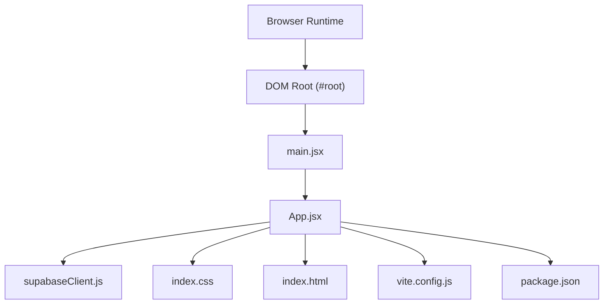
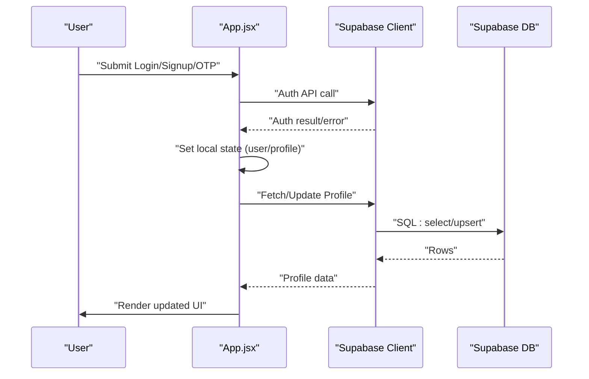
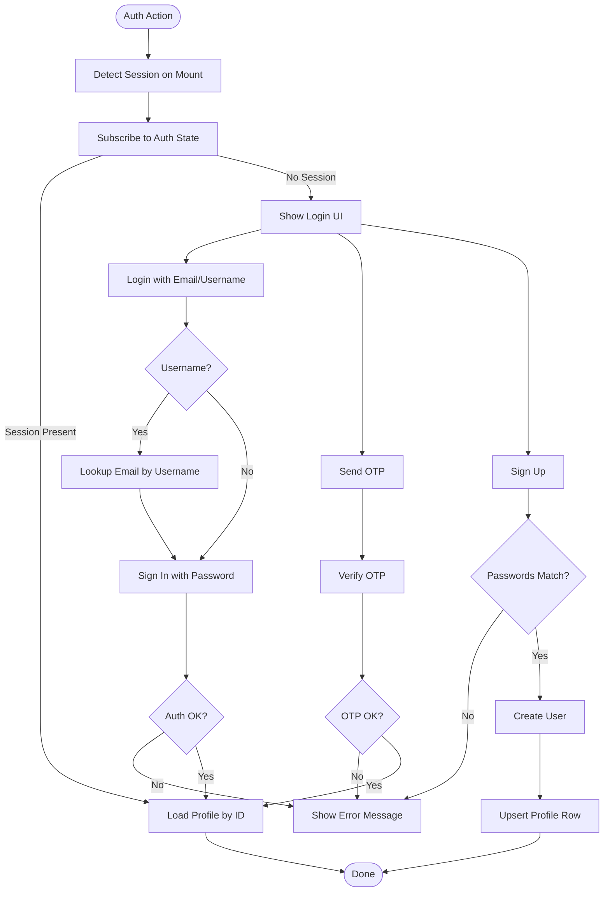
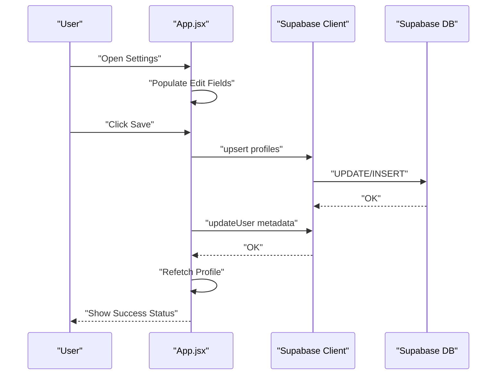
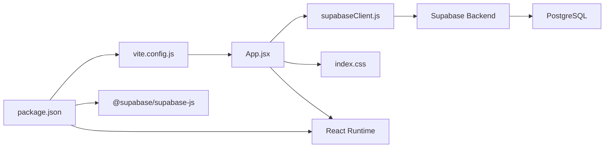

# React Implementation

<cite>
**Referenced Files in This Document**
- [App.jsx](file://src/App.jsx)
- [main.jsx](file://src/main.jsx)
- [supabaseClient.js](file://src/supabaseClient.js)
- [index.css](file://src/index.css)
- [styles.css](file://styles.css)
- [index.html](file://index.html)
- [vite.config.js](file://vite.config.js)
- [package.json](file://package.json)
- [setup.sql](file://setup.sql)
- [website.html](file://website.html)
</cite>

## Table of Contents
1. [Introduction](#introduction)
2. [Project Structure](#project-structure)
3. [Core Components](#core-components)
4. [Architecture Overview](#architecture-overview)
5. [Detailed Component Analysis](#detailed-component-analysis)
6. [Dependency Analysis](#dependency-analysis)
7. [Performance Considerations](#performance-considerations)
8. [Troubleshooting Guide](#troubleshooting-guide)
9. [Conclusion](#conclusion)
10. [Appendices](#appendices)

## Introduction
This document explains the React implementation of the HMC WEBSITE, focusing on the component hierarchy, state management with React hooks, and integration with the Supabase client. It covers the authentication system (login, signup, OTP recovery), session lifecycle, profile management with real-time-like updates, form handling, validation, educational content delivery, responsive design, and styling architecture using CSS custom properties. Practical examples are linked to actual code locations to help developers navigate and extend the system.

## Project Structure
The application is a Vite-powered React SPA bootstrapped from a minimal template. The runtime entry point renders the root App component into the DOM. Styling is centralized via CSS custom properties and modular CSS files. Supabase is configured as a singleton client for authentication and database operations.

**Diagram sources**
- [index.html:11-14](file://index.html#L11-L14)
- [main.jsx:6-10](file://src/main.jsx#L6-L10)
- [App.jsx:1-650](file://src/App.jsx#L1-L650)
- [supabaseClient.js:1-11](file://src/supabaseClient.js#L1-L11)
- [index.css:1-1148](file://src/index.css#L1-L1148)
- [vite.config.js:1-8](file://vite.config.js#L1-L8)
- [package.json:1-22](file://package.json#L1-L22)

**Section sources**
- [index.html:1-16](file://index.html#L1-L16)
- [main.jsx:1-11](file://src/main.jsx#L1-L11)
- [vite.config.js:1-8](file://vite.config.js#L1-L8)
- [package.json:1-22](file://package.json#L1-L22)

## Core Components
- App.jsx: Central application component managing authentication state, navigation, views, and profile editing. It integrates with Supabase for auth and database operations and coordinates UI states for login, signup, recovery, settings, and notes.
- supabaseClient.js: Initializes the Supabase client using environment variables and exposes a singleton for use across the app.
- index.css: Defines CSS custom properties for themes and provides base layout, glassmorphism forms, navigation, dashboard, settings modal, notes view, and responsive breakpoints.
- main.jsx: Renders the App component inside React.StrictMode and mounts to the DOM root element.
- index.html: Provides the HTML shell with the root container and font linking.

Key responsibilities:
- Authentication: Session detection, login/signup, OTP-based recovery, logout, and error messaging.
- Profile Management: Fetching, editing, and saving profile data; updating Supabase auth user metadata.
- Educational Content: Notes view rendering static educational material.
- Theming: Dark/light mode persisted in localStorage and reflected via CSS custom properties.

**Section sources**
- [App.jsx:1-650](file://src/App.jsx#L1-L650)
- [supabaseClient.js:1-11](file://src/supabaseClient.js#L1-L11)
- [index.css:1-1148](file://src/index.css#L1-L1148)
- [main.jsx:1-11](file://src/main.jsx#L1-L11)
- [index.html:1-16](file://index.html#L1-L16)

## Architecture Overview
The app follows a unidirectional data flow:
- React state drives UI and user actions.
- Supabase auth emits events to keep the app synchronized with server-side session state.
- Supabase database operations (select/upsert) keep profile data consistent.

**Diagram sources**
- [App.jsx:36-63](file://src/App.jsx#L36-L63)
- [App.jsx:102-139](file://src/App.jsx#L102-L139)
- [App.jsx:181-237](file://src/App.jsx#L181-L237)
- [App.jsx:141-179](file://src/App.jsx#L141-L179)
- [App.jsx:83-95](file://src/App.jsx#L83-L95)
- [supabaseClient.js:1-11](file://src/supabaseClient.js#L1-L11)

## Detailed Component Analysis

### Authentication System
- Session Detection and Subscription
  - On mount, retrieves the current session and subscribes to auth state changes. Updates user and profile state accordingly.
  - Unsubscribes on cleanup to prevent leaks.

- Login Flow
  - Supports email or username input. If only a username is provided, resolves to an email via a database lookup.
  - Calls Supabase sign-in with password and handles errors with user-friendly messages.

- OTP Recovery Flow
  - Sends an SMS OTP and transitions to verification step.
  - Verifies OTP and logs the user in, enabling subsequent password changes in settings.

- Signup Flow
  - Validates password confirmation.
  - Creates a user via Supabase auth and inserts/upserts a profile row with defaults and provided metadata.

- Logout
  - Signs out the user and resets view state.

- Error Handling
  - Displays localized error messages for invalid credentials, rate limits, and other auth errors.
  - Uses a temporary status message display with auto-clear.

**Diagram sources**
- [App.jsx:36-63](file://src/App.jsx#L36-L63)
- [App.jsx:102-139](file://src/App.jsx#L102-L139)
- [App.jsx:141-179](file://src/App.jsx#L141-L179)
- [App.jsx:181-237](file://src/App.jsx#L181-L237)
- [App.jsx:83-95](file://src/App.jsx#L83-L95)

**Section sources**
- [App.jsx:36-63](file://src/App.jsx#L36-L63)
- [App.jsx:102-139](file://src/App.jsx#L102-L139)
- [App.jsx:141-179](file://src/App.jsx#L141-L179)
- [App.jsx:181-237](file://src/App.jsx#L181-L237)
- [App.jsx:83-95](file://src/App.jsx#L83-L95)

### Profile Management
- Fetching Profile
  - Queries the profiles table by user ID and sets the profile state.

- Editing and Saving
  - Populates editable fields from the profile when entering settings.
  - Saves edits to both the profiles table and Supabase auth user metadata.
  - Shows success/failure status messages.

- Validation and UX
  - Disables save while loading.
  - Displays status messages with auto-hide.

**Diagram sources**
- [App.jsx:66-72](file://src/App.jsx#L66-L72)
- [App.jsx:244-275](file://src/App.jsx#L244-L275)
- [App.jsx:83-95](file://src/App.jsx#L83-L95)

**Section sources**
- [App.jsx:66-72](file://src/App.jsx#L66-L72)
- [App.jsx:244-275](file://src/App.jsx#L244-L275)
- [App.jsx:83-95](file://src/App.jsx#L83-L95)

### Educational Content Delivery
- Notes View
  - Static educational material rendered under the “Junior Youth Notes” action card.
  - Includes scripture references, structured sections, and responsive typography.

- Navigation
  - Back button returns to the dashboard.
  - Sticky navbar with branding and welcome text.

**Section sources**
- [App.jsx:327-456](file://src/App.jsx#L327-L456)
- [App.jsx:444-456](file://src/App.jsx#L444-L456)

### Theme and Responsive Design
- Theme System
  - CSS custom properties define dark and light variants.
  - App toggles theme via a checkbox and persists preference in localStorage.
  - Theme attribute is applied to the document element.

- Responsive Breakpoints
  - Media queries adjust spacing, typography, and layout for smaller screens.
  - Notes view and login container adapt to mobile layouts.

**Section sources**
- [index.css:7-29](file://src/index.css#L7-L29)
- [App.jsx:74-81](file://src/App.jsx#L74-L81)
- [index.css:777-814](file://src/index.css#L777-L814)
- [index.css:794-814](file://src/index.css#L794-L814)

### Styling Architecture
- CSS Custom Properties
  - Centralized color tokens for backgrounds, borders, text, accents, inputs, and nav.
  - Theme switching updates root attributes and triggers smooth transitions.

- Modular Styles
  - Glassmorphism login boxes, navigation, dashboard cards, settings modal, notes view, and landing page cards.
  - Reusable toggle switch component for theme preferences.

- Fonts and Accessibility
  - Inter font loaded via Google Fonts.
  - Semantic headings and aria attributes present in the notes view and modal.

**Section sources**
- [index.css:1-1148](file://src/index.css#L1-L1148)
- [index.html:7-19](file://index.html#L7-L19)
- [website.html:16-22](file://website.html#L16-L22)

## Dependency Analysis
- Runtime Dependencies
  - @supabase/supabase-js: Authentication and database client.
  - react, react-dom: UI framework and renderer.
  - @vitejs/plugin-react: JSX transform and fast refresh.

- Build Tooling
  - Vite: Dev server and bundling.
  - package scripts: dev, build, lint, preview.

- Supabase Schema
  - Profiles table with foreign key to auth.users.
  - Row Level Security policies for visibility and ownership.

**Diagram sources**
- [App.jsx:1-650](file://src/App.jsx#L1-L650)
- [supabaseClient.js:1-11](file://src/supabaseClient.js#L1-L11)
- [index.css:1-1148](file://src/index.css#L1-L1148)
- [vite.config.js:1-8](file://vite.config.js#L1-L8)
- [package.json:12-20](file://package.json#L12-L20)
- [setup.sql:1-26](file://setup.sql#L1-L26)

**Section sources**
- [package.json:12-20](file://package.json#L12-L20)
- [setup.sql:1-26](file://setup.sql#L1-L26)

## Performance Considerations
- Avoid unnecessary re-renders
  - Keep state granular; separate auth state from UI flags.
  - Use memoization for derived data if needed.

- Efficient Supabase Queries
  - Use single-row selectors and targeted upserts.
  - Debounce rapid user edits before persisting.

- Bundle Size and Dev Experience
  - Vite’s plugin setup enables fast HMR and optimized builds.
  - Keep CSS modular to reduce unused styles.

- Accessibility and UX
  - Provide loading indicators during auth and save operations.
  - Clear error messages and status notifications.

[No sources needed since this section provides general guidance]

## Troubleshooting Guide
- Supabase Credentials Missing
  - The client warns if the anonymous key is missing or placeholder. Ensure environment variables are configured.

- Authentication Errors
  - Incorrect credentials, unconfirmed emails, and rate limits are handled with user-friendly messages.
  - OTP recovery requires a valid phone number and correct token.

- Profile Update Failures
  - If either the database upsert or auth metadata update fails, a status message is shown and errors are logged.

- Theme Not Persisting
  - Ensure localStorage is enabled and the theme attribute is applied to the document element.

**Section sources**
- [supabaseClient.js:6-8](file://src/supabaseClient.js#L6-L8)
- [App.jsx:129-138](file://src/App.jsx#L129-L138)
- [App.jsx:150-157](file://src/App.jsx#L150-L157)
- [App.jsx:267-274](file://src/App.jsx#L267-L274)
- [App.jsx:74-77](file://src/App.jsx#L74-L77)

## Conclusion
The React implementation of HMC WEBSITE demonstrates a clean separation of concerns: a single App component orchestrates authentication, profile management, and content delivery, backed by Supabase for identity and data. The styling architecture leverages CSS custom properties for theme flexibility and responsive design. With robust error handling, optimistic UX updates, and a modular CSS foundation, the system is extensible and maintainable.

[No sources needed since this section summarizes without analyzing specific files]

## Appendices

### Practical Examples and References
- Authentication flows and state management
  - [Session detection and subscription:36-63](file://src/App.jsx#L36-L63)
  - [Login with username/email resolution:102-139](file://src/App.jsx#L102-L139)
  - [OTP recovery send and verify:141-179](file://src/App.jsx#L141-L179)
  - [Signup with profile creation:181-237](file://src/App.jsx#L181-L237)
  - [Logout:239-242](file://src/App.jsx#L239-L242)

- Profile management
  - [Fetch profile:83-95](file://src/App.jsx#L83-L95)
  - [Edit and save profile:244-275](file://src/App.jsx#L244-L275)
  - [Update password:277-300](file://src/App.jsx#L277-L300)

- Educational content
  - [Notes view rendering:327-456](file://src/App.jsx#L327-L456)

- Styling and theming
  - [CSS custom properties and theme toggling:7-29](file://src/index.css#L7-L29)
  - [Responsive breakpoints:777-814](file://src/index.css#L777-L814)

- Supabase configuration and schema
  - [Client initialization:1-11](file://src/supabaseClient.js#L1-L11)
  - [Schema and policies:1-26](file://setup.sql#L1-L26)

- Legacy website comparison
  - [Original website HTML structure:1-303](file://website.html#L1-L303)