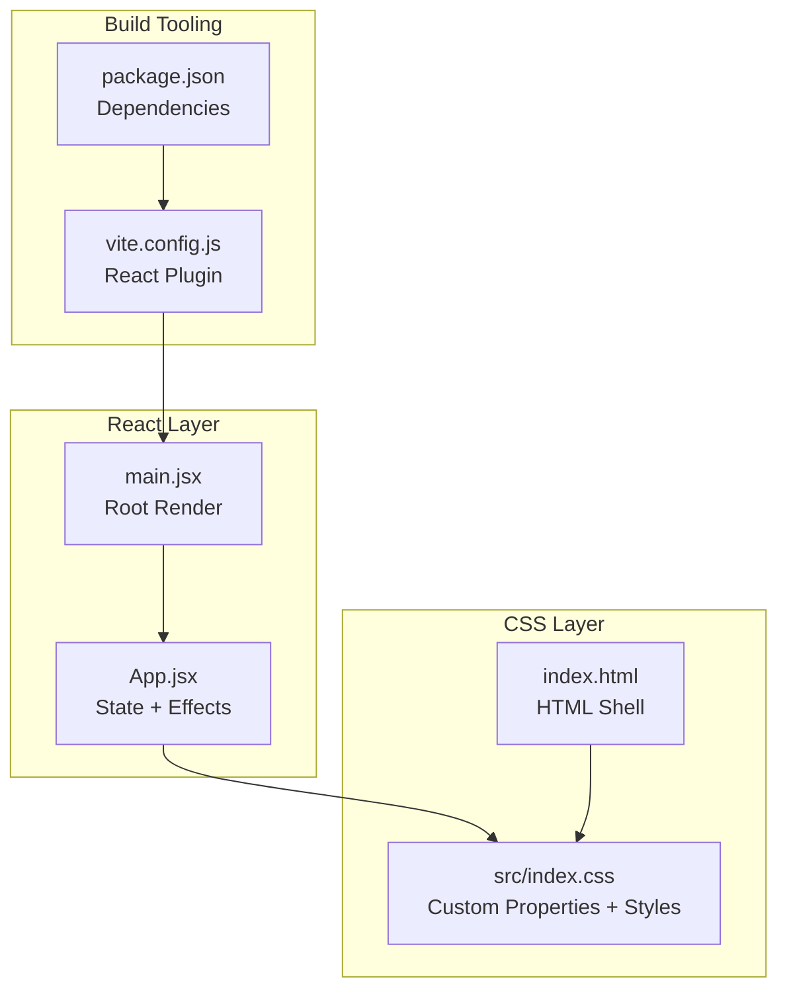
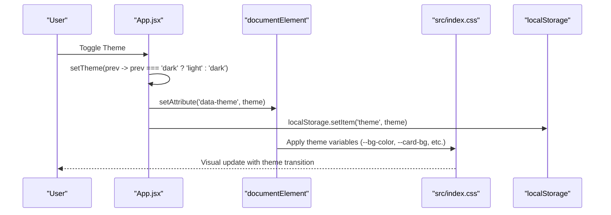
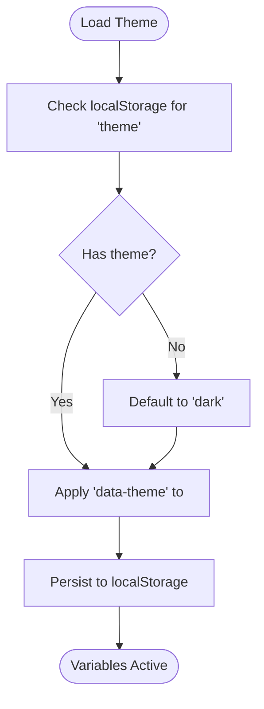
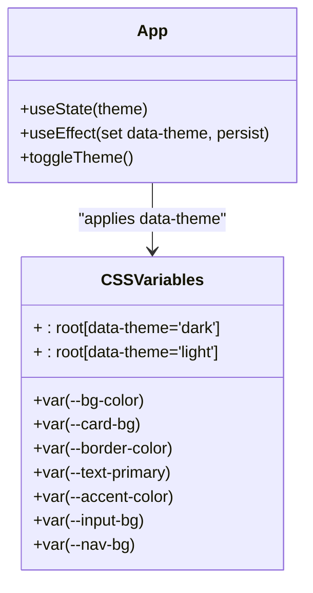
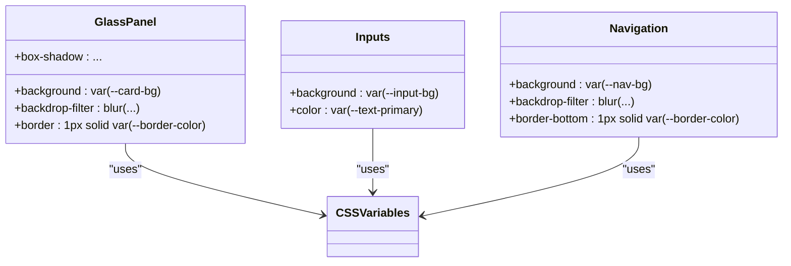
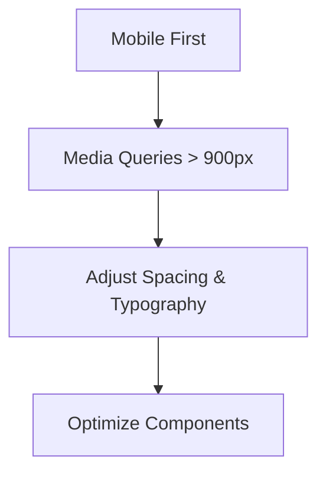
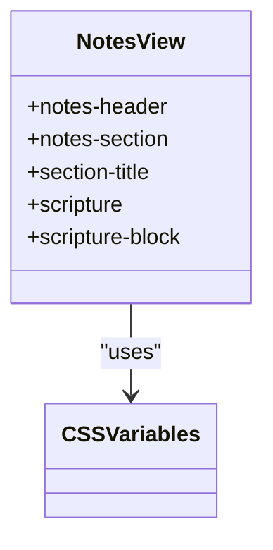
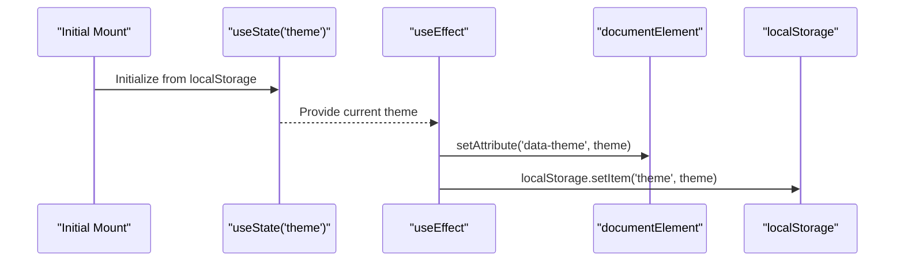
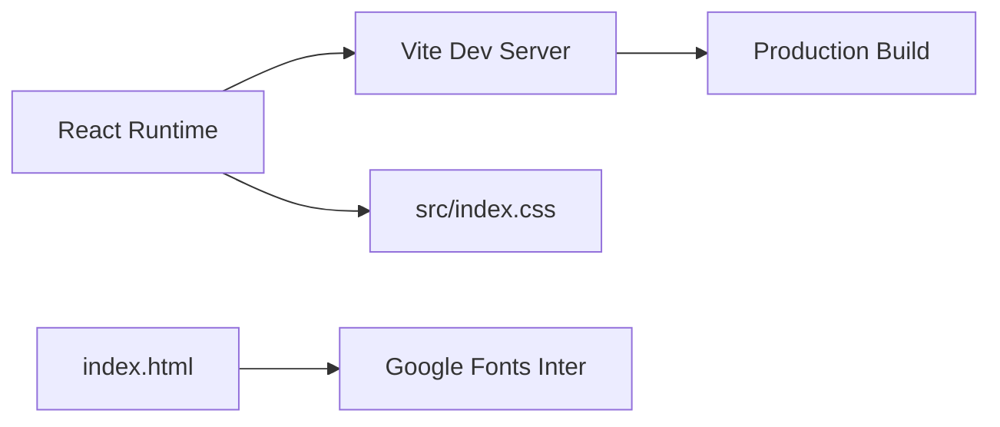

# Styling and Theming System

<cite>
**Referenced Files in This Document**
- [src/index.css](file://src/index.css)
- [styles.css](file://styles.css)
- [src/App.jsx](file://src/App.jsx)
- [src/main.jsx](file://src/main.jsx)
- [index.html](file://index.html)
- [package.json](file://package.json)
- [vite.config.js](file://vite.config.js)
</cite>

## Table of Contents
1. [Introduction](#introduction)
2. [Project Structure](#project-structure)
3. [Core Components](#core-components)
4. [Architecture Overview](#architecture-overview)
5. [Detailed Component Analysis](#detailed-component-analysis)
6. [Dependency Analysis](#dependency-analysis)
7. [Performance Considerations](#performance-considerations)
8. [Troubleshooting Guide](#troubleshooting-guide)
9. [Conclusion](#conclusion)
10. [Appendices](#appendices)

## Introduction
This document explains the styling and theming system used in the React application. It covers the CSS architecture built around CSS custom properties for theme management, the dark/light mode toggle implementation, responsive design patterns optimized for mobile devices, and the glassmorphism aesthetic. It also documents how React state integrates with CSS custom properties, theme persistence using localStorage, and the toggleTheme function’s lifecycle with useEffect hooks. Practical examples of CSS variable usage, media queries, and educational content presentation styling are included, along with cross-browser compatibility considerations, performance optimization tips, and best practices for consistent theming.

## Project Structure
The styling and theming system spans three primary areas:
- Global CSS architecture with CSS custom properties for theming
- React component state and effects controlling theme application
- Responsive design and glassmorphism styling for modern UI

**Diagram sources**
- [src/main.jsx:1-11](file://src/main.jsx#L1-L11)
- [src/App.jsx:1-621](file://src/App.jsx#L1-L621)
- [src/index.css:1-1148](file://src/index.css#L1-L1148)
- [index.html:1-16](file://index.html#L1-L16)
- [vite.config.js:1-8](file://vite.config.js#L1-L8)
- [package.json:1-22](file://package.json#L1-L22)

**Section sources**
- [src/main.jsx:1-11](file://src/main.jsx#L1-L11)
- [src/App.jsx:1-621](file://src/App.jsx#L1-L621)
- [src/index.css:1-1148](file://src/index.css#L1-L1148)
- [index.html:1-16](file://index.html#L1-L16)
- [vite.config.js:1-8](file://vite.config.js#L1-L8)
- [package.json:1-22](file://package.json#L1-L22)

## Core Components
- CSS custom properties for theming: Centralized color tokens for background, card backgrounds, borders, text, accents, inputs, and navigation, defined under both dark and light theme selectors.
- Glassmorphism styling: Extensive use of backdrop-filter blur, rgba backgrounds, and subtle borders to achieve a frosted-glass effect.
- Dark/light mode toggle: A React-controlled switch that updates the theme state and persists it to localStorage.
- Responsive design: Media queries targeting tablet and mobile breakpoints to optimize layout and typography.
- Educational content presentation: Dedicated styles for notes sections, scripture references, and structured lists.

**Section sources**
- [src/index.css:7-38](file://src/index.css#L7-L38)
- [src/App.jsx:14-80](file://src/App.jsx#L14-L80)
- [src/index.css:776-817](file://src/index.css#L776-L817)
- [src/index.css:816-948](file://src/index.css#L816-L948)

## Architecture Overview
The theming architecture couples React state with CSS custom properties. The App component manages theme state, applies it to the document element, and persists it to localStorage. CSS custom properties are defined in the global stylesheet and consumed throughout component classes.

**Diagram sources**
- [src/App.jsx:73-80](file://src/App.jsx#L73-L80)
- [src/index.css:7-38](file://src/index.css#L7-L38)

**Section sources**
- [src/App.jsx:73-80](file://src/App.jsx#L73-L80)
- [src/index.css:7-38](file://src/index.css#L7-L38)

## Detailed Component Analysis

### CSS Custom Property System
- Theme roots: CSS custom properties are declared under both dark and light theme selectors to ensure proper fallbacks and overrides.
- Variables include background, card backgrounds, borders, text colors, accents, inputs, and navigation styling.
- Global transitions: Body and other elements animate smoothly when theme variables change.

**Diagram sources**
- [src/App.jsx:14](file://src/App.jsx#L14)
- [src/App.jsx:73-76](file://src/App.jsx#L73-L76)
- [src/index.css:7-38](file://src/index.css#L7-L38)

**Section sources**
- [src/index.css:7-38](file://src/index.css#L7-L38)
- [src/App.jsx:14](file://src/App.jsx#L14)
- [src/App.jsx:73-76](file://src/App.jsx#L73-L76)

### Dark/Light Mode Toggle Implementation
- State: theme managed via React state initialized from localStorage.
- Effect: On theme change, the component sets the data attribute on the document element and persists the choice.
- UI: A styled checkbox switch toggles the theme state.

**Diagram sources**
- [src/App.jsx:14](file://src/App.jsx#L14)
- [src/App.jsx:73-80](file://src/App.jsx#L73-L80)
- [src/index.css:7-38](file://src/index.css#L7-L38)

**Section sources**
- [src/App.jsx:14](file://src/App.jsx#L14)
- [src/App.jsx:73-80](file://src/App.jsx#L73-L80)
- [src/index.css:7-38](file://src/index.css#L7-L38)

### Glassmorphism Design Aesthetic
- Frosted glass: Components use rgba backgrounds and backdrop-filter blur to achieve translucency.
- Borders and shadows: Subtle borders and layered shadows reinforce depth while preserving readability.
- Consistent tokens: All glass-like panels consume the same CSS variables for cohesive theming.

**Diagram sources**
- [src/index.css:110-123](file://src/index.css#L110-L123)
- [src/index.css:131-141](file://src/index.css#L131-L141)
- [src/index.css:254-265](file://src/index.css#L254-L265)

**Section sources**
- [src/index.css:110-123](file://src/index.css#L110-L123)
- [src/index.css:131-141](file://src/index.css#L131-L141)
- [src/index.css:254-265](file://src/index.css#L254-L265)

### Responsive Design Patterns
- Mobile-first approach: Base styles target small screens; media queries adapt layouts for larger viewports.
- Breakpoints: Tablet and desktop adjustments refine spacing, typography, and component widths.
- Flexible containers: Grids and flex layouts accommodate varying screen sizes.

**Diagram sources**
- [src/index.css:776-817](file://src/index.css#L776-L817)

**Section sources**
- [src/index.css:776-817](file://src/index.css#L776-L817)

### Educational Content Presentation
- Notes view: Structured sections with numbered titles, bullet points, and scripture references.
- Scripture emphasis: Distinct styling for scripture citations and blocks to improve readability.
- Back button and navigation: Clear transitions between views.

**Diagram sources**
- [src/index.css:816-948](file://src/index.css#L816-L948)
- [src/App.jsx:326-456](file://src/App.jsx#L326-L456)

**Section sources**
- [src/index.css:816-948](file://src/index.css#L816-L948)
- [src/App.jsx:326-456](file://src/App.jsx#L326-L456)

### Integration Between React State and CSS Custom Properties
- Initialization: theme state reads from localStorage to maintain continuity across sessions.
- Application: An effect sets the data attribute on the document element, triggering CSS variable updates.
- Persistence: Each theme change writes to localStorage for persistence.

**Diagram sources**
- [src/App.jsx:14](file://src/App.jsx#L14)
- [src/App.jsx:73-76](file://src/App.jsx#L73-L76)

**Section sources**
- [src/App.jsx:14](file://src/App.jsx#L14)
- [src/App.jsx:73-76](file://src/App.jsx#L73-L76)

## Dependency Analysis
- React depends on Vite for development and build.
- The app imports the global stylesheet in the root component.
- The HTML page includes Inter font via Google Fonts.

**Diagram sources**
- [package.json:1-22](file://package.json#L1-L22)
- [vite.config.js:1-8](file://vite.config.js#L1-L8)
- [src/main.jsx:1-11](file://src/main.jsx#L1-L11)
- [index.html:7-9](file://index.html#L7-L9)

**Section sources**
- [package.json:1-22](file://package.json#L1-L22)
- [vite.config.js:1-8](file://vite.config.js#L1-L8)
- [src/main.jsx:1-11](file://src/main.jsx#L1-L11)
- [index.html:7-9](file://index.html#L7-L9)

## Performance Considerations
- CSS custom properties: Efficiently update visuals without recalculating stylesheets.
- backdrop-filter: Use judiciously; consider performance on lower-end devices and test across browsers.
- Transitions: Keep animations lightweight to avoid jank on mobile devices.
- Media queries: Prefer logical units and viewport-relative sizing for scalable layouts.
- Font loading: Preconnect to Google Fonts to reduce render-blocking.

[No sources needed since this section provides general guidance]

## Troubleshooting Guide
- Theme not persisting: Verify localStorage availability and that the effect runs after state updates.
- Variables not applying: Ensure the data attribute is set on the document element and CSS selectors match the applied theme.
- Glass effect not visible: Confirm browser support for backdrop-filter and that rgba values are used consistently.
- Responsive issues: Validate media query breakpoints and ensure viewport meta tag is present.

**Section sources**
- [src/App.jsx:73-76](file://src/App.jsx#L73-L76)
- [src/index.css:7-38](file://src/index.css#L7-L38)
- [index.html:5](file://index.html#L5)

## Conclusion
The application employs a robust, maintainable theming system centered on CSS custom properties and React state. The dark/light toggle is seamless, persistent, and visually consistent thanks to carefully chosen variables and glassmorphism styling. Responsive design ensures usability across devices, while the modular CSS architecture supports easy maintenance and extension.

[No sources needed since this section summarizes without analyzing specific files]

## Appendices

### Practical Examples Index
- CSS variables usage: Backgrounds, borders, text, accents, inputs, and navigation use consistent tokens.
- Media queries: Tablet and mobile breakpoints adjust layout and typography.
- Educational content: Notes sections, scripture blocks, and numbered titles for clarity.

**Section sources**
- [src/index.css:7-38](file://src/index.css#L7-L38)
- [src/index.css:776-817](file://src/index.css#L776-L817)
- [src/index.css:816-948](file://src/index.css#L816-L948)