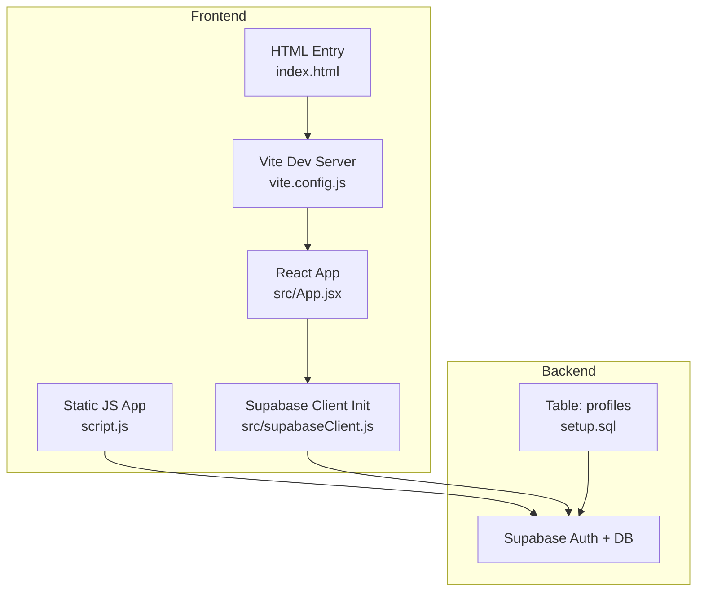
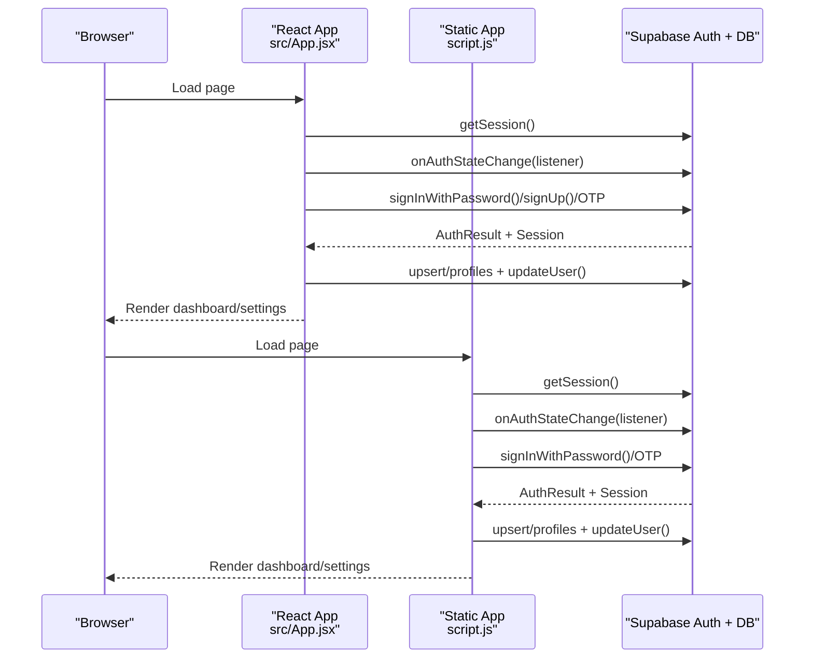
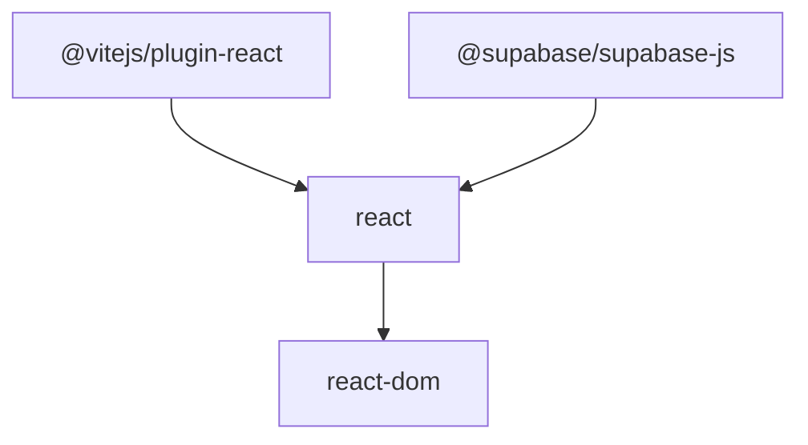

# Security Considerations

<cite>
**Referenced Files in This Document**
- [src/supabaseClient.js](file://src/supabaseClient.js)
- [setup.sql](file://setup.sql)
- [src/App.jsx](file://src/App.jsx)
- [script.js](file://script.js)
- [vite.config.js](file://vite.config.js)
- [package.json](file://package.json)
- [index.html](file://index.html)
</cite>

## Table of Contents
1. [Introduction](#introduction)
2. [Project Structure](#project-structure)
3. [Core Components](#core-components)
4. [Architecture Overview](#architecture-overview)
5. [Detailed Component Analysis](#detailed-component-analysis)
6. [Dependency Analysis](#dependency-analysis)
7. [Performance Considerations](#performance-considerations)
8. [Troubleshooting Guide](#troubleshooting-guide)
9. [Conclusion](#conclusion)
10. [Appendices](#appendices)

## Introduction
This document provides comprehensive security guidance for the HMC WEBSITE project. It focuses on Supabase authentication security, session management, password policies, Row Level Security (RLS) implementation, input validation and sanitization strategies, and CORS configuration for API security. It also covers security measures for both React and static implementations, including XSS prevention, CSRF protection, and secure credential handling. Authentication flow security, session persistence security, and data access control mechanisms are addressed, along with security audit procedures, vulnerability assessment guidelines, incident response protocols, secure deployment practices, environment variable management, and regular security maintenance procedures.

## Project Structure
The project consists of:
- A React frontend using Vite for development and building
- A static HTML/JavaScript implementation for an alternate deployment
- Supabase client initialization and authentication flows
- Supabase database schema with Row Level Security enabled

**Diagram sources**
- [vite.config.js:1-8](file://vite.config.js#L1-L8)
- [src/App.jsx:1-623](file://src/App.jsx#L1-L623)
- [script.js:1-660](file://script.js#L1-L660)
- [src/supabaseClient.js:1-11](file://src/supabaseClient.js#L1-L11)
- [index.html:1-16](file://index.html#L1-L16)
- [setup.sql:1-26](file://setup.sql#L1-L26)

**Section sources**
- [vite.config.js:1-8](file://vite.config.js#L1-L8)
- [package.json:1-22](file://package.json#L1-L22)
- [index.html:1-16](file://index.html#L1-L16)

## Core Components
- Supabase client initialization and environment variable handling
- Authentication flows: email/password, OTP, sign-up, password change
- Session lifecycle and real-time auth state synchronization
- Database schema with Row Level Security policies
- Static and React implementations sharing Supabase client logic

Key security-relevant areas:
- Supabase client credentials and environment variables
- Auth state change listeners and session persistence
- Profile upsert/update operations and user metadata updates
- OTP-based recovery flow and error messaging
- Static vs. React differences in credential exposure

**Section sources**
- [src/supabaseClient.js:1-11](file://src/supabaseClient.js#L1-L11)
- [src/App.jsx:35-62](file://src/App.jsx#L35-L62)
- [src/App.jsx:101-138](file://src/App.jsx#L101-L138)
- [src/App.jsx:140-178](file://src/App.jsx#L140-L178)
- [src/App.jsx:180-236](file://src/App.jsx#L180-L236)
- [src/App.jsx:243-299](file://src/App.jsx#L243-L299)
- [setup.sql:14-26](file://setup.sql#L14-L26)
- [script.js:165-191](file://script.js#L165-L191)
- [script.js:273-324](file://script.js#L273-L324)
- [script.js:193-256](file://script.js#L193-L256)
- [script.js:550-560](file://script.js#L550-L560)

## Architecture Overview
The authentication and data access architecture relies on Supabase’s hosted Auth service and Postgres database with RLS. The client applications (React and static) initialize the Supabase client and perform authentication operations against Supabase endpoints. Sessions are persisted in the client and synchronized via auth state listeners.

**Diagram sources**
- [src/App.jsx:35-62](file://src/App.jsx#L35-L62)
- [src/App.jsx:101-138](file://src/App.jsx#L101-L138)
- [src/App.jsx:180-236](file://src/App.jsx#L180-L236)
- [src/App.jsx:243-299](file://src/App.jsx#L243-L299)
- [script.js:631-657](file://script.js#L631-L657)
- [script.js:165-191](file://script.js#L165-L191)
- [script.js:273-324](file://script.js#L273-L324)
- [script.js:193-256](file://script.js#L193-L256)
- [script.js:550-560](file://script.js#L550-L560)

## Detailed Component Analysis

### Supabase Authentication Security
- Client initialization uses environment variables for Supabase URL and anonymous key. A warning is logged if the anonymous key is missing or placeholder-like.
- Authentication flows include email/password login, OTP-based recovery, and sign-up with metadata injection.
- Password change uses the Supabase user update method.
- Auth state change listener keeps UI and session state synchronized.

Security considerations:
- Ensure environment variables are configured and not hardcoded in production builds.
- Validate and sanitize form inputs before invoking Supabase auth APIs.
- Use HTTPS in production to protect credentials in transit.
- Monitor rate limits and error messages to prevent enumeration attacks.

**Section sources**
- [src/supabaseClient.js:3-8](file://src/supabaseClient.js#L3-L8)
- [src/App.jsx:101-138](file://src/App.jsx#L101-L138)
- [src/App.jsx:140-178](file://src/App.jsx#L140-L178)
- [src/App.jsx:180-236](file://src/App.jsx#L180-L236)
- [src/App.jsx:276-299](file://src/App.jsx#L276-L299)
- [script.js:165-191](file://script.js#L165-L191)
- [script.js:273-324](file://script.js#L273-L324)
- [script.js:193-256](file://script.js#L193-L256)
- [script.js:550-560](file://script.js#L550-L560)

### Session Management Security
- The apps check for an existing session on load and subscribe to auth state changes.
- Session persistence is implicit through Supabase’s client storage mechanisms.
- Logout signs out the user and resets views.

Recommendations:
- Prefer secure, same-site cookies for session storage in server-side deployments.
- Implement idle timeout and forced re-authentication for sensitive actions.
- Ensure auth state listeners unsubscribe on component unmount to prevent memory leaks.

**Section sources**
- [src/App.jsx:35-62](file://src/App.jsx#L35-L62)
- [src/App.jsx:238-241](file://src/App.jsx#L238-L241)
- [script.js:631-657](file://script.js#L631-L657)
- [script.js:326-329](file://script.js#L326-L329)

### Password Policies
- Password mismatch validation occurs on the client before sending requests.
- Password change uses the Supabase user update method.
- No explicit server-side password policy enforcement is visible in the client code.

Recommendations:
- Enforce strong password requirements server-side via Supabase Auth policies.
- Consider adding client-side checks for minimum length, complexity, and common password detection.
- Implement rate limiting for password change attempts.

**Section sources**
- [src/App.jsx:185-189](file://src/App.jsx#L185-L189)
- [src/App.jsx:281-285](file://src/App.jsx#L281-L285)
- [src/App.jsx:287-299](file://src/App.jsx#L287-L299)
- [script.js:376-379](file://script.js#L376-L379)
- [script.js:550-560](file://script.js#L550-L560)

### Row Level Security (RLS) Implementation
- The profiles table has RLS enabled.
- Policies:
  - Selectable by everyone
  - Insert/upsert allowed only for the owning user
  - Update allowed only for the owning user

Security implications:
- Ensures users can only modify their own profile data.
- Prevents unauthorized access to profile records.

Recommendations:
- Regularly review and test RLS policies.
- Use least privilege principles when adding new columns or tables.
- Monitor policy violations and adjust as needed.

**Section sources**
- [setup.sql:14-26](file://setup.sql#L14-L26)

### Input Validation and Sanitization Strategies
- Client-side validation includes:
  - Password confirmation matching
  - Required field presence
  - OTP verification steps
- Supabase handles server-side validation for auth operations.

Recommendations:
- Apply input sanitization and normalization on the server side.
- Use allowlists for allowed characters and lengths.
- Implement rate limiting and CAPTCHA for forms to mitigate automated abuse.

**Section sources**
- [src/App.jsx:185-189](file://src/App.jsx#L185-L189)
- [src/App.jsx:281-285](file://src/App.jsx#L281-L285)
- [src/App.jsx:108-121](file://src/App.jsx#L108-L121)
- [script.js:207-212](file://script.js#L207-L212)
- [script.js:376-379](file://script.js#L376-L379)
- [script.js:273-296](file://script.js#L273-L296)

### CORS Configuration for API Security
- The project uses Vite’s default development server behavior.
- Production deployments should configure CORS at the Supabase project level and reverse proxy if applicable.

Recommendations:
- Configure Supabase project URLs and custom domains.
- Restrict origins to trusted domains only.
- Use HTTPS-only headers and secure cookie attributes in production.

**Section sources**
- [vite.config.js:1-8](file://vite.config.js#L1-L8)

### Security Measures for React Implementation
- Environment variables are loaded via Vite’s import.meta.env.
- Auth state listeners keep UI synchronized.
- Profile updates use upsert and user metadata updates.

Recommendations:
- Store secrets in environment variables, not in client bundles.
- Use CSP headers and secure defaults in production builds.
- Implement CSRF protection at the server level if backend endpoints are used.

**Section sources**
- [src/supabaseClient.js:3-10](file://src/supabaseClient.js#L3-L10)
- [src/App.jsx:35-62](file://src/App.jsx#L35-L62)
- [src/App.jsx:243-274](file://src/App.jsx#L243-L274)

### Security Measures for Static Implementation
- Static script initializes Supabase client and shares auth logic with React.
- Credentials are exposed in the static version; treat as public anonymous key.

Recommendations:
- Limit static usage to non-sensitive read-only operations.
- Avoid storing sensitive credentials in the static bundle.
- Prefer server-side rendering or SSR for sensitive operations.

**Section sources**
- [script.js:1-9](file://script.js#L1-L9)
- [script.js:631-657](file://script.js#L631-L657)
- [script.js:105-117](file://script.js#L105-L117)
- [script.js:500-548](file://script.js#L500-L548)

### Authentication Flow Security
- Email/username normalization for login
- OTP-based recovery flow with two-step process
- Sign-up with metadata injection

Recommendations:
- Enforce email confirmation requirements.
- Implement rate limiting for OTP requests.
- Log and monitor suspicious login attempts.

**Section sources**
- [src/App.jsx:108-121](file://src/App.jsx#L108-L121)
- [src/App.jsx:140-178](file://src/App.jsx#L140-L178)
- [src/App.jsx:180-236](file://src/App.jsx#L180-L236)
- [script.js:273-324](file://script.js#L273-L324)
- [script.js:193-256](file://script.js#L193-L256)

### Session Persistence Security
- Supabase client manages session persistence.
- Auth state changes trigger UI updates.

Recommendations:
- Use secure, same-site storage for sessions in server-side contexts.
- Implement automatic logout on inactivity.
- Clear session data on logout.

**Section sources**
- [src/App.jsx:35-62](file://src/App.jsx#L35-L62)
- [src/App.jsx:238-241](file://src/App.jsx#L238-L241)
- [script.js:631-657](file://script.js#L631-L657)
- [script.js:326-329](file://script.js#L326-L329)

### Data Access Control Mechanisms
- RLS policies restrict profile access to owners.
- Upsert and update operations target the authenticated user’s ID.

Recommendations:
- Audit RLS policies regularly.
- Use Supabase’s built-in logging and monitoring.
- Apply row-level filtering consistently across queries.

**Section sources**
- [setup.sql:14-26](file://setup.sql#L14-L26)
- [src/App.jsx:243-274](file://src/App.jsx#L243-L274)
- [script.js:500-548](file://script.js#L500-L548)

## Dependency Analysis
- Dependencies include React, React DOM, and @supabase/supabase-js.
- Vite plugin for React is configured for development.

**Diagram sources**
- [package.json:12-16](file://package.json#L12-L16)
- [vite.config.js:1-8](file://vite.config.js#L1-L8)

**Section sources**
- [package.json:12-20](file://package.json#L12-L20)
- [vite.config.js:1-8](file://vite.config.js#L1-L8)

## Performance Considerations
- Minimize unnecessary auth state subscriptions and UI re-renders.
- Debounce form submissions and OTP requests.
- Use efficient selectors and caching for profile data.

## Troubleshooting Guide
Common issues and mitigations:
- Missing or placeholder anonymous key:
  - Verify environment variables are set and not default placeholders.
  - Check console warnings and network tab for initialization failures.
- Authentication errors:
  - Inspect error messages returned by Supabase auth APIs.
  - Confirm email confirmation status and rate limits.
- Session persistence:
  - Ensure auth state listeners are active and not unsubscribed prematurely.
  - Clear local storage/session storage if stuck in an inconsistent state.

**Section sources**
- [src/supabaseClient.js:6-8](file://src/supabaseClient.js#L6-L8)
- [src/App.jsx:128-137](file://src/App.jsx#L128-L137)
- [src/App.jsx:35-62](file://src/App.jsx#L35-L62)

## Conclusion
The HMC WEBSITE project leverages Supabase for authentication and data access with RLS-enabled profiles. Security hinges on proper environment variable management, robust input validation, careful session handling, and adherence to Supabase’s security best practices. Production deployments should enforce HTTPS, configure CORS appropriately, and implement server-side policies for password strength and rate limiting. Regular audits, vulnerability assessments, and incident response procedures are essential for maintaining a secure environment.

## Appendices

### Security Audit Procedures
- Review environment variables and secrets management
- Validate RLS policies and permissions
- Test authentication flows and error handling
- Assess client-side input validation and sanitization
- Verify CORS and origin restrictions
- Audit network traffic and logs

### Vulnerability Assessment Guidelines
- Penetration testing of authentication endpoints
- SQL injection checks for custom queries
- XSS scanning for dynamic content
- CSRF testing for state-changing requests
- Dependency vulnerability scans

### Incident Response Protocols
- Immediate isolation of affected accounts
- Notification to users and stakeholders
- Forensic analysis and remediation
- Post-mortem review and policy updates

### Secure Deployment Practices
- Use HTTPS and secure headers
- Restrict access to Supabase project settings
- Manage environment variables securely
- Monitor and alert on anomalies
- Regular backups and disaster recovery drills

### Environment Variable Management
- Store Supabase URL and keys in secure vaults
- Avoid committing secrets to version control
- Rotate keys periodically
- Use separate environments for dev/staging/prod

### Regular Security Maintenance
- Update dependencies regularly
- Patch vulnerabilities promptly
- Retire unused features and endpoints
- Conduct periodic security reviews