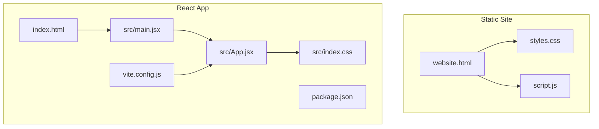
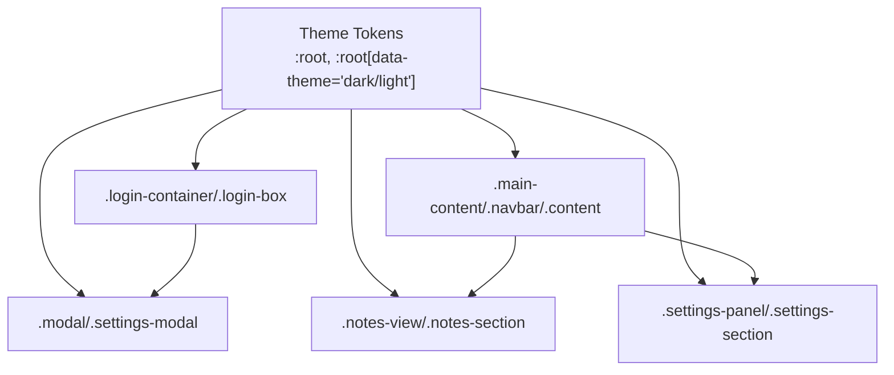
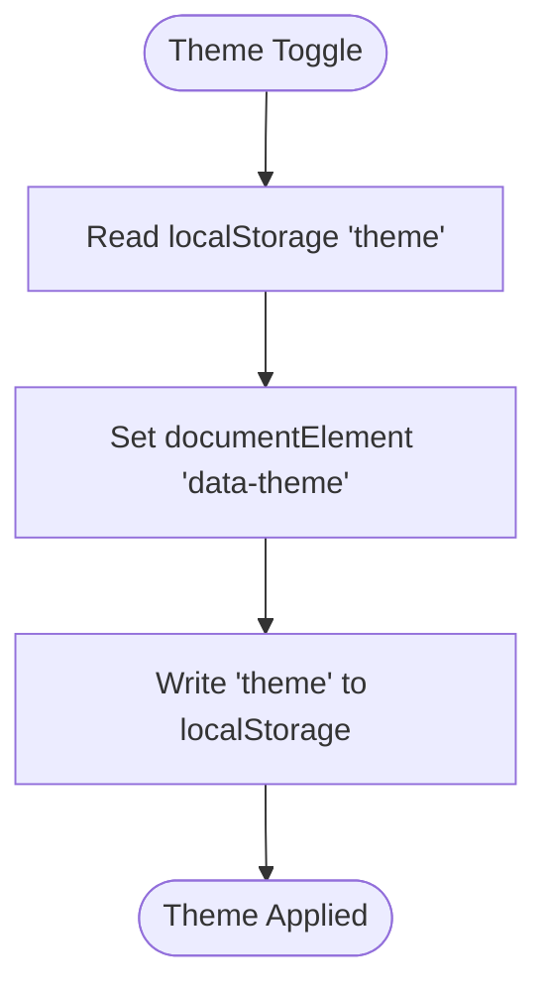
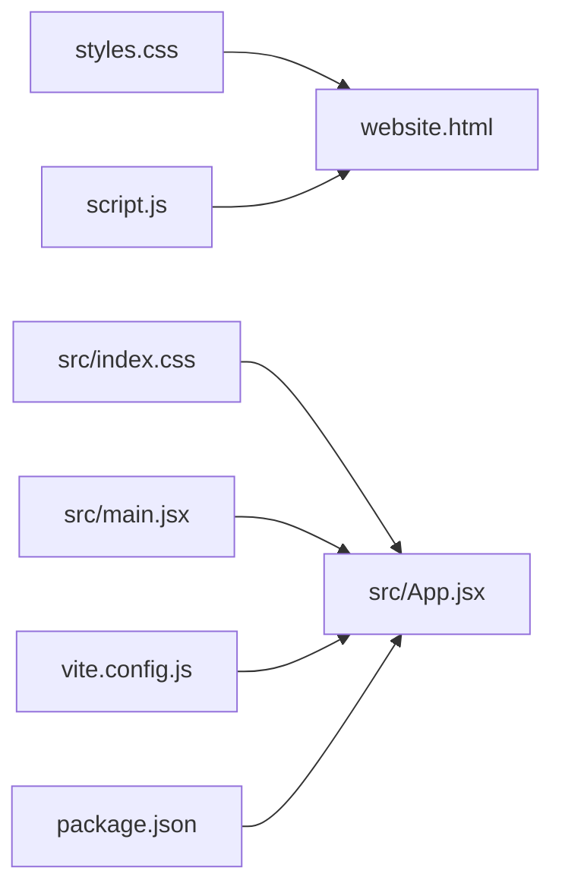

# CSS Architecture and Styling System

<cite>
**Referenced Files in This Document**
- [styles.css](file://styles.css)
- [src/index.css](file://src/index.css)
- [website.html](file://website.html)
- [index.html](file://index.html)
- [script.js](file://script.js)
- [src/App.jsx](file://src/App.jsx)
- [src/main.jsx](file://src/main.jsx)
- [vite.config.js](file://vite.config.js)
- [package.json](file://package.json)
</cite>

## Table of Contents
1. [Introduction](#introduction)
2. [Project Structure](#project-structure)
3. [Core Components](#core-components)
4. [Architecture Overview](#architecture-overview)
5. [Detailed Component Analysis](#detailed-component-analysis)
6. [Dependency Analysis](#dependency-analysis)
7. [Performance Considerations](#performance-considerations)
8. [Troubleshooting Guide](#troubleshooting-guide)
9. [Conclusion](#conclusion)

## Introduction
This document explains the CSS architecture and styling system used across both the static HTML/CSS/JS implementation and the React-based Vite application. It covers the custom properties system for theme management, responsive design patterns, component-based styling, glassmorphism design elements, typography scale, spacing systems, color palette, mobile-first breakpoints, flexbox and grid usage, animations/transitions, styling consistency between implementations, custom property inheritance, and browser compatibility considerations.

## Project Structure
The project includes two primary styling implementations:
- Static site: a single-page HTML document with embedded CSS and JavaScript for authentication and UI interactions.
- React/Vite application: a modern React SPA with modular CSS imports and component-based styling.

Key files:
- Static: styles.css, website.html, script.js, index.html
- React: src/index.css, src/App.jsx, src/main.jsx, vite.config.js, package.json

**Diagram sources**
- [website.html](file://website.html)
- [styles.css](file://styles.css)
- [script.js](file://script.js)
- [index.html](file://index.html)
- [src/index.css](file://src/index.css)
- [src/App.jsx](file://src/App.jsx)
- [src/main.jsx](file://src/main.jsx)
- [vite.config.js](file://vite.config.js)
- [package.json](file://package.json)

**Section sources**
- [website.html](file://website.html)
- [styles.css](file://styles.css)
- [script.js](file://script.js)
- [index.html](file://index.html)
- [src/index.css](file://src/index.css)
- [src/App.jsx](file://src/App.jsx)
- [src/main.jsx](file://src/main.jsx)
- [vite.config.js](file://vite.config.js)
- [package.json](file://package.json)

## Core Components
- Theme system using CSS custom properties (:root and data-theme attributes)
- Glassmorphism design with backdrop-filter and translucent backgrounds
- Mobile-first responsive layout with media queries
- Component-based CSS classes for login, dashboard, modals, settings, and notes
- Typography scale with Inter font family
- Spacing system using consistent padding/margins and gaps
- Color palette with accent, neutral, and semantic colors (success/error)
- Flexbox and grid usage for layouts and cards
- Animations/transitions for hover effects and modal transitions

**Section sources**
- [styles.css](file://styles.css)
- [src/index.css](file://src/index.css)
- [script.js](file://script.js)
- [src/App.jsx](file://src/App.jsx)

## Architecture Overview
The styling architecture centers around a shared theme system and component classes. Both implementations rely on:
- CSS custom properties for theme tokens
- Component classes for consistent UI elements
- Responsive breakpoints targeting mobile-first
- Transitions and animations for interactive feedback

**Diagram sources**
- [styles.css](file://styles.css)
- [src/index.css](file://src/index.css)
- [script.js](file://script.js)
- [src/App.jsx](file://src/App.jsx)

## Detailed Component Analysis

### Theme System and Custom Properties
- Theme tokens are defined in :root and :root[data-theme='dark']/:root[data-theme='light'].
- Tokens include background, card background, borders, text colors, accents, inputs, and nav backgrounds.
- The theme is toggled by setting data-theme on the document element and persisted in localStorage.

**Diagram sources**
- [script.js](file://script.js)
- [src/App.jsx](file://src/App.jsx)

**Section sources**
- [styles.css](file://styles.css)
- [src/index.css](file://src/index.css)
- [script.js](file://script.js)
- [src/App.jsx](file://src/App.jsx)

### Glassmorphism Design Elements
- Glass panels use var(--card-bg) with backdrop-filter blur and reduced opacity.
- Borders use var(--border-color) with subtle alpha values.
- Inputs and buttons inherit theme tokens for consistent visuals.

Examples of glass classes:
- .login-box
- .action-card
- .settings-panel
- .modal-content

**Section sources**
- [styles.css](file://styles.css)
- [src/index.css](file://src/index.css)

### Typography Scale and Font Family
- Inter font is loaded via Google Fonts and used across body and headings.
- Headings (h1–h3) use bold weights and tight letter-spacing.
- Body text uses readable line heights and font sizes aligned with the design system.

**Section sources**
- [index.html](file://index.html)
- [styles.css](file://styles.css)
- [src/index.css](file://src/index.css)

### Spacing System
- Consistent use of padding and margins across components.
- Flex gaps and grid gaps for component layouts.
- Max-width containers and centered content for readability.

**Section sources**
- [styles.css](file://styles.css)
- [src/index.css](file://src/index.css)

### Color Palette Implementation
- Background and text colors switch with theme.
- Accent color is used for highlights, buttons, and decorative elements.
- Semantic colors (success/error) for status messages and alerts.

**Section sources**
- [styles.css](file://styles.css)
- [src/index.css](file://src/index.css)

### Responsive Design Patterns
- Mobile-first approach with base styles and progressive enhancement.
- Media queries target widths under 900px for layout adjustments.
- Flexible grids and wrapping lists adapt to smaller screens.

Breakpoints:
- @media (max-width: 900px): Adjustments for login container, headings, and note sections.

**Section sources**
- [styles.css](file://styles.css)
- [src/index.css](file://src/index.css)

### Component-Based Styling Approach
- Login container and form: .login-container, .login-box, .login-info-section
- Dashboard: .main-content, .navbar, .content, .dashboard-container
- Action cards: .action-card with hover effects
- Modals: .modal, .modal-content, .settings-modal
- Notes view: .notes-view, .notes-section, .section-title
- Settings panel: .settings-panel, .settings-section

**Section sources**
- [styles.css](file://styles.css)
- [src/index.css](file://src/index.css)
- [website.html](file://website.html)
- [src/App.jsx](file://src/App.jsx)

### Flexbox and Grid Usage
- Flexbox for navigation alignment, login layout, and action cards.
- Grid-like layouts using flex-wrap and gap for landing cards.
- Centered modals and settings overlays.

**Section sources**
- [styles.css](file://styles.css)
- [src/index.css](file://src/index.css)

### Animations and Transitions
- Fade-in animation for settings views.
- Hover transitions for buttons, cards, and links.
- Smooth theme transitions using color and background transitions.

**Section sources**
- [styles.css](file://styles.css)
- [src/index.css](file://src/index.css)

### Styling Consistency Between Static and React Implementations
- Both implementations share the same theme tokens and component classes.
- React uses CSS imports while static uses external stylesheet inclusion.
- Theme persistence and toggling logic is mirrored in both environments.

**Section sources**
- [styles.css](file://styles.css)
- [src/index.css](file://src/index.css)
- [script.js](file://script.js)
- [src/App.jsx](file://src/App.jsx)

### Custom Property Inheritance and CSS-in-JS Patterns
- Static: direct CSS custom property usage with :root and data-theme.
- React: CSS-in-JS via inline styles and CSS module imports; theme tokens still referenced via var(--accent-color), etc.
- Both approaches maintain consistent theming through shared tokens.

**Section sources**
- [styles.css](file://styles.css)
- [src/index.css](file://src/index.css)
- [src/App.jsx](file://src/App.jsx)

### Browser Compatibility Considerations
- backdrop-filter requires vendor prefixes (-webkit-) in some browsers.
- CSS custom properties are widely supported; fallbacks may be needed for older browsers.
- Flexbox and grid are broadly supported; ensure vendor prefixes if targeting legacy environments.
- Transitions and transforms are well-supported across modern browsers.

**Section sources**
- [styles.css](file://styles.css)
- [src/index.css](file://src/index.css)

## Dependency Analysis
- Static site depends on styles.css and script.js for UI logic and theming.
- React app depends on src/index.css and src/App.jsx for styling and component rendering.
- Both share the theme system and component classes.

**Diagram sources**
- [styles.css](file://styles.css)
- [src/index.css](file://src/index.css)
- [website.html](file://website.html)
- [script.js](file://script.js)
- [src/App.jsx](file://src/App.jsx)
- [src/main.jsx](file://src/main.jsx)
- [vite.config.js](file://vite.config.js)
- [package.json](file://package.json)

**Section sources**
- [styles.css](file://styles.css)
- [src/index.css](file://src/index.css)
- [website.html](file://website.html)
- [script.js](file://script.js)
- [src/App.jsx](file://src/App.jsx)
- [src/main.jsx](file://src/main.jsx)
- [vite.config.js](file://vite.config.js)
- [package.json](file://package.json)

## Performance Considerations
- Minimize reflows by animating transform and opacity rather than layout properties.
- Use CSS custom properties for efficient theme switching without recalculating styles.
- Prefer CSS transitions over JavaScript animations for smoother performance.
- Keep glassmorphism blur effects reasonable to avoid heavy GPU usage on low-end devices.

[No sources needed since this section provides general guidance]

## Troubleshooting Guide
Common issues and resolutions:
- Theme not applying: Verify data-theme attribute on documentElement and localStorage persistence.
- Glass effect not visible: Ensure backdrop-filter support and sufficient contrast; check vendor prefixes.
- Responsive layout glitches: Confirm media query breakpoints and flex/grid usage.
- Button/link hover states: Ensure transitions are defined and not overridden by specificity.

**Section sources**
- [script.js](file://script.js)
- [src/App.jsx](file://src/App.jsx)
- [styles.css](file://styles.css)
- [src/index.css](file://src/index.css)

## Conclusion
The project employs a cohesive, theme-driven CSS architecture with glassmorphism, responsive design, and component-based styling. Both the static and React implementations share a unified theme system and visual language, enabling consistent user experiences across platforms. By leveraging CSS custom properties, flexbox/grid layouts, and smooth transitions, the design remains performant and accessible.