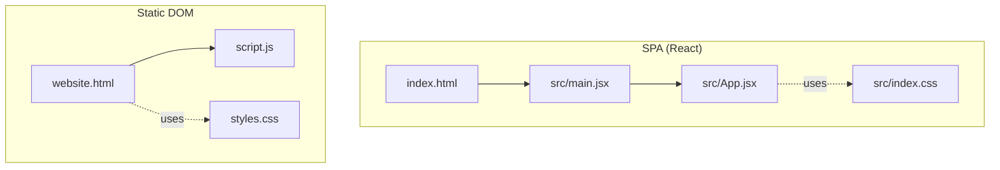
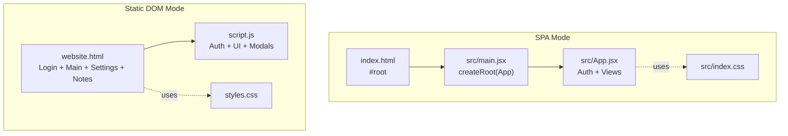
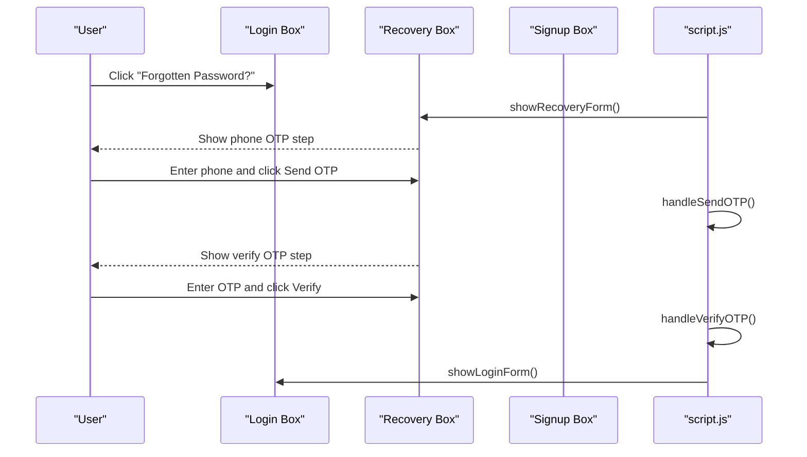
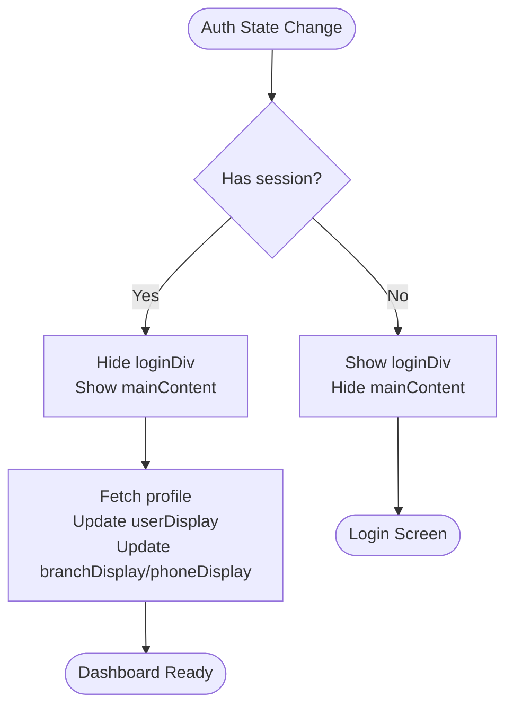
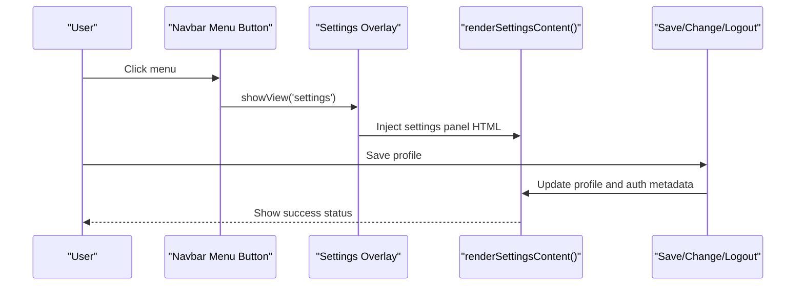
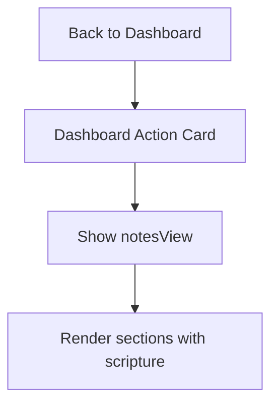
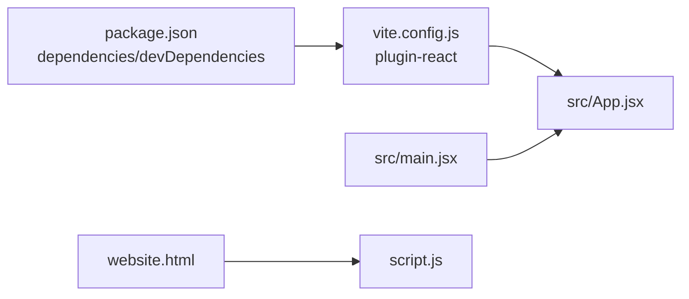

# HTML Structure and Template

<cite>
**Referenced Files in This Document**
- [index.html](file://index.html)
- [website.html](file://website.html)
- [src/App.jsx](file://src/App.jsx)
- [src/main.jsx](file://src/main.jsx)
- [script.js](file://script.js)
- [styles.css](file://styles.css)
- [src/index.css](file://src/index.css)
- [package.json](file://package.json)
- [vite.config.js](file://vite.config.js)
</cite>

## Table of Contents
1. [Introduction](#introduction)
2. [Project Structure](#project-structure)
3. [Core Components](#core-components)
4. [Architecture Overview](#architecture-overview)
5. [Detailed Component Analysis](#detailed-component-analysis)
6. [Dependency Analysis](#dependency-analysis)
7. [Performance Considerations](#performance-considerations)
8. [Troubleshooting Guide](#troubleshooting-guide)
9. [Conclusion](#conclusion)
10. [Appendices](#appendices)

## Introduction
This document explains the HTML structure and template organization of the static HMC WEBSITE implementation. It covers semantic HTML5 structure, DOM element hierarchy, and container organization; documents the login form sections (login, recovery, signup), main content area, settings modal, and notes view components; details the ID-based element identification system and class naming conventions; and describes accessibility attributes and responsive design. It also shows how the HTML structure supports the JavaScript functionality and DOM manipulation patterns used throughout the application.

## Project Structure
The project includes two primary HTML entry points:
- A React-based SPA entry via index.html and src/App.jsx
- A static HTML page with embedded JavaScript for a pure DOM-based implementation

Key files:
- index.html: Minimal React root container and module script
- website.html: Full static HTML with login, main content, settings modal, and notes view
- src/App.jsx: React application rendering login, dashboard, settings, and notes views
- src/main.jsx: React root mounting
- script.js: Static DOM-based logic for authentication, UI toggling, and modal rendering
- styles.css and src/index.css: Shared and React-specific CSS
- package.json and vite.config.js: Build tooling configuration

**Diagram sources**
- [index.html:1-16](file://index.html#L1-L16)
- [src/main.jsx:1-11](file://src/main.jsx#L1-L11)
- [src/App.jsx:1-621](file://src/App.jsx#L1-L621)
- [website.html:1-303](file://website.html#L1-L303)
- [script.js:1-660](file://script.js#L1-L660)
- [styles.css:1-1071](file://styles.css#L1-L1071)
- [src/index.css:1-1148](file://src/index.css#L1-L1148)

**Section sources**
- [index.html:1-16](file://index.html#L1-L16)
- [website.html:1-303](file://website.html#L1-L303)
- [src/App.jsx:1-621](file://src/App.jsx#L1-L621)
- [src/main.jsx:1-11](file://src/main.jsx#L1-L11)
- [script.js:1-660](file://script.js#L1-L660)
- [styles.css:1-1071](file://styles.css#L1-L1071)
- [src/index.css:1-1148](file://src/index.css#L1-L1148)
- [package.json:1-22](file://package.json#L1-L22)
- [vite.config.js:1-8](file://vite.config.js#L1-L8)

## Core Components
- Login container and forms: login, recovery (OTP), and signup sections with ID-based element identification
- Main content area: dashboard with navbar, user header, action cards, and status messages
- Settings modal: overlay with editable profile fields, password change, and theme toggle
- Notes view: structured sections with scripture references and styled lists
- Static DOM helpers: modal dialog system, status messaging, and theme persistence

Key ID-based identifiers:
- Login: loginDiv, loginBox, recoveryBox, signupBox, loginForm, signupForm, errorMsg, recoveryError, recoveryPhone, recoveryOTP, recoveryPhoneStep, recoveryVerifyStep, toggleLoginPassword, toggleSignupPassword, toggleSignupConfirmPassword
- Main content: mainContent, menuBtn, userDisplay, branchDisplay, phoneDisplay, statusMessage
- Settings: settingsOverlay, settingsContent, closeSettingsModalBtn, saveProfileBtn, changePasswordBtn, themeToggleCheckbox, logoutPanelBtn
- Notes: notesView, backToDashBtn
- Modal: modal, modalBody, modalOverlay

Class naming conventions:
- login-container, login-box, login-info-section, info-list, error
- main-content, navbar, dashboard-container, user-header, user-greeting, user-info-bar, action-card
- settings-overlay, settings-modal, settings-content, settings-section
- notes-view, notes-header, notes-section, section-title, scripture, scripture-block
- modal, modal-content, option-btn, setting-input, theme-toggle-wrapper, switch

Accessibility attributes:
- aria-label on interactive elements (e.g., toggle buttons, modal)
- aria-live on statusMessage for screen reader announcements
- role="dialog" and aria-modal on modal content
- aria-hidden on modal when hidden

Responsive design:
- Media queries for smaller screens adjust typography and spacing
- Flexible layouts with flexbox and max-width constraints

SEO and metadata:
- website.html includes meta description, keywords, author, robots, Open Graph tags, and canonical link

**Section sources**
- [website.html:24-303](file://website.html#L24-L303)
- [script.js:11-43](file://script.js#L11-L43)
- [styles.css:776-817](file://styles.css#L776-L817)
- [src/index.css:776-814](file://src/index.css#L776-L814)
- [website.html:4-22](file://website.html#L4-L22)

## Architecture Overview
The application supports two modes:
- React SPA mode: index.html mounts React, which renders login, dashboard, settings, and notes views
- Static DOM mode: website.html provides the same UI with vanilla JavaScript for authentication and UI transitions

**Diagram sources**
- [index.html:11-13](file://index.html#L11-L13)
- [src/main.jsx:6-10](file://src/main.jsx#L6-L10)
- [src/App.jsx:530-620](file://src/App.jsx#L530-L620)
- [website.html:24-303](file://website.html#L24-L303)
- [script.js:631-660](file://script.js#L631-L660)

## Detailed Component Analysis

### Login Form Sections
The login container organizes:
- Information and picture section
- Login form (email/username, password, submit, error message, forgot password, signup link)
- Recovery form (phone OTP step and verify OTP step)
- Signup form (username, email, phone, branch, passwords, submit, error message, login link)

DOM structure and IDs:
- Container: loginDiv
- Boxes: loginBox, recoveryBox, signupBox
- Forms: loginForm, signupForm
- Inputs: username/password, signupUsername/signupEmail/signupPhone/signupBranch/signupPassword/signupConfirmPassword
- OTP steps: recoveryPhoneStep, recoveryVerifyStep
- Toggle buttons: toggleLoginPassword, toggleSignupPassword, toggleSignupConfirmPassword
- Links: forgotPasswordLink, backToLoginLink, signupLink, loginLink

JavaScript integration:
- Elements collected via getElementById
- Event listeners bind submit handlers and navigation links
- Password visibility toggled by switching input type and button text
- OTP flow switches between phone and verify steps

**Diagram sources**
- [website.html:26-101](file://website.html#L26-L101)
- [script.js:264-324](file://script.js#L264-L324)

**Section sources**
- [website.html:26-101](file://website.html#L26-L101)
- [script.js:11-43](file://script.js#L11-L43)
- [script.js:587-629](file://script.js#L587-L629)
- [script.js:273-324](file://script.js#L273-L324)

### Main Content Area (Dashboard)
Structure:
- Navbar with branding and menu button
- Dashboard container with user header and action cards
- Status message area

Key IDs and classes:
- mainContent, navbar, dashboard-container, user-header, user-greeting, user-info-bar, action-card
- menuBtn, userDisplay, branchDisplay, phoneDisplay, statusMessage

Behavior:
- On successful login, the login container is hidden and mainContent is shown
- User profile data updates greeting and info bars
- Action card triggers notes view

**Diagram sources**
- [script.js:631-657](file://script.js#L631-L657)
- [script.js:137-161](file://script.js#L137-L161)

**Section sources**
- [website.html:104-148](file://website.html#L104-L148)
- [script.js:137-161](file://script.js#L137-L161)
- [script.js:631-657](file://script.js#L631-L657)

### Settings Modal
Structure:
- Overlay with settings-modal and settings-header
- settingsContent area populated dynamically
- Close button and sections for personal info, security, preferences, and logout

Dynamic content injection:
- renderSettingsContent builds HTML for profile fields, password change, theme toggle, and logout
- Event bindings for saving profile, changing password, theme toggle, and logout

Accessibility:
- Close button and modal overlay support keyboard focus and aria-hidden management

**Diagram sources**
- [website.html:150-161](file://website.html#L150-L161)
- [script.js:427-571](file://script.js#L427-L571)

**Section sources**
- [website.html:150-161](file://website.html#L150-L161)
- [script.js:427-571](file://script.js#L427-L571)

### Notes View Components
Structure:
- Header with back button and title
- Multiple notes-section blocks with section-title and numbered bullets
- Scripture references and highlighted scripture blocks

DOM elements:
- notesView, backToDashBtn, notes-header, notes-content, notes-section, section-title, scripture, scripture-block

Behavior:
- Clicking the action card navigates to notes view
- Back button returns to dashboard

**Diagram sources**
- [website.html:163-289](file://website.html#L163-L289)
- [script.js:604-613](file://script.js#L604-L613)

**Section sources**
- [website.html:163-289](file://website.html#L163-L289)
- [script.js:604-613](file://script.js#L604-L613)

### Modal Dialog System
Structure:
- modal wrapper with overlay and content area
- modalBody for dynamic content
- aria-modal and role="dialog" for accessibility

Behavior:
- showModal injects HTML into modalBody and sets aria-hidden=false
- hideModal resets aria-hidden=true and clears content

**Section sources**
- [website.html:292-299](file://website.html#L292-L299)
- [script.js:90-101](file://script.js#L90-L101)

## Dependency Analysis
- React SPA depends on React and ReactDOM; Vite plugin for React is configured
- Static DOM relies on Supabase client loaded via CDN for authentication
- Both modes share CSS variables and theme logic
- Authentication state drives UI visibility and content updates

**Diagram sources**
- [package.json:12-20](file://package.json#L12-L20)
- [vite.config.js:1-8](file://vite.config.js#L1-L8)
- [src/App.jsx:1-6](file://src/App.jsx#L1-L6)
- [src/main.jsx:1-11](file://src/main.jsx#L1-L11)
- [website.html:24-303](file://website.html#L24-L303)
- [script.js:1-9](file://script.js#L1-L9)

**Section sources**
- [package.json:12-20](file://package.json#L12-L20)
- [vite.config.js:1-8](file://vite.config.js#L1-L8)
- [src/App.jsx:1-6](file://src/App.jsx#L1-L6)
- [src/main.jsx:1-11](file://src/main.jsx#L1-L11)
- [website.html:24-303](file://website.html#L24-L303)
- [script.js:1-9](file://script.js#L1-L9)

## Performance Considerations
- Minimize DOM reflows by batching updates (e.g., updating multiple spans in one pass)
- Use CSS variables for theme switching to avoid layout thrashing
- Debounce or disable buttons during async operations to prevent duplicate submissions
- Lazy-load heavy assets and defer non-critical scripts

## Troubleshooting Guide
Common issues and checks:
- Missing Supabase keys: Ensure SUPABASE_ANON_KEY is set in script.js for static mode
- Theme not persisting: Verify localStorage usage and data-theme attribute updates
- Modal not closing: Confirm aria-hidden and hidden class toggles
- OTP flow errors: Validate phone number format and network connectivity
- Styling inconsistencies: Check CSS specificity and media query breakpoints

**Section sources**
- [script.js:4-9](file://script.js#L4-L9)
- [script.js:390-401](file://script.js#L390-L401)
- [script.js:90-101](file://script.js#L90-L101)
- [script.js:273-324](file://script.js#L273-L324)
- [styles.css:776-817](file://styles.css#L776-L817)

## Conclusion
The HMC WEBSITE implements a dual-mode architecture: a React SPA and a static DOM application. Both share a cohesive HTML structure, ID-based element identification, and consistent class naming conventions. The design emphasizes accessibility, responsive behavior, and clear separation of concerns across login, dashboard, settings, and notes views. The JavaScript layer orchestrates authentication, UI transitions, and dynamic content rendering while maintaining robust accessibility and responsive styling.

## Appendices

### Accessibility Checklist
- Ensure all interactive elements have accessible names (aria-label)
- Use role="dialog" and aria-modal for modals
- Announce dynamic status messages with aria-live
- Provide skip links and logical tab order
- Test keyboard navigation and screen reader compatibility

### Responsive Breakpoints
- Adjustments for widths below 900px for notes view and login layout
- Centered login info and simplified lists on small screens

**Section sources**
- [styles.css:776-817](file://styles.css#L776-L817)
- [src/index.css:776-814](file://src/index.css#L776-L814)