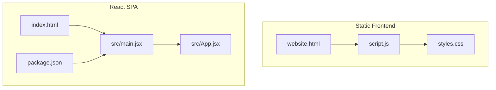
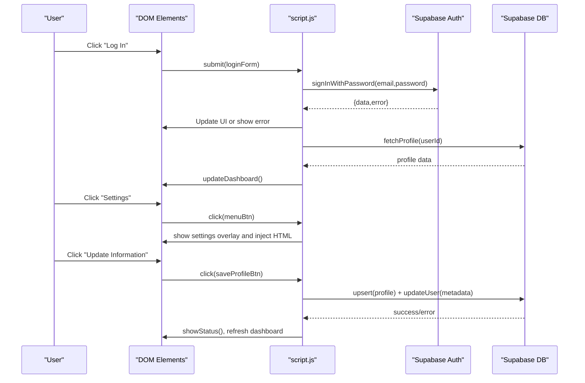
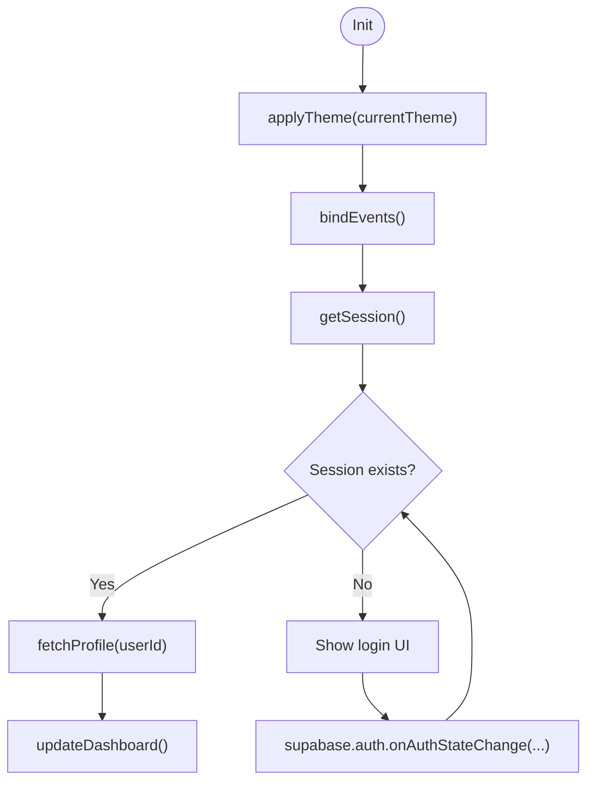
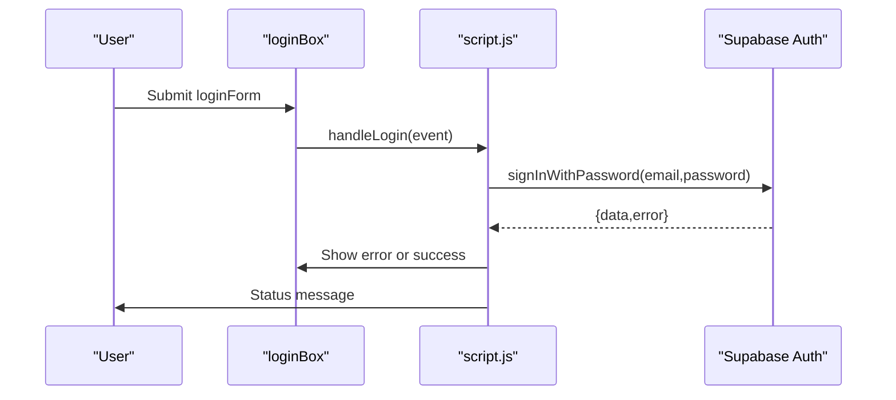
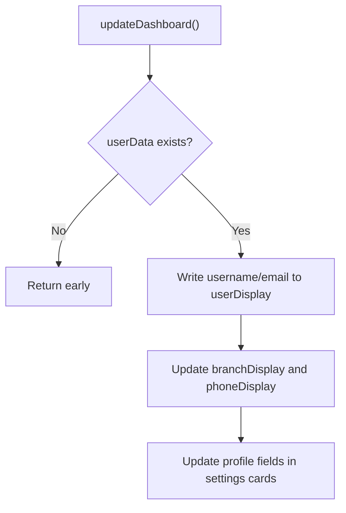
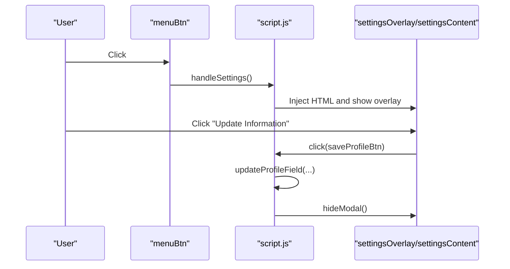
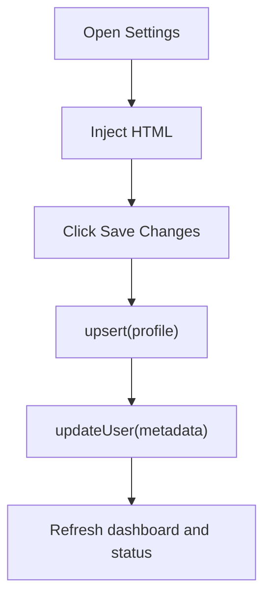
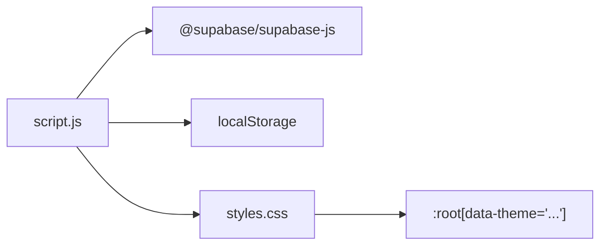
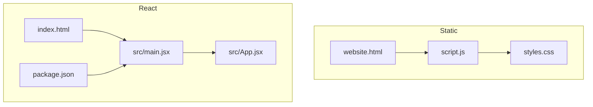

# JavaScript Logic and Event Handling

<cite>
**Referenced Files in This Document**
- [script.js](file://script.js)
- [website.html](file://website.html)
- [styles.css](file://styles.css)
- [index.html](file://index.html)
- [src/main.jsx](file://src/main.jsx)
- [src/App.jsx](file://src/App.jsx)
- [package.json](file://package.json)
</cite>

## Table of Contents
1. [Introduction](#introduction)
2. [Project Structure](#project-structure)
3. [Core Components](#core-components)
4. [Architecture Overview](#architecture-overview)
5. [Detailed Component Analysis](#detailed-component-analysis)
6. [Dependency Analysis](#dependency-analysis)
7. [Performance Considerations](#performance-considerations)
8. [Troubleshooting Guide](#troubleshooting-guide)
9. [Conclusion](#conclusion)
10. [Appendices](#appendices)

## Introduction
This document explains the JavaScript logic and event-driven architecture of the static implementation for the HMCI Waterburg website. It focuses on how the page initializes, manages global state, registers event listeners, and orchestrates authentication flows, modal management, DOM manipulation, and educational content rendering. It also contrasts this event-driven approach with a component-based architecture and highlights practical examples of event delegation, DOM traversal, and dynamic content updates.

## Project Structure
The project includes two primary frontends:
- A static HTML page with embedded JavaScript logic for login, authentication, and dashboard views.
- A React-based SPA that mirrors the same functionality using React components and hooks.

Key files:
- Static frontend: [website.html](file://website.html), [script.js](file://script.js), [styles.css](file://styles.css)
- React SPA: [index.html](file://index.html), [src/main.jsx](file://src/main.jsx), [src/App.jsx](file://src/App.jsx), [package.json](file://package.json)

**Diagram sources**
- [website.html](file://website.html)
- [script.js](file://script.js)
- [styles.css](file://styles.css)
- [index.html](file://index.html)
- [src/main.jsx](file://src/main.jsx)
- [src/App.jsx](file://src/App.jsx)
- [package.json](file://package.json)

**Section sources**
- [website.html](file://website.html)
- [script.js](file://script.js)
- [styles.css](file://styles.css)
- [index.html](file://index.html)
- [src/main.jsx](file://src/main.jsx)
- [src/App.jsx](file://src/App.jsx)
- [package.json](file://package.json)

## Core Components
- Global state and element registry: centralized in [script.js](file://script.js) with a dedicated elements object and a userData cache.
- Authentication handlers: login, signup, password recovery via OTP, and logout.
- Modal management: reusable modal system for dialogs and settings.
- Settings panel: dynamic content injection and profile/password update flows.
- Educational content rendering: static notes content rendered directly in the HTML.
- Theme management: persistent theme toggling with CSS custom properties.

**Section sources**
- [script.js](file://script.js)
- [website.html](file://website.html)
- [styles.css](file://styles.css)

## Architecture Overview
The static implementation uses an event-driven architecture:
- Initialization binds DOM events and sets up Supabase auth listeners.
- Authentication state drives UI visibility and content updates.
- Modal overlays and settings panels are dynamically injected and event-bound.
- Educational content is static HTML and remains unchanged after load.

**Diagram sources**
- [script.js](file://script.js)
- [website.html](file://website.html)

## Detailed Component Analysis

### Module Pattern and Global State
- Elements registry: [script.js](file://script.js) defines an elements object that caches frequently accessed DOM nodes, reducing repeated queries.
- Global state: userData holds the current user’s profile; currentTheme persists the active theme in localStorage.
- Helper functions: formatDateTime, calculateAccountAge, showStatus, showModal, hideModal encapsulate common UI behaviors.

**Diagram sources**
- [script.js](file://script.js)

**Section sources**
- [script.js](file://script.js)

### Authentication Flow Functions
- Login: [script.js](file://script.js) handles form submission, disables the button while loading, and normalizes error messages. On success, it relies on the auth listener to initialize the dashboard.
- Signup: Validates password confirmation, calls Supabase sign-up, creates a profile record, and shows a success message.
- Password recovery (OTP): Two-step process—send OTP to phone, then verify OTP and log in.
- Logout: Calls Supabase sign-out and updates UI.

**Diagram sources**
- [script.js](file://script.js)
- [website.html](file://website.html)

**Section sources**
- [script.js](file://script.js)
- [website.html](file://website.html)

### DOM Manipulation Utilities
- Element caching: elements object centralizes getElementById calls.
- Dynamic content updates: updateDashboard writes profile data into spans and cards.
- Visibility toggles: showView switches between dashboard, settings, and notes views.
- Status messaging: showStatus displays transient messages with automatic dismissal.

**Diagram sources**
- [script.js](file://script.js)

**Section sources**
- [script.js](file://script.js)

### Modal Management System
- Modal lifecycle: showModal injects HTML into modalBody and reveals the modal; hideModal hides it and clears content.
- Settings modal: handleSettings opens the overlay and injects content; renderSettingsContent builds the form and binds events.
- Edit profile modal: handleEditProfile injects a form and binds save/change-password/close handlers.

**Diagram sources**
- [script.js](file://script.js)
- [website.html](file://website.html)

**Section sources**
- [script.js](file://script.js)
- [website.html](file://website.html)

### Form Validation and Error Handling
- Validation patterns:
  - Password confirmation mismatch in signup.
  - OTP presence checks in recovery steps.
  - Username vs email resolution in login.
- Error handling:
  - Error messages mapped to user-friendly text.
  - Status messages provide immediate feedback.
  - Disabled buttons during async operations to prevent double submissions.

**Section sources**
- [script.js](file://script.js)
- [website.html](file://website.html)

### User Feedback Systems
- showStatus displays transient messages with severity classes (success/error/info).
- Status messages are cleared automatically after a timeout.
- Buttons reflect loading states by disabling and changing text.

**Section sources**
- [script.js](file://script.js)

### Settings Modal Content Injection and Profile Update
- Content injection: renderSettingsContent builds the HTML for personal info, security, preferences, and logout controls.
- Profile updates: handleSaveProfile performs an upsert on profiles and updateUser on metadata, then refreshes the dashboard.
- Theme toggle: toggleTheme switches between dark and light modes and persists the preference.

**Diagram sources**
- [script.js](file://script.js)
- [website.html](file://website.html)

**Section sources**
- [script.js](file://script.js)
- [website.html](file://website.html)

### Educational Content Rendering
- Static notes content is embedded in [website.html](file://website.html) under the notes view. The static implementation does not dynamically generate this content; it is rendered as-is.

**Section sources**
- [website.html](file://website.html)

### Practical Examples
- Event delegation: The modal overlay listens for clicks to close the modal, demonstrating delegation to a single parent.
- DOM traversal: updateDashboard traverses the DOM to locate and update specific elements within cards.
- Dynamic content updates: renderSettingsContent and handleEditProfile inject HTML and re-bind event handlers.

**Section sources**
- [script.js](file://script.js)
- [website.html](file://website.html)

### Advantages of Event-Driven Approach vs Component-Based Architecture
- Simplicity: Single-file logic with minimal abstractions suits small, static pages.
- Predictability: Centralized event binding and state updates reduce complexity.
- Rapid iteration: Direct DOM manipulation enables quick UI changes without component re-renders.
- Lightweight: No virtual DOM overhead; efficient for straightforward dashboards and forms.

[No sources needed since this section provides general guidance]

## Dependency Analysis
- Supabase client: Imported in [script.js](file://script.js) and used for auth and database operations.
- Theme persistence: localStorage keys for theme and session state.
- CSS custom properties: Theme switching updates :root attributes and applies transitions.

**Diagram sources**
- [script.js](file://script.js)
- [styles.css](file://styles.css)
- [package.json](file://package.json)

**Section sources**
- [script.js](file://script.js)
- [styles.css](file://styles.css)
- [package.json](file://package.json)

## Performance Considerations
- Minimize DOM queries: Use the elements registry to cache nodes.
- Debounce or throttle frequent UI updates.
- Avoid unnecessary reflows by batching DOM writes.
- Prefer event delegation for dynamic content to reduce listener count.

[No sources needed since this section provides general guidance]

## Troubleshooting Guide
Common issues and remedies:
- Authentication errors: Normalize messages and display user-friendly text; ensure Supabase credentials are configured.
- Modal not closing: Verify modalOverlay click handler and hideModal logic.
- Profile not updating: Confirm both upsert and updateUser calls succeed; check network tab for errors.
- Theme not persisting: Ensure applyTheme writes to localStorage and updates :root attributes.

**Section sources**
- [script.js](file://script.js)
- [website.html](file://website.html)
- [styles.css](file://styles.css)

## Conclusion
The static implementation demonstrates a clean, event-driven architecture that efficiently manages authentication, modal interactions, and profile updates. It prioritizes simplicity and directness, making it easy to maintain and iterate quickly. While a component-based approach offers scalability and reusability for larger applications, this event-driven model is well-suited for the current scope and provides a solid foundation for future enhancements.

[No sources needed since this section summarizes without analyzing specific files]

## Appendices

### Appendix A: Static vs React SPA Comparison
- Static frontend: [website.html](file://website.html) + [script.js](file://script.js) + [styles.css](file://styles.css)
- React SPA: [index.html](file://index.html) + [src/main.jsx](file://src/main.jsx) + [src/App.jsx](file://src/App.jsx) + [package.json](file://package.json)

**Diagram sources**
- [website.html](file://website.html)
- [script.js](file://script.js)
- [styles.css](file://styles.css)
- [index.html](file://index.html)
- [src/main.jsx](file://src/main.jsx)
- [src/App.jsx](file://src/App.jsx)
- [package.json](file://package.json)