# Static Implementation

<cite>
**Referenced Files in This Document**
- [index.html](file://index.html)
- [website.html](file://website.html)
- [script.js](file://script.js)
- [styles.css](file://styles.css)
- [src/index.css](file://src/index.css)
- [src\App.jsx](file://src\App.jsx)
- [src\main.jsx](file://src\main.jsx)
- [src\supabaseClient.js](file://src\supabaseClient.js)
</cite>

## Table of Contents
1. [Introduction](#introduction)
2. [Project Structure](#project-structure)
3. [Core Components](#core-components)
4. [Architecture Overview](#architecture-overview)
5. [Detailed Component Analysis](#detailed-component-analysis)
6. [Dependency Analysis](#dependency-analysis)
7. [Performance Considerations](#performance-considerations)
8. [Troubleshooting Guide](#troubleshooting-guide)
9. [Conclusion](#conclusion)
10. [Appendices](#appendices)

## Introduction
This document explains the static HTML/CSS/JavaScript implementation of the HMC WEBSITE. It focuses on the HTML template structure, JavaScript module architecture, DOM manipulation patterns, event-driven authentication logic, modal-based settings interface, and form processing mechanisms. It also documents JavaScript functions for profile management, theme switching, and educational content rendering. The CSS architecture is covered with emphasis on custom properties, responsive design patterns, and styling consistency across both implementations. Practical examples demonstrate state management, DOM manipulation, and user interaction handling. Finally, it compares the advantages and limitations of this static approach versus the React version.

## Project Structure
The repository contains two primary implementations:
- A static website built with pure HTML, CSS, and JavaScript, hosted as a single-page application with a dedicated HTML page and a script module.
- A React-based SPA that shares the same styling and Supabase integration.

Key files:
- Static SPA: website.html, script.js, styles.css
- React SPA: src\App.jsx, src\main.jsx, src\index.css, src\supabaseClient.js
- Shared assets: index.html (React entry) and shared CSS files

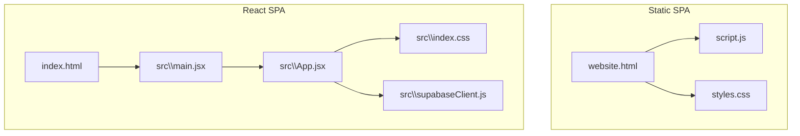

**Diagram sources**
- [website.html](file://website.html)
- [script.js](file://script.js)
- [styles.css](file://styles.css)
- [index.html](file://index.html)
- [src\main.jsx](file://src\main.jsx)
- [src\App.jsx](file://src\App.jsx)
- [src\index.css](file://src\index.css)
- [src\supabaseClient.js](file://src\supabaseClient.js)

**Section sources**
- [website.html](file://website.html)
- [script.js](file://script.js)
- [styles.css](file://styles.css)
- [index.html](file://index.html)
- [src\main.jsx](file://src\main.jsx)
- [src\App.jsx](file://src\App.jsx)
- [src\index.css](file://src\index.css)
- [src\supabaseClient.js](file://src\supabaseClient.js)

## Core Components
- HTML Template: Defines login forms, recovery flow, sign-up form, main dashboard, settings modal, and notes view.
- JavaScript Module: Implements Supabase client initialization, authentication handlers, profile management, modal orchestration, theme switching, and view transitions.
- CSS Architecture: Uses CSS custom properties for themes, glassmorphism effects, and responsive breakpoints.

Key responsibilities:
- Authentication: Login, sign-up, OTP recovery, logout.
- Profile Management: Fetch, update, and persist user profile data.
- UI Views: Dashboard, settings panel, and notes view.
- Theming: Dark/light mode persisted in localStorage.
- Accessibility: Status messages, aria attributes, and keyboard-friendly controls.

**Section sources**
- [website.html](file://website.html)
- [script.js](file://script.js)
- [styles.css](file://styles.css)

## Architecture Overview
The static implementation uses a module pattern with a central script that:
- Initializes Supabase client and binds DOM events.
- Manages authentication state via Supabase auth listeners.
- Updates the DOM to reflect authenticated state and user profile.
- Renders modals and views dynamically.

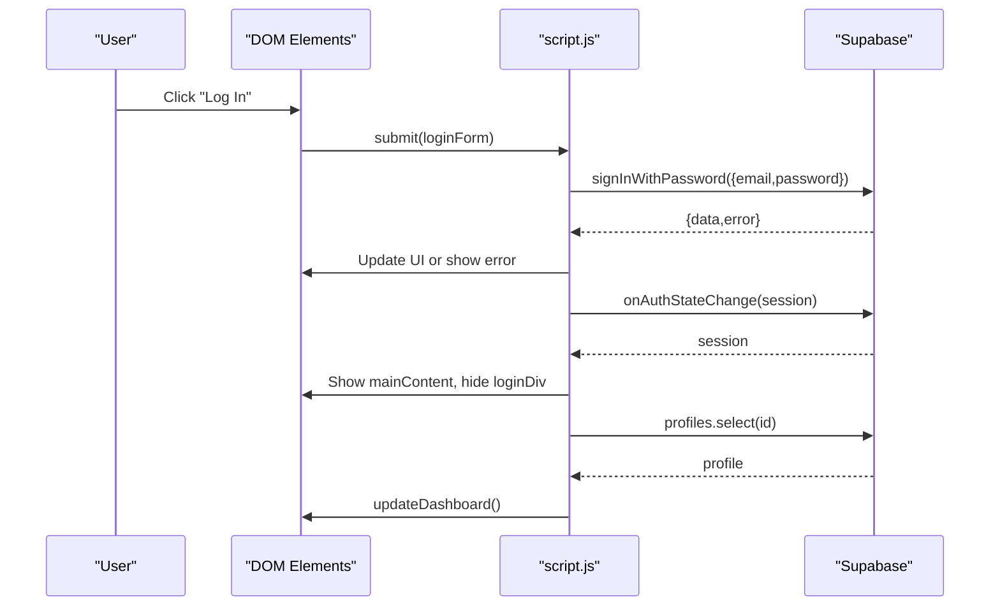

**Diagram sources**
- [script.js](file://script.js)
- [website.html](file://website.html)

## Detailed Component Analysis

### HTML Template Structure
The static site defines:
- Login container with information and login box.
- Recovery form with two steps: phone input and OTP verification.
- Sign-up form with validation and submission.
- Main dashboard with user greeting and action cards.
- Settings overlay modal for profile editing and preferences.
- Notes view replacing the dashboard with structured educational content.

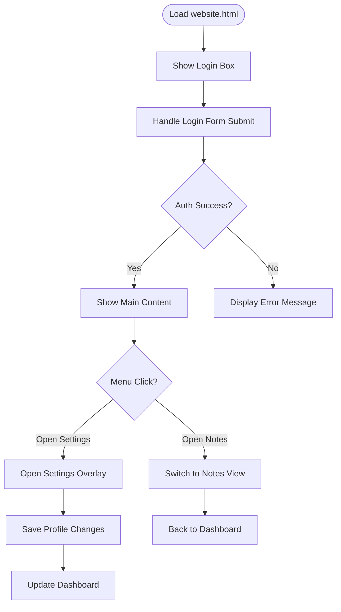

**Diagram sources**
- [website.html](file://website.html)

**Section sources**
- [website.html](file://website.html)

### JavaScript Module Architecture
The script module exports a cohesive set of helpers and handlers:
- Element registry: centralized DOM element references.
- Helpers: date formatting, account age calculation, status messaging, modal orchestration.
- Data management: fetch profile, update profile fields, dashboard updates.
- Auth handlers: login, sign-up, OTP send/verify, logout.
- Settings modals: edit profile, change password, theme toggle.
- UI toggles: view switching, password visibility toggles.
- Initialization: theme application, event binding, auth listener setup.

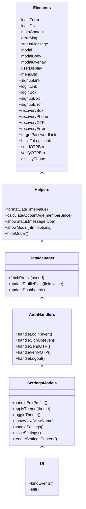

**Diagram sources**
- [script.js](file://script.js)

**Section sources**
- [script.js](file://script.js)

### Event-Driven Authentication Logic
- Login: Prevents default form submission, disables button, calls Supabase sign-in, handles errors, and triggers auth state change.
- Sign-up: Validates password confirmation, creates user, upserts profile, and shows success message.
- OTP Recovery: Two-step process with phone input and OTP verification, updating UI accordingly.
- Logout: Calls Supabase sign-out and shows status.

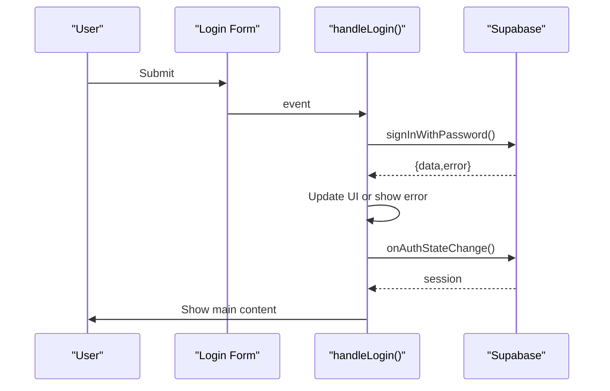

**Diagram sources**
- [script.js](file://script.js)

**Section sources**
- [script.js](file://script.js)

### Modal-Based Settings Interface
- Settings Overlay: Fixed-position modal with header and content area.
- Edit Profile Modal: Dynamically generated HTML with inputs for personal info and password change.
- Settings Panel: Persistent overlay with sections for personal info, security, preferences, and logout.

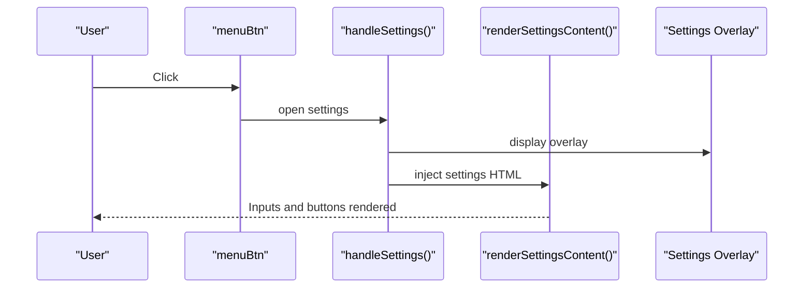

**Diagram sources**
- [script.js](file://script.js)
- [website.html](file://website.html)

**Section sources**
- [script.js](file://script.js)
- [website.html](file://website.html)

### Form Processing Mechanisms
- Login Form: Submits credentials, disables button while loading, displays errors, and transitions to dashboard on success.
- Sign-up Form: Validates passwords, submits registration, upserts profile, and returns to login.
- OTP Recovery: Phone step sends OTP; verify step validates token and logs in.
- Settings Forms: Inline forms for saving profile and changing password.

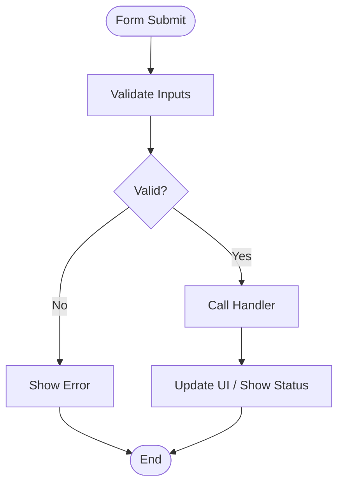

**Diagram sources**
- [script.js](file://script.js)

**Section sources**
- [script.js](file://script.js)

### JavaScript Functions for Profile Management
- fetchProfile(userId): Retrieves profile data from Supabase.
- updateProfileField(field, value): Updates a single field and refreshes UI.
- updateDashboard(): Updates user display and info bar.

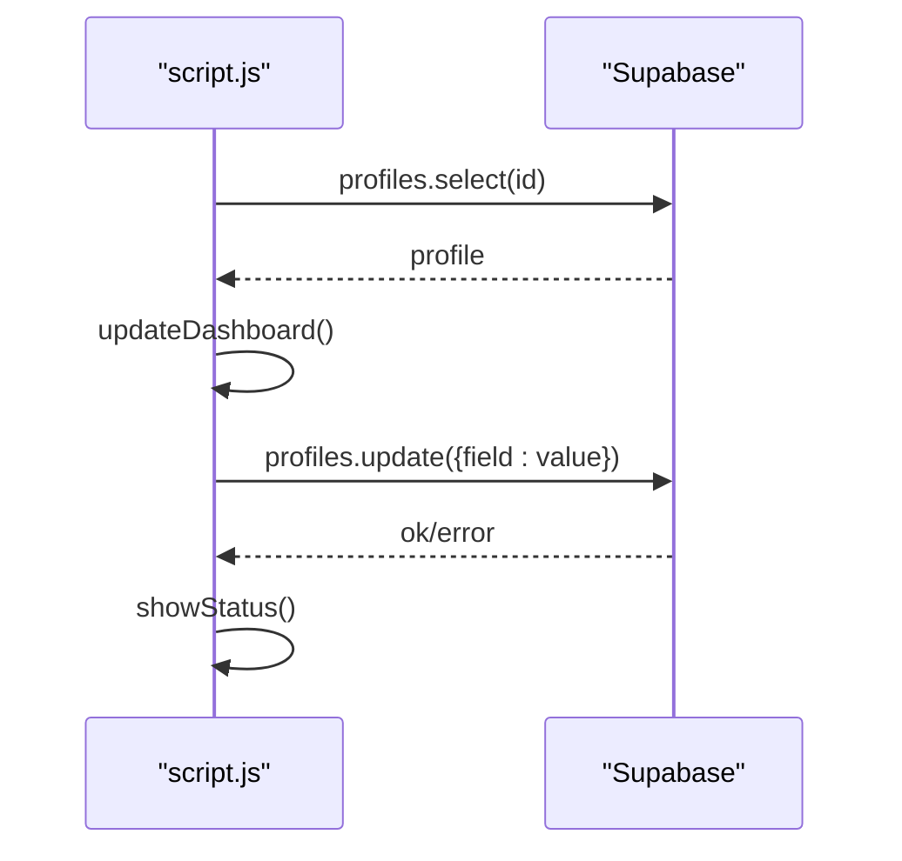

**Diagram sources**
- [script.js](file://script.js)

**Section sources**
- [script.js](file://script.js)

### Theme Switching
- applyTheme(theme): Sets data-theme attribute and persists to localStorage.
- toggleTheme(): Switches between dark and light modes and refreshes settings content.

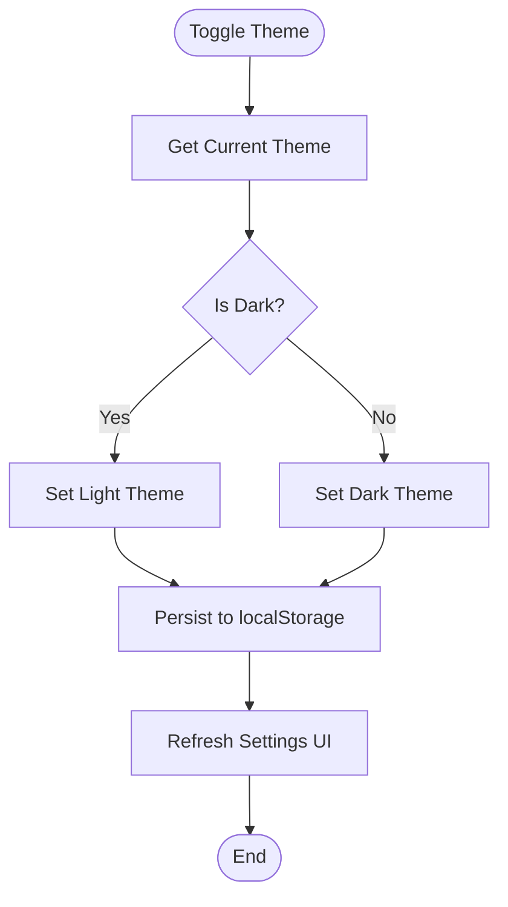

**Diagram sources**
- [script.js](file://script.js)

**Section sources**
- [script.js](file://script.js)

### Educational Content Rendering
- Notes View: Replaces dashboard with structured sections containing scripture references and formatted lists.
- Navigation: Action card opens notes; back button returns to dashboard.

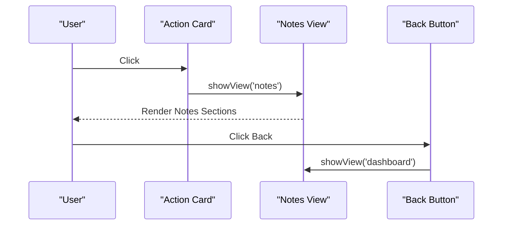

**Diagram sources**
- [website.html](file://website.html)
- [script.js](file://script.js)

**Section sources**
- [website.html](file://website.html)
- [script.js](file://script.js)

### CSS Architecture and Styling Consistency
- Custom Properties: Centralized theme tokens in :root and :root[data-theme='light']/:root[data-theme='dark'].
- Glassmorphism: Backdrop filters and translucent backgrounds for cards and overlays.
- Responsive Design: Media queries adjust layout for smaller screens.
- Consistency: Both static and React implementations share the same CSS custom properties and class names.

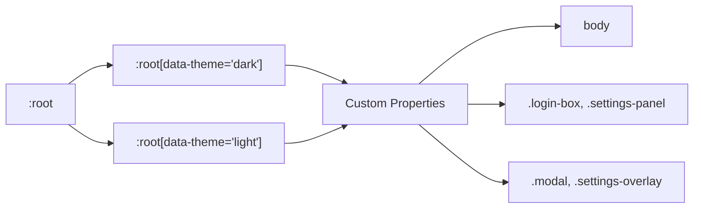

**Diagram sources**
- [styles.css](file://styles.css)
- [src\index.css](file://src\index.css)

**Section sources**
- [styles.css](file://styles.css)
- [src\index.css](file://src\index.css)

## Dependency Analysis
- Supabase Client: Imported via CDN in script.js; used for auth and database operations.
- DOM Events: Centralized event binding in bindEvents(), covering forms, links, and UI toggles.
- Local Storage: Theme persistence and basic state storage.
- CSS Dependencies: Shared custom properties and responsive styles.

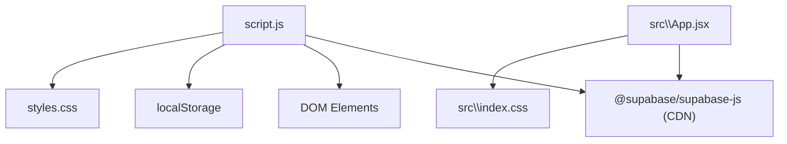

**Diagram sources**
- [script.js](file://script.js)
- [styles.css](file://styles.css)
- [src\App.jsx](file://src\App.jsx)
- [src\index.css](file://src\index.css)

**Section sources**
- [script.js](file://script.js)
- [src\App.jsx](file://src\App.jsx)

## Performance Considerations
- Single-page navigation: Minimal DOM reflows by toggling display styles and injecting HTML into existing containers.
- Event delegation: Centralized event binding reduces overhead.
- CSS custom properties: Efficient theming without recalculating styles.
- Modal rendering: Dynamic innerHTML for modals avoids heavy frameworks.
- Supabase client: Lightweight CDN import suitable for static usage.

[No sources needed since this section provides general guidance]

## Troubleshooting Guide
Common issues and resolutions:
- Authentication errors: Check error messages displayed in error containers and ensure correct credentials.
- OTP recovery failures: Verify phone number format and network connectivity.
- Profile updates failing: Confirm Supabase permissions and that the user is authenticated.
- Theme not applying: Ensure data-theme attribute is set on documentElement and localStorage contains the theme.
- Modal not closing: Verify click handlers for overlay and close buttons are attached.

**Section sources**
- [script.js](file://script.js)
- [website.html](file://website.html)

## Conclusion
The static implementation delivers a robust, self-contained solution with Supabase-backed authentication and dynamic UI updates. It leverages modern CSS custom properties and responsive design patterns for consistent theming and layout. Compared to the React version, it offers simplicity, reduced bundle size, and straightforward maintenance, while React provides better componentization, state management, and developer ergonomics.

[No sources needed since this section summarizes without analyzing specific files]

## Appendices

### Practical Examples

- State Management
  - Auth state is managed via Supabase auth listeners and reflected by toggling display styles on loginDiv and mainContent.
  - User profile state is stored locally in memory and refreshed after updates.

- DOM Manipulation Patterns
  - Centralized element registry for consistent access.
  - Dynamic innerHTML injection for modals and settings panels.
  - Utility functions for status messages and modal orchestration.

- User Interaction Handling
  - Form submissions are prevented and handled asynchronously.
  - Password visibility toggles switch input types and button icons.
  - View transitions swap display styles between dashboard, settings, and notes.

**Section sources**
- [script.js](file://script.js)
- [website.html](file://website.html)

### Advantages and Limitations Compared to React Version
- Advantages
  - Simpler deployment and hosting model.
  - Faster iteration for small features.
  - Lower learning curve for contributors.
- Limitations
  - Manual DOM management increases risk of leaks and inconsistencies.
  - No component lifecycle or declarative UI benefits.
  - Larger script maintenance burden for complex interactions.

[No sources needed since this section provides general guidance]