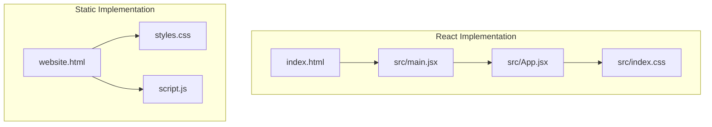
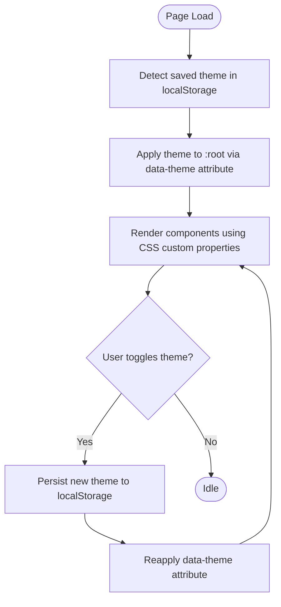
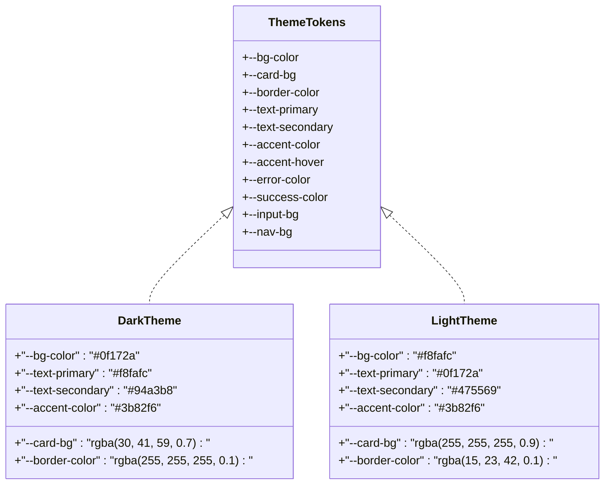
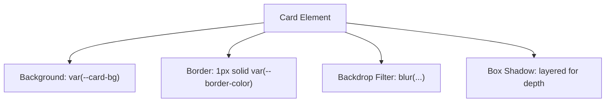
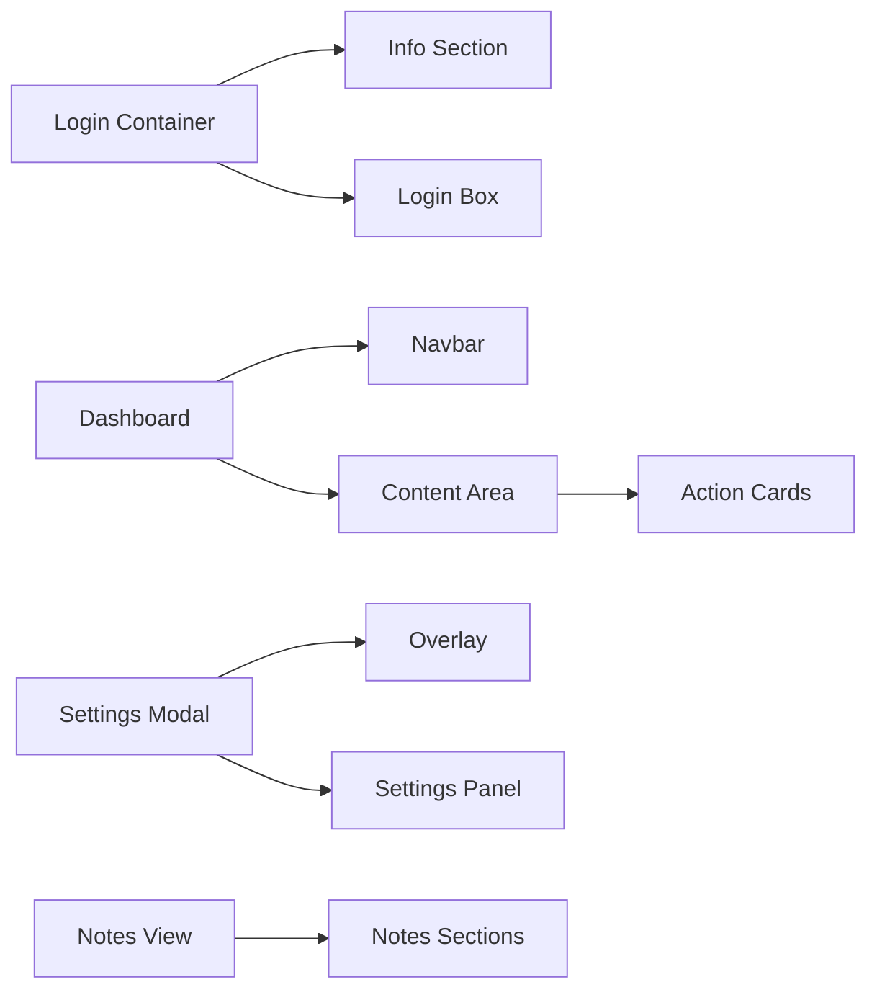
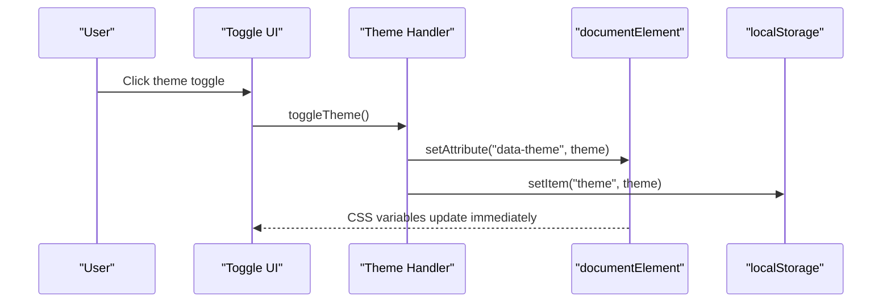
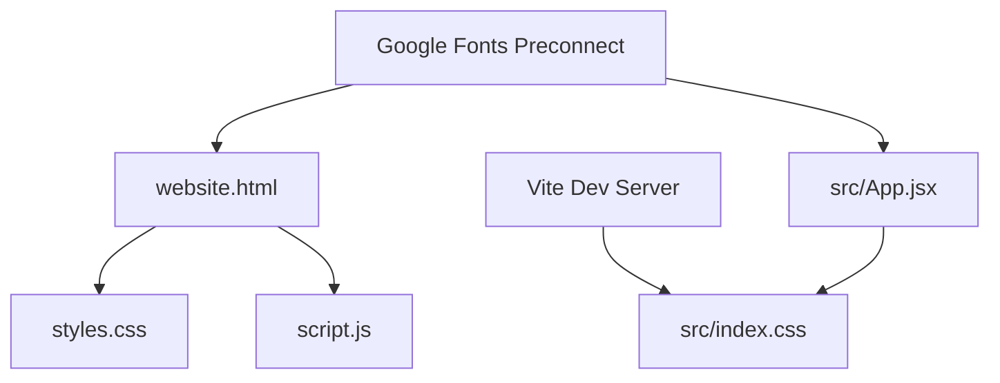

# Styling System

<cite>
**Referenced Files in This Document**
- [src/index.css](file://src/index.css)
- [styles.css](file://styles.css)
- [index.html](file://index.html)
- [website.html](file://website.html)
- [src/main.jsx](file://src/main.jsx)
- [src/App.jsx](file://src/App.jsx)
- [script.js](file://script.js)
- [package.json](file://package.json)
- [vite.config.js](file://vite.config.js)
</cite>

## Table of Contents
1. [Introduction](#introduction)
2. [Project Structure](#project-structure)
3. [Core Components](#core-components)
4. [Architecture Overview](#architecture-overview)
5. [Detailed Component Analysis](#detailed-component-analysis)
6. [Dependency Analysis](#dependency-analysis)
7. [Performance Considerations](#performance-considerations)
8. [Troubleshooting Guide](#troubleshooting-guide)
9. [Conclusion](#conclusion)

## Introduction
This document describes the HMC WEBSITE styling system across both the React SPA and the static HTML implementation. It explains the CSS architecture, theme management via CSS custom properties, component styling patterns, responsive design, and cross-implementation consistency. It also covers the glassmorphism aesthetic, color systems, typography scale, spacing conventions, theme switching mechanisms, browser compatibility, performance optimization, and maintenance strategies.

## Project Structure
The styling system is shared between two implementations:
- React SPA: served via Vite, with styles imported in the root module.
- Static HTML: standalone pages with embedded stylesheets.

Key files:
- Global CSS: [src/index.css](file://src/index.css) and [styles.css](file://styles.css)
- HTML entry points: [index.html](file://index.html) (React) and [website.html](file://website.html) (static)
- Theme and behavior logic: [src/App.jsx](file://src/App.jsx) (React) and [script.js](file://script.js) (static)
- Build tooling: [vite.config.js](file://vite.config.js)
- Dependencies: [package.json](file://package.json)

**Diagram sources**
- [index.html:1-16](file://index.html#L1-L16)
- [src/main.jsx:1-11](file://src/main.jsx#L1-L11)
- [src/App.jsx:1-649](file://src/App.jsx#L1-L649)
- [src/index.css:1-1148](file://src/index.css#L1-L1148)
- [website.html:1-303](file://website.html#L1-L303)
- [styles.css:1-1071](file://styles.css#L1-L1071)
- [script.js:1-660](file://script.js#L1-L660)

**Section sources**
- [index.html:1-16](file://index.html#L1-L16)
- [website.html:1-303](file://website.html#L1-L303)
- [src/index.css:1-1148](file://src/index.css#L1-L1148)
- [styles.css:1-1071](file://styles.css#L1-L1071)
- [src/main.jsx:1-11](file://src/main.jsx#L1-L11)
- [src/App.jsx:1-649](file://src/App.jsx#L1-L649)
- [script.js:1-660](file://script.js#L1-L660)
- [vite.config.js:1-8](file://vite.config.js#L1-L8)
- [package.json:1-22](file://package.json#L1-L22)

## Core Components
- CSS custom properties for theme management
- Glassmorphism components using backdrop-filter and translucent backgrounds
- Component-specific styles for login, dashboard, settings, and notes views
- Responsive breakpoints and mobile-first layout patterns
- Cross-implementation consistency via shared CSS files and theme attributes

Key implementation highlights:
- Theme tokens defined in :root and :root[data-theme='light'|'dark']
- Glass-like cards with blur and borders
- Typography scale using Inter font family
- Spacing via consistent padding/margin utilities
- Theme switching persisted in localStorage and applied via data attributes

**Section sources**
- [src/index.css:7-29](file://src/index.css#L7-L29)
- [styles.css:7-29](file://styles.css#L7-L29)
- [src/App.jsx:73-80](file://src/App.jsx#L73-L80)
- [script.js:390-401](file://script.js#L390-L401)

## Architecture Overview
The styling architecture centers on CSS custom properties and a unified theme attribute applied to the document element. Both implementations share the same design tokens and patterns, ensuring visual consistency.

**Diagram sources**
- [src/App.jsx:73-80](file://src/App.jsx#L73-L80)
- [script.js:390-401](file://script.js#L390-L401)

## Detailed Component Analysis

### Theme System and Design Tokens
- Tokens include background, card background, borders, text colors, accents, inputs, and nav backgrounds.
- Two themes: dark (default) and light, controlled via :root[data-theme='light'|'dark'].
- CSS custom properties are consumed across components for seamless theme transitions.

**Diagram sources**
- [src/index.css:7-29](file://src/index.css#L7-L29)
- [styles.css:7-29](file://styles.css#L7-L29)

**Section sources**
- [src/index.css:7-29](file://src/index.css#L7-L29)
- [styles.css:7-29](file://styles.css#L7-L29)

### Glassmorphism Aesthetic
- Implemented using translucent backgrounds and backdrop-filter blur on cards, modals, and overlays.
- Consistent use of rgba values for transparency and subtle borders.
- Blur radius and shadows tuned for depth while maintaining readability.

**Diagram sources**
- [src/index.css:110-123](file://src/index.css#L110-L123)
- [styles.css:522-537](file://styles.css#L522-L537)
- [src/App.jsx:460-525](file://src/App.jsx#L460-L525)

**Section sources**
- [src/index.css:110-123](file://src/index.css#L110-L123)
- [styles.css:522-537](file://styles.css#L522-L537)
- [src/App.jsx:460-525](file://src/App.jsx#L460-L525)

### Color System and Typography Scale
- Color palette: primary text, secondary text, accent, success, error, and neutral backgrounds.
- Typography: Inter font family with weights 300–700; headings emphasize weight and letter spacing.
- Spacing: consistent padding/margin patterns across components; cards and panels use 12–35px padding ranges.

**Section sources**
- [src/index.css:31-44](file://src/index.css#L31-L44)
- [styles.css:31-44](file://styles.css#L31-L44)
- [src/index.css:817-880](file://src/index.css#L817-L880)
- [styles.css:819-881](file://styles.css#L819-L881)

### Component Styling Patterns
- Login container: centered layout with info section and login box; responsive adjustments at smaller widths.
- Dashboard: navbar with branding and actions; content area with cards and action buttons.
- Settings modal: overlay with panel and sections; inputs styled with accent and border tokens.
- Notes view: structured sections with numbered titles, scripture blocks, and bullet styles.

**Diagram sources**
- [src/index.css:54-123](file://src/index.css#L54-L123)
- [styles.css:25-101](file://styles.css#L25-L101)
- [src/App.jsx:305-527](file://src/App.jsx#L305-L527)
- [website.html:24-148](file://website.html#L24-L148)

**Section sources**
- [src/index.css:54-123](file://src/index.css#L54-L123)
- [styles.css:25-101](file://styles.css#L25-L101)
- [src/App.jsx:305-527](file://src/App.jsx#L305-L527)
- [website.html:24-148](file://website.html#L24-L148)

### Theme Switching Mechanism
- React SPA: theme state updates data attribute on documentElement and persists to localStorage.
- Static HTML: theme applied via data attribute and persisted to localStorage; checkbox toggles theme and refreshes settings UI.

**Diagram sources**
- [src/App.jsx:73-80](file://src/App.jsx#L73-L80)
- [script.js:390-401](file://script.js#L390-L401)

**Section sources**
- [src/App.jsx:73-80](file://src/App.jsx#L73-L80)
- [script.js:390-401](file://script.js#L390-L401)

### Responsive Design Implementation
- Media queries target widths around 900px to adjust layout and typography.
- Flexbox and grid patterns adapt to single-column layouts on smaller screens.
- Inputs and buttons scale appropriately; navigation remains sticky and accessible.

**Section sources**
- [src/index.css:776-817](file://src/index.css#L776-L817)
- [styles.css:779-817](file://styles.css#L779-L817)
- [src/App.jsx:1073-1148](file://src/App.jsx#L1073-L1148)

### Cross-Implementation Styling Consistency
- Both implementations use identical CSS custom properties and class names for shared components.
- React and static pages reference the same stylesheet files and rely on the same theme tokens.
- Dynamic theme application is synchronized via data attributes and localStorage.

**Section sources**
- [src/index.css:1-1148](file://src/index.css#L1-L1148)
- [styles.css:1-1071](file://styles.css#L1-L1071)
- [src/App.jsx:73-80](file://src/App.jsx#L73-L80)
- [script.js:390-401](file://script.js#L390-L401)

## Dependency Analysis
- React SPA depends on Vite for development and build; styles are imported in the root module.
- Static HTML relies on external CSS and JavaScript files; fonts are preconnected for performance.
- Both implementations depend on the same design tokens and responsive patterns.

**Diagram sources**
- [vite.config.js:1-8](file://vite.config.js#L1-L8)
- [src/main.jsx:1-11](file://src/main.jsx#L1-L11)
- [src/App.jsx:1-649](file://src/App.jsx#L1-L649)
- [index.html:7-9](file://index.html#L7-L9)
- [website.html:17-21](file://website.html#L17-L21)

**Section sources**
- [vite.config.js:1-8](file://vite.config.js#L1-L8)
- [package.json:1-22](file://package.json#L1-L22)
- [src/main.jsx:1-11](file://src/main.jsx#L1-L11)
- [index.html:7-9](file://index.html#L7-L9)
- [website.html:17-21](file://website.html#L17-L21)

## Performance Considerations
- CSS custom properties enable efficient theme switching without re-rendering components.
- Backdrop-filter blur is used selectively; ensure vendor prefixes are considered for older browsers.
- Font loading uses preconnect to reduce latency; keep font subsets minimal.
- Consider bundling and minification via Vite for production builds to optimize CSS delivery.

[No sources needed since this section provides general guidance]

## Troubleshooting Guide
Common issues and resolutions:
- Theme not persisting: verify localStorage availability and correct data attribute application.
- Glass effect not visible: ensure backdrop-filter support and correct rgba values; test fallbacks.
- Responsive layout breaks: review media query breakpoints and ensure flex/grid adjustments.
- Missing fonts: confirm Google Fonts preconnect and network accessibility.

**Section sources**
- [src/App.jsx:73-80](file://src/App.jsx#L73-L80)
- [script.js:390-401](file://script.js#L390-L401)
- [src/index.css:110-123](file://src/index.css#L110-L123)
- [styles.css:522-537](file://styles.css#L522-L537)
- [index.html:7-9](file://index.html#L7-L9)
- [website.html:17-21](file://website.html#L17-L21)

## Conclusion
The HMC WEBSITE styling system leverages CSS custom properties and a shared design token set to deliver a cohesive, theme-aware experience across both React and static implementations. The glassmorphism aesthetic, consistent typography and spacing, and responsive patterns ensure a modern, accessible interface. By centralizing theme logic and maintaining consistent class naming, the system supports easy maintenance and cross-platform parity.