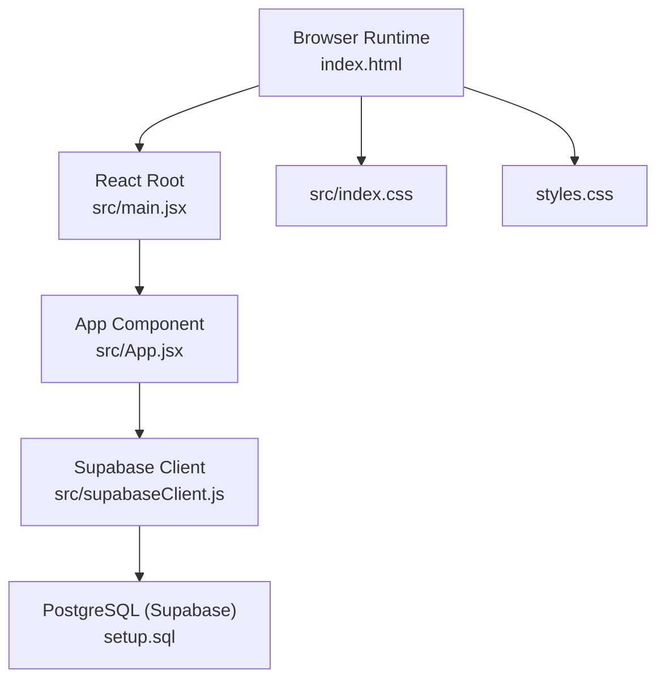
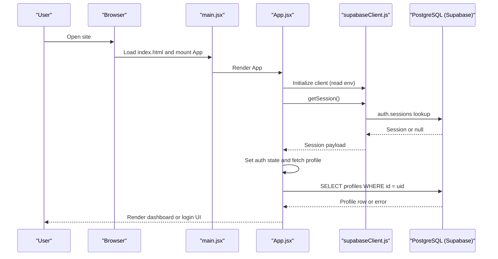
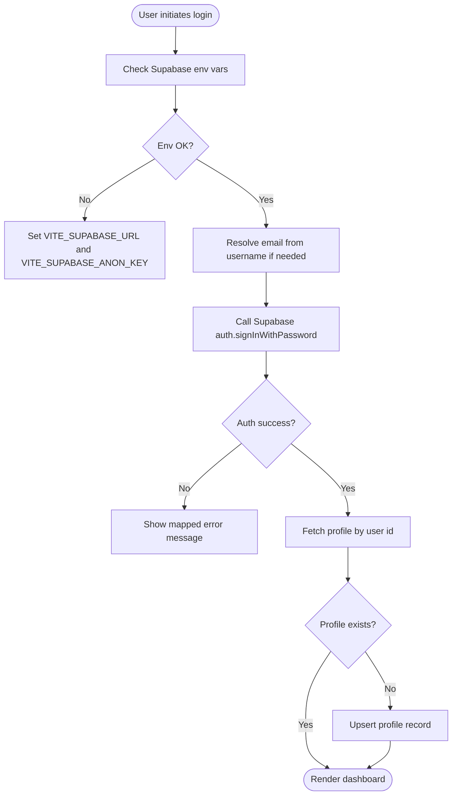
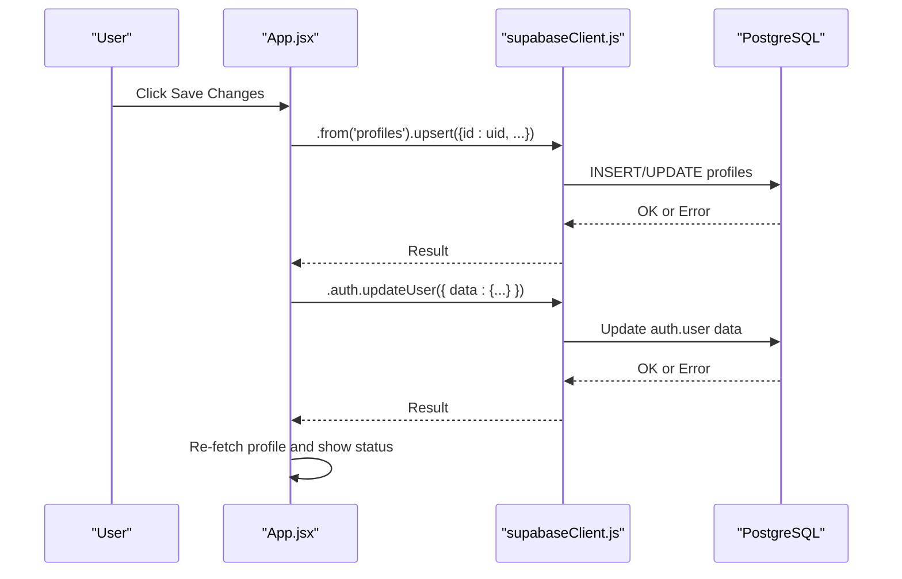
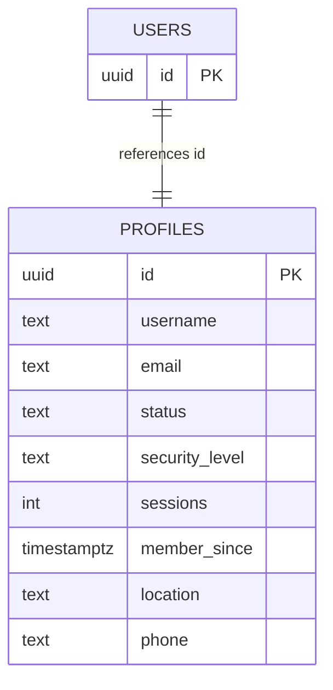
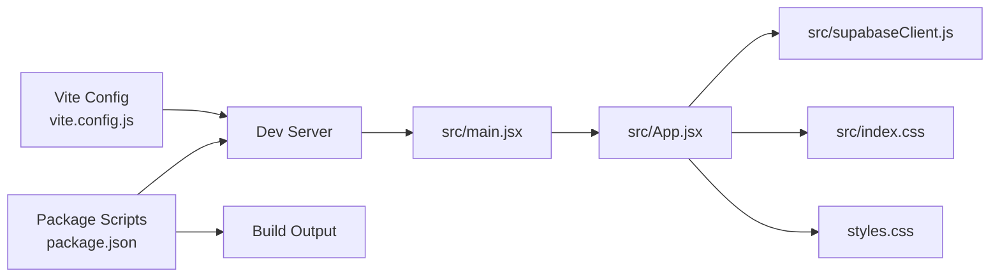

# Troubleshooting and FAQ

<cite>
**Referenced Files in This Document**
- [package.json](file://package.json)
- [vite.config.js](file://vite.config.js)
- [index.html](file://index.html)
- [src/main.jsx](file://src/main.jsx)
- [src/App.jsx](file://src/App.jsx)
- [src/supabaseClient.js](file://src/supabaseClient.js)
- [setup.sql](file://setup.sql)
- [src/index.css](file://src/index.css)
- [styles.css](file://styles.css)
</cite>

## Table of Contents
1. [Introduction](#introduction)
2. [Project Structure](#project-structure)
3. [Core Components](#core-components)
4. [Architecture Overview](#architecture-overview)
5. [Detailed Component Analysis](#detailed-component-analysis)
6. [Dependency Analysis](#dependency-analysis)
7. [Performance Considerations](#performance-considerations)
8. [Troubleshooting Guide](#troubleshooting-guide)
9. [Frequently Asked Questions (FAQ)](#frequently-asked-questions-faq)
10. [Conclusion](#conclusion)

## Introduction
This document provides comprehensive troubleshooting and FAQ guidance for the HMC WEBSITE project. It focuses on diagnosing and resolving:
- Authentication problems (login failures, session errors, credential issues)
- Database connection and schema issues (RLS policy errors, schema conflicts)
- Build and deployment errors (Vite configuration issues, environment setup)
- Performance issues (slow loading, authentication delays, database query performance)
- Debugging and monitoring strategies for both React and static implementations

## Project Structure
The project is a Vite + React SPA that integrates Supabase for authentication and real-time profile data. Key elements:
- Application entry and rendering in the browser
- Supabase client initialization and environment variable usage
- Authentication flows (email/password, OTP SMS)
- Profile CRUD operations against a Postgres table with Row Level Security (RLS)
- Styling via CSS modules

**Diagram sources**
- [index.html:1-16](file://index.html#L1-L16)
- [src/main.jsx:1-11](file://src/main.jsx#L1-L11)
- [src/App.jsx:1-621](file://src/App.jsx#L1-L621)
- [src/supabaseClient.js:1-11](file://src/supabaseClient.js#L1-L11)
- [setup.sql:1-26](file://setup.sql#L1-L26)
- [src/index.css:1-1148](file://src/index.css#L1-L1148)
- [styles.css:1-1071](file://styles.css#L1-L1071)

**Section sources**
- [index.html:1-16](file://index.html#L1-L16)
- [src/main.jsx:1-11](file://src/main.jsx#L1-L11)
- [src/App.jsx:1-621](file://src/App.jsx#L1-L621)
- [src/supabaseClient.js:1-11](file://src/supabaseClient.js#L1-L11)
- [setup.sql:1-26](file://setup.sql#L1-L26)
- [src/index.css:1-1148](file://src/index.css#L1-L1148)
- [styles.css:1-1071](file://styles.css#L1-L1071)

## Core Components
- Supabase client initialization and environment variable checks
- Authentication flows: login with email/username fallback, OTP SMS recovery, sign-up, logout
- Profile management: upsert profile on sign-up, update profile and user metadata
- Theme persistence and UI state management
- Static assets and routing via a single-page app

Common areas for issues:
- Missing or invalid Supabase environment variables
- Supabase auth errors surfaced to the UI
- Postgres RLS policy misconfiguration
- Vite dev/build configuration and asset serving

**Section sources**
- [src/supabaseClient.js:1-11](file://src/supabaseClient.js#L1-L11)
- [src/App.jsx:101-236](file://src/App.jsx#L101-L236)
- [src/App.jsx:243-299](file://src/App.jsx#L243-L299)
- [setup.sql:1-26](file://setup.sql#L1-L26)
- [package.json:1-22](file://package.json#L1-L22)
- [vite.config.js:1-8](file://vite.config.js#L1-L8)

## Architecture Overview
High-level runtime flow:
- The browser loads index.html and mounts the React app
- App initializes Supabase client using Vite import.meta.env variables
- On load, the app checks the current session and subscribes to auth state changes
- Authentication actions trigger Supabase auth APIs and profile upserts
- Profile data is fetched from the Postgres table “profiles” with RLS enabled

**Diagram sources**
- [index.html:1-16](file://index.html#L1-L16)
- [src/main.jsx:1-11](file://src/main.jsx#L1-L11)
- [src/App.jsx:35-62](file://src/App.jsx#L35-L62)
- [src/supabaseClient.js:1-11](file://src/supabaseClient.js#L1-L11)
- [setup.sql:1-26](file://setup.sql#L1-L26)

## Detailed Component Analysis

### Authentication Flow Diagnostics
Common symptoms:
- Login fails immediately with an error message
- After successful login, the app does not navigate to the dashboard
- OTP recovery sends but verification fails
- Sign-up completes but profile is not created

Diagnostics and resolutions:
- Verify environment variables are present and correct
- Inspect Supabase auth error messages and map to user-friendly messages
- Confirm RLS policies allow inserting/updating the authenticated user’s profile
- Ensure profile upsert occurs after sign-up and that user metadata updates are applied

**Diagram sources**
- [src/supabaseClient.js:1-11](file://src/supabaseClient.js#L1-L11)
- [src/App.jsx:101-138](file://src/App.jsx#L101-L138)
- [src/App.jsx:82-94](file://src/App.jsx#L82-L94)
- [src/App.jsx:214-236](file://src/App.jsx#L214-L236)
- [setup.sql:1-26](file://setup.sql#L1-L26)

**Section sources**
- [src/supabaseClient.js:1-11](file://src/supabaseClient.js#L1-L11)
- [src/App.jsx:101-138](file://src/App.jsx#L101-L138)
- [src/App.jsx:82-94](file://src/App.jsx#L82-L94)
- [src/App.jsx:180-236](file://src/App.jsx#L180-L236)
- [setup.sql:1-26](file://setup.sql#L1-L26)

### Profile Management Diagnostics
Common symptoms:
- Profile updates fail silently
- User metadata updates do not persist
- Dashboard shows stale profile data

Diagnostics and resolutions:
- Confirm the profile exists for the current user ID
- Ensure upsert operations target the authenticated user’s ID
- Verify RLS UPDATE policy allows the user to modify their own profile
- Check for concurrent updates and re-fetch after changes

**Diagram sources**
- [src/App.jsx:243-274](file://src/App.jsx#L243-L274)
- [setup.sql:21-25](file://setup.sql#L21-L25)

**Section sources**
- [src/App.jsx:243-274](file://src/App.jsx#L243-L274)
- [setup.sql:21-25](file://setup.sql#L21-L25)

### Database Schema and RLS Diagnostics
Common symptoms:
- SELECT queries return empty or unauthorized results
- INSERT or UPDATE operations fail with permission errors
- Profile creation succeeds but cannot be retrieved

Diagnostics and resolutions:
- Confirm the “profiles” table exists with the expected columns
- Verify RLS is enabled and policies allow:
  - Select for everyone
  - Insert with check matching auth.uid() = id
  - Update using auth.uid() = id
- Test queries directly in the Supabase SQL editor to isolate client-side issues

**Diagram sources**
- [setup.sql:1-26](file://setup.sql#L1-L26)

**Section sources**
- [setup.sql:1-26](file://setup.sql#L1-L26)

## Dependency Analysis
- Vite dev server and build pipeline
- React runtime and DOM rendering
- Supabase JS client for auth and PostgREST
- CSS for theming and responsive layout

**Diagram sources**
- [vite.config.js:1-8](file://vite.config.js#L1-L8)
- [package.json:1-22](file://package.json#L1-L22)
- [src/main.jsx:1-11](file://src/main.jsx#L1-L11)
- [src/App.jsx:1-621](file://src/App.jsx#L1-L621)
- [src/supabaseClient.js:1-11](file://src/supabaseClient.js#L1-L11)
- [src/index.css:1-1148](file://src/index.css#L1-L1148)
- [styles.css:1-1071](file://styles.css#L1-L1071)

**Section sources**
- [vite.config.js:1-8](file://vite.config.js#L1-L8)
- [package.json:1-22](file://package.json#L1-L22)
- [src/main.jsx:1-11](file://src/main.jsx#L1-L11)
- [src/App.jsx:1-621](file://src/App.jsx#L1-L621)
- [src/supabaseClient.js:1-11](file://src/supabaseClient.js#L1-L11)
- [src/index.css:1-1148](file://src/index.css#L1-L1148)
- [styles.css:1-1071](file://styles.css#L1-L1071)

## Performance Considerations
- Authentication delays
  - Check network tab for auth requests timing out or blocked by CORS
  - Ensure environment variables are loaded before Supabase client initialization
- Database query performance
  - Minimize redundant profile fetches; cache in component state
  - Use targeted selects and avoid wildcard queries
- Frontend performance
  - Keep CSS minimal; avoid heavy animations during auth transitions
  - Defer non-critical assets until after auth state is resolved

[No sources needed since this section provides general guidance]

## Troubleshooting Guide

### Authentication Problems
Symptoms:
- Login fails with generic or misleading messages
- OTP send succeeds but verification fails
- Email not confirmed errors appear unexpectedly
- Rate limit exceeded messages on sign-up

Diagnostics:
- Confirm environment variables are set and not the placeholder values
- Review Supabase auth logs and mapped error messages in the UI
- Validate that the user’s email is confirmed before login attempts
- Check rate limits for email sign-ups

Resolutions:
- Set VITE_SUPABASE_URL and VITE_SUPABASE_ANON_KEY in your environment
- Redirect users to resend confirmation if email is unconfirmed
- Implement retry logic and user guidance for rate-limited sign-ups

**Section sources**
- [src/supabaseClient.js:1-11](file://src/supabaseClient.js#L1-L11)
- [src/App.jsx:128-137](file://src/App.jsx#L128-L137)
- [src/App.jsx:204-212](file://src/App.jsx#L204-L212)

### Session and Auth State Issues
Symptoms:
- App shows loading indefinitely
- Auth state changes do not reflect UI updates
- Logout does not clear profile data

Diagnostics:
- Verify auth state subscription is established on mount
- Ensure session retrieval runs before rendering protected views
- Check that signOut clears local state and resets view

Resolutions:
- Confirm the auth state listener is attached and unsubscribed properly
- Re-fetch profile after auth state changes
- Reset UI state on sign-out

**Section sources**
- [src/App.jsx:35-62](file://src/App.jsx#L35-L62)
- [src/App.jsx:238-241](file://src/App.jsx#L238-L241)

### Database Connection and Schema Problems
Symptoms:
- Profile fetch returns an error
- Profile upsert/update fails with permission errors
- RLS prevents viewing or editing profile

Diagnostics:
- Confirm “profiles” table exists with correct schema
- Verify RLS policies allow select, insert with check, and update using auth.uid()
- Test queries in the Supabase SQL editor

Resolutions:
- Recreate or adjust policies to match the app’s expectations
- Ensure the authenticated user’s ID matches the profile ID for updates

**Section sources**
- [setup.sql:1-26](file://setup.sql#L1-L26)
- [src/App.jsx:82-94](file://src/App.jsx#L82-L94)
- [src/App.jsx:247-255](file://src/App.jsx#L247-L255)

### Build and Deployment Errors
Symptoms:
- Vite dev server fails to start
- Build fails with missing dependencies or unknown import.meta.env keys
- Preview server serves blank page

Diagnostics:
- Ensure Vite plugin for React is configured
- Verify package scripts and dependencies are installed
- Confirm .env variables are available during build/preview

Resolutions:
- Run install and dev/build commands as defined in package scripts
- Provide environment variables for VITE_SUPABASE_URL and VITE_SUPABASE_ANON_KEY
- Use preview to test production-like behavior

**Section sources**
- [vite.config.js:1-8](file://vite.config.js#L1-L8)
- [package.json:1-22](file://package.json#L1-L22)
- [index.html:1-16](file://index.html#L1-L16)

### Environment Setup Problems
Symptoms:
- Console warns about missing Supabase anon key
- App appears blank or auth never initializes

Diagnostics:
- Check that import.meta.env variables are populated
- Confirm .env file is placed at the project root and loaded by Vite

Resolutions:
- Add VITE_SUPABASE_URL and VITE_SUPABASE_ANON_KEY to your environment
- Restart dev server after adding environment variables

**Section sources**
- [src/supabaseClient.js:1-11](file://src/supabaseClient.js#L1-L11)
- [index.html:1-16](file://index.html#L1-L16)

### Slow Loading and Performance Delays
Symptoms:
- Long initial load times
- Delayed auth state detection
- Slow profile fetches

Diagnostics:
- Monitor network requests for auth and profile endpoints
- Observe frontend rendering and theme switching performance
- Check for unnecessary re-renders in the App component

Resolutions:
- Optimize CSS and reduce heavy assets
- Cache profile data and avoid redundant fetches
- Ensure environment variables are preloaded to prevent extra retries

**Section sources**
- [src/App.jsx:35-62](file://src/App.jsx#L35-L62)
- [src/App.jsx:82-94](file://src/App.jsx#L82-L94)
- [src/index.css:1-1148](file://src/index.css#L1-L1148)
- [styles.css:1-1071](file://styles.css#L1-L1071)

### Debugging Tools, Logging Strategies, and Monitoring
- Browser developer tools
  - Network tab: inspect auth and PostgREST calls, response codes, and latency
  - Console: review Supabase warnings and error messages
  - Sources: step through Supabase client initialization and auth flows
- Supabase dashboard
  - Auth logs: track sign-in/sign-up events and OTP flows
  - SQL editor: test RLS policies and profile queries
  - Analytics: monitor request volume and latency
- Local logging
  - Wrap async auth/profile calls with try/catch and log errors
  - Use status messages to surface actionable feedback to users

**Section sources**
- [src/supabaseClient.js:1-11](file://src/supabaseClient.js#L1-L11)
- [src/App.jsx:89-93](file://src/App.jsx#L89-L93)
- [src/App.jsx:266-273](file://src/App.jsx#L266-L273)

## Frequently Asked Questions (FAQ)

Q1: Why does login fail with “Invalid login credentials”?
- Ensure the email/username and password are correct. If using a username, the app resolves the email internally before signing in.

Q2: I signed up but cannot log in. Why?
- The account may require email confirmation. Prompt the user to check their inbox and click the confirmation link.

Q3: How do I reset my password?
- Use the “Forgotten Password?” flow to receive an OTP via SMS, verify it, and then change your password in settings.

Q4: My profile changes did not save. What went wrong?
- The app performs both a profile upsert and a user metadata update. Check for errors and re-fetch the profile after saving.

Q5: Why can’t I see my profile after logging in?
- The app fetches the profile by the authenticated user ID. Ensure the profile exists and RLS policies permit selection.

Q6: The app shows a warning about the Supabase anon key. How do I fix it?
- Set VITE_SUPABASE_URL and VITE_SUPABASE_ANON_KEY in your environment and restart the dev server.

Q7: How do I switch themes?
- Toggle the dark/light mode switch in the settings panel. The preference is saved locally.

Q8: How do I log out?
- Click the logout button in the settings panel. This signs you out and resets the UI.

Q9: Why does the build fail?
- Ensure all dependencies are installed and environment variables are present. Use the scripts defined in package.json.

Q10: How can I improve performance?
- Minimize heavy CSS, avoid unnecessary re-renders, and cache profile data to reduce repeated fetches.

**Section sources**
- [src/App.jsx:108-137](file://src/App.jsx#L108-L137)
- [src/App.jsx:140-178](file://src/App.jsx#L140-L178)
- [src/App.jsx:243-299](file://src/App.jsx#L243-L299)
- [src/App.jsx:82-94](file://src/App.jsx#L82-L94)
- [src/supabaseClient.js:1-11](file://src/supabaseClient.js#L1-L11)
- [src/App.jsx:518-521](file://src/App.jsx#L518-L521)
- [package.json:1-22](file://package.json#L1-L22)

## Conclusion
This guide consolidates practical diagnostics and resolutions for authentication, database, build, and performance issues in the HMC WEBSITE project. By validating environment variables, understanding Supabase auth flows, confirming RLS policies, and leveraging browser and Supabase monitoring tools, most issues can be quickly identified and resolved. For persistent problems, consult the Supabase dashboard logs and SQL editor to isolate backend concerns.